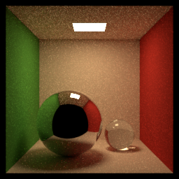

# 第一周周报


## 概述

1.   查阅官方文档，熟悉mitsuba的python api。我发现mitsuba的python api能控制的渲染流程极其有限，可能只能用于采集材质的bsdf数据。
2.   看mitsuba源代码，了解如何用mitsuba采集各个角度下layered material的bsdf值。我发现mitsuba渲染layered bsdf采取的是加权求和，而不是用path tracing模拟光线在两层材质间散射和反射。因此可能采集材质需要自己写算法。
3.   跟李沐学ai，了解注意力机制、注意力分数，使用注意力机制的seq2seq、自注意力和位置编码，并且记录笔记。


## 下周计划

1.   看mitsuba源代码，从mitsuba.cpp作为入口，试图理清其渲染流程。
2.   跟李沐学ai，了解Transformer，并且查看相关代码。


## 完成细节

1.   查阅官方文档，熟悉mitsuba的python api。

     这是一个大致流程：设置渲染环境、加载场景、渲染：

     

     同时你可以编辑场景，改变物体的位置、材质：

     

     同时你可以设定相机的参数，从不同角度渲染：

     


     同时你可以编辑渲染流程，但是可以修改的非常有限，真的要修改可能还是要源代码：
    
     


​     

2.   看mitsuba源代码，了解如何用mitsuba采集各个角度下layered material的bsdf值。

     这个官方文档没有给出相应方案，通过看源代码，用python api计算材质的bsdf值过程如下：

     ```python
     def bsdf_eval(material_properties, wi, wo):
         wi = dr.normalize(wi)
         wo = dr.normalize(wo)
     
         bsdf = mi.load_dict(material_properties)
     
         ctx = mi.BSDFContext()
     
         si_dummy = mi.SurfaceInteraction3f()
         si_dummy.wi = wi
     
         bsdf_value = bsdf.eval(ctx, si_dummy, wo)
     
         return bsdf_value
     ```

     其中w_i是入射光线，w_o是出射光线，material_properties是材质的属性（以python字典的形式），例如：

     ```python
     diffuse_properties = {
         'type': 'diffuse',
         'reflectance': {
             'type': 'rgb',
             'value': [0.2, 0.25, 0.7]
         }
     }
     ```

     值得注意的是，mitsuba计算layered material的属性定义为：

     ```python
     diffuse_properties = {
         'type': 'blendbsdf',
         'weight': {
             'type': 'bitmap',
             'filename': 'pattern.png'
         },
         'bsdf_0': {
             'type': 'conductor'
         },
         'bsdf_1': {
             'type': 'roughplastic',
             'diffuse_reflectance': 0.1
         }
     }
     ```

     mitsuba计算layered material的代码为：

     ```c++
     Spectrum eval(const BSDFContext &ctx, const SurfaceInteraction3f &si,
                   const Vector3f &wo, Mask active) const override {
         MI_MASKED_FUNCTION(ProfilerPhase::BSDFEvaluate, active);
     
         Float weight = eval_weight(si, active);
         if (unlikely(ctx.component != (uint32_t) -1)) {
             bool sample_first = ctx.component < m_nested_bsdf[0]->component_count();
             BSDFContext ctx2(ctx);
             if (!sample_first)
                 ctx2.component -= (uint32_t) m_nested_bsdf[0]->component_count();
             else
                 weight = 1.f - weight;
             return weight * m_nested_bsdf[sample_first ? 0 : 1]->eval(ctx2, si, wo, active);
         }
     
         return m_nested_bsdf[0]->eval(ctx, si, wo, active) * (1 - weight) +
             m_nested_bsdf[1]->eval(ctx, si, wo, active) * weight;
     }
     ```

     因此他对layered brdf的计算方式为加权求和，而不是使用蒙特卡罗随机游走计算。因此不能直接使用mitsuba采集的材质作为label训练神经网络。需要另外想办法。

     根据许老师的建议，先尝试将现成的神经网络嵌入到渲染流程中，因此下周的任务主要是理顺mitsuba的渲染流程。

     

3.   跟李沐学ai，了解注意力机制、注意力分数，使用注意力机制的seq2seq、自注意力和位置编码。

     完成，但是对于 seq2seq 怎么嵌入注意力机制还是有点模糊，需要下周上手实践。