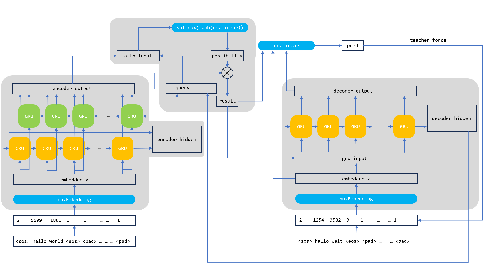

# 2023.10.23-2023.10.29


## 概述

1.   学习 Transformer，自己动手实践嵌入注意力机制的 seq2seq 以及实现一个 Transformer，尽可能理解每个模块的设计方式。
2.   看 mitsuba 源代码，从 mitsuba.cpp 作为入口，试图理清其渲染流程。
3.   同步开始阅读 DirectX12 和 DirectML 的文档，尝试其他出路。


## 下周计划

1.   完成Transformer的代码，并理解自注意力机制。
2.   尝试修改mitsuba源代码，对其debug调出材质和物体id。


## 完成细节

1. 自己动手实践嵌入注意力机制的 seq2seq

   我在 Pytorch 中实现了一个 Seq2Seq+Attention，结构如下：

   

   1. 训练过程

      1. 输入序列的编码：

         输入序列被传入到 embedding 层。这些嵌入向量随后被传递给编码器。

         编码器为输入序列中的每个词生成一个上下文表示 encoder_output。

         编码器的最终隐藏状态 encoder_hidden 被用作解码器的初始隐藏状态，其之后将作为第一个 query 输入注意力模块。

      2. 带注意力机制的解码：

         目标序列被传入到 embedding 层。这些嵌入向量随后被传递给解码器。

         解码器的当前隐藏状态用作下一个输入的查询来计算注意力权重。

         这些注意力权重与 encoder_output 合并输入注意力模块，得到的结果和  encoder_output（即 value ）相乘得到结果。

         将结果与解码器的嵌入向量结合，传递给解码器的GRU，产生一个新的输出和隐藏状态。

         解码器的输入、输出、注意力模块的输出传递给一个线性层，产生预测。

   2.   推导过程 (也称为解码过程)

        1. 开始标记：

           解码始于一个`<sos>`标记。

        2. 注意力加权和解码：

           使用先前时间步的输出（或`<sos>`）和隐藏状态作为输入，解码器生成一个新的输出词。这个输出词被视为下一个时间步的输入。

        3. 终止条件：

           解码继续直到模型预测出一个`<eos>`标记或者达到某个最大长度。

        4. 生成翻译：

           连接解码器的所有输出，生成最终的翻译。

   

2. 看 mitsuba 源代码，从 mitsuba.cpp 作为入口，试图理清其渲染流程

   mitsuba.cpp 中 render 入口为：

   ```cpp
   integrator->render(scene, (uint32_t) sensor_i,
                      0 /* seed */,
                      0 /* spp */,
                      false /* develop */,
                      true /* evaluate */);
   ```

   其中 integrator 包装了多种渲染方式，path tracing 的 integrator 实现位于 src/integrators/path.cpp 中，类 PathInterestingrator 继承了 MonteCarloIntegrator，MonteCarloIntegrator 继承了 SamplingIntegrator，在 SamplingIntegrator 中实现了基类 Integrator 的 render 方法：

   ```cpp
   for (size_t i = 0; i < n_passes; i++) {
       render_sample(scene, sensor, sampler, block, aovs.get(), pos,
                     diff_scale_factor);
   
       if (n_passes > 1) {
           sampler->advance(); // Will trigger a kernel launch of size 1
           sampler->schedule_state();
           dr::eval(block->tensor());
       }
   }
   ```

   render 方法中调用 render_sample 方法渲染场景。

   render_sample 中调用 sample 方法渲染：

   ```cpp
   auto [spec, valid] = sample(scene, sampler, ray, medium,
   aovs + (has_alpha ? 5 : 4) /* skip R,G,B,[A],W */, active);
   ```

   sample 方法在子类：PathIntegrator 中实现。

   sample 方法中，判断和物体相交的函数为：

   ```cpp
   SurfaceInteraction3f si =
       scene->ray_intersect(ray,
                            /* ray_flags = */ +RayFlags::All,
                            /* coherent = */ dr::eq(depth, 0u));
   ```

   si 是 SurfaceInteraction 类的一个实例，该实例存储了对应的网格信息（ShapePtr shape），uv 坐标（Point2f uv），入射方向（Vector3f wi）等重要信息，下一步就是想办法 debug mitsuba，在场景渲染中调出这些信息并组成 buffer。