# 第三周周报

    徐晖曜

## 概述

完成低光照NeRF项目的stage1部分调参、对比试验以及数据集的收集整理。

## 下周计划

1. 查看训练好的 Seq2seq Attention 模型效果。
2. 了解体渲染的原理以及 NeRF 如何运用的体渲染。

## 完成细节

1. 对比试验

   对比试验的方案是：

   - 将数据集分为两组，一组颜色有变化，一组颜色无变化。
   - 对数据集进行降噪以及resize
   - 对数据集经过SCI、Zero-DCE、Enlighten-Gan增强
   - 使用 Colmap 对数据集位姿进行计算
   - 输入到 instant ngp 进行训练

   结果：

   - 亮度无变化数据集的输入示例：

     

         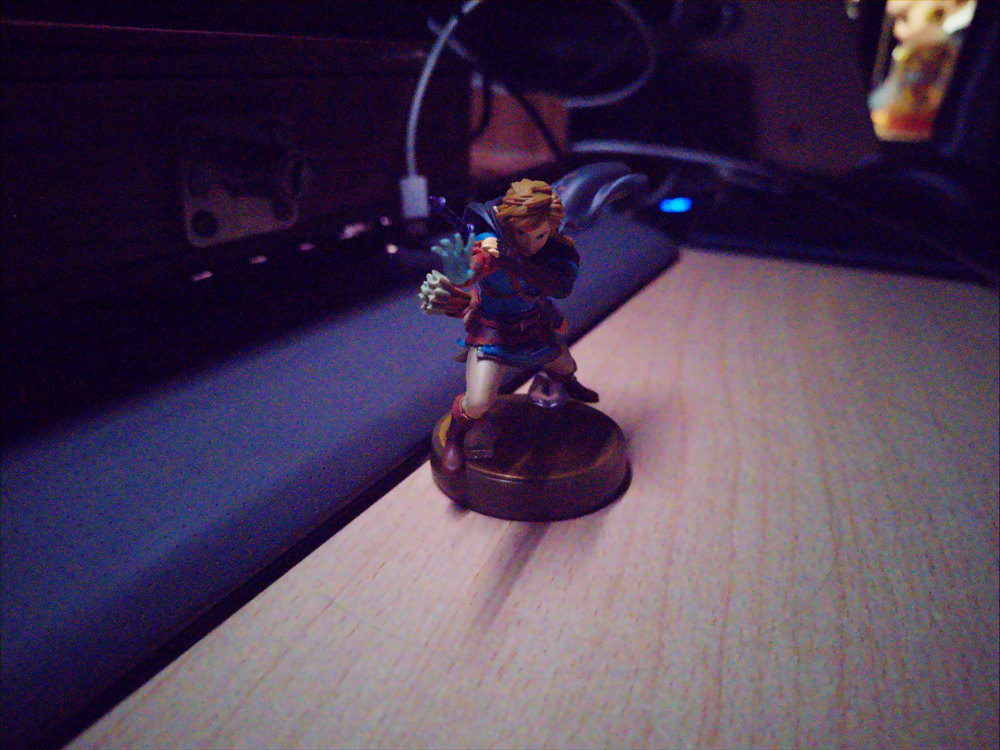
         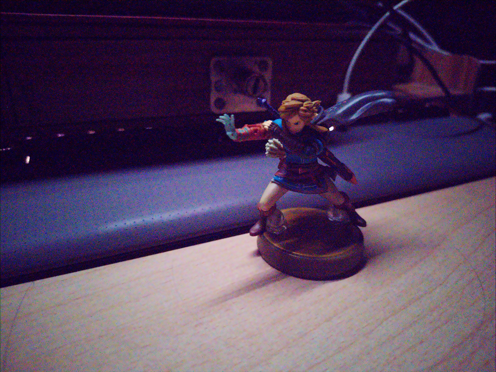
     

   - 亮度无变化数据集的结果示例：

     

         
         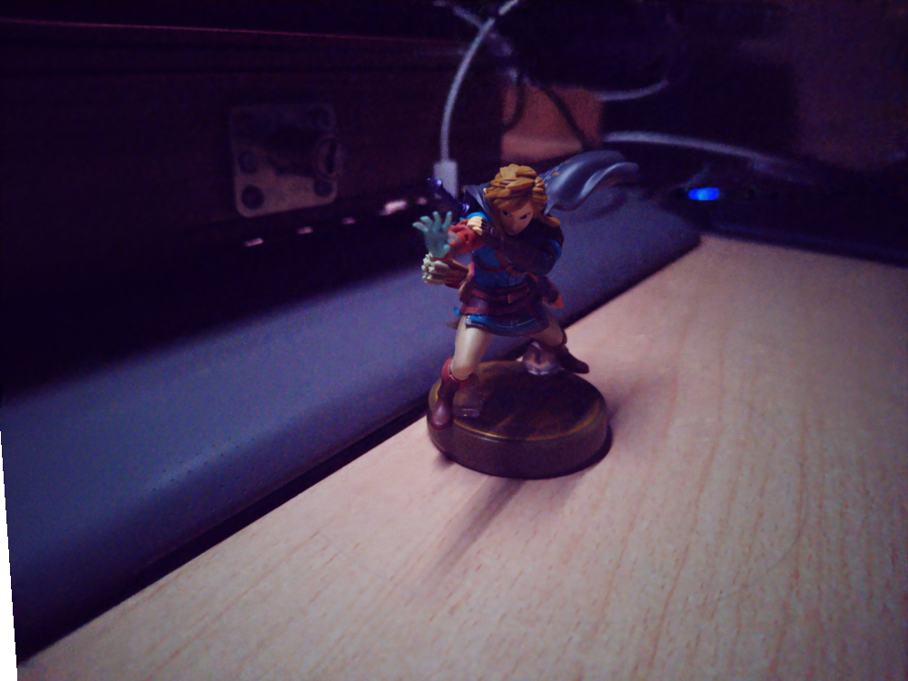
     

   - 亮度有变化数据集的输入示例：

     

         
         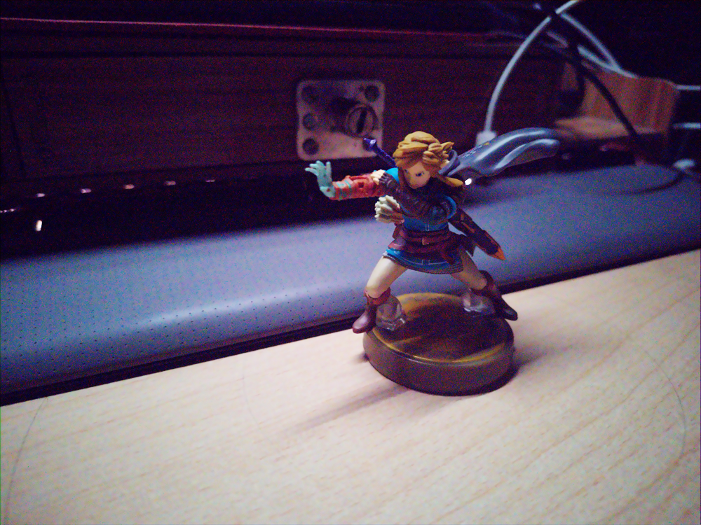
     

   - 亮度有变化数据集的结果示例：

     

         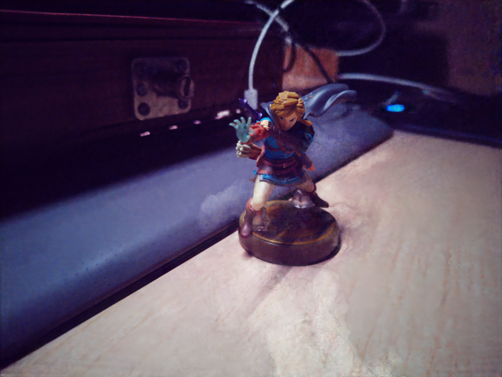
         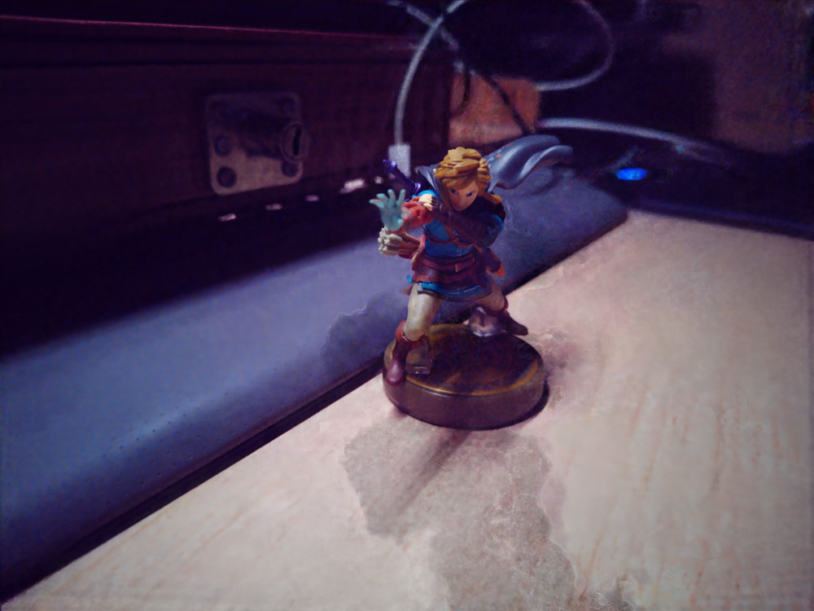
     

   结论：在亮度没有变化的情况下，2D 增强+instant ngp效果较好，对纹理细节的还原较好；但是在输入数据集亮度有变化的情况下，2D 增强+instant ngp效果不好，会出现色斑。

2. 数据集的收集整理

   目前拍摄了近 10 组数据集，可用的有5组，分别是：

   - 林克手办（见上，有两组可用）

   - 室内盆栽

     

         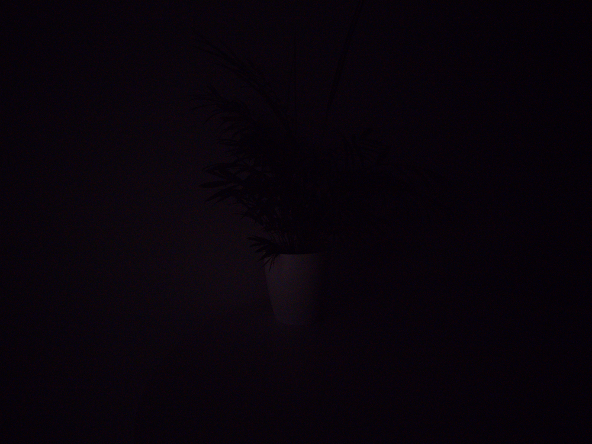
         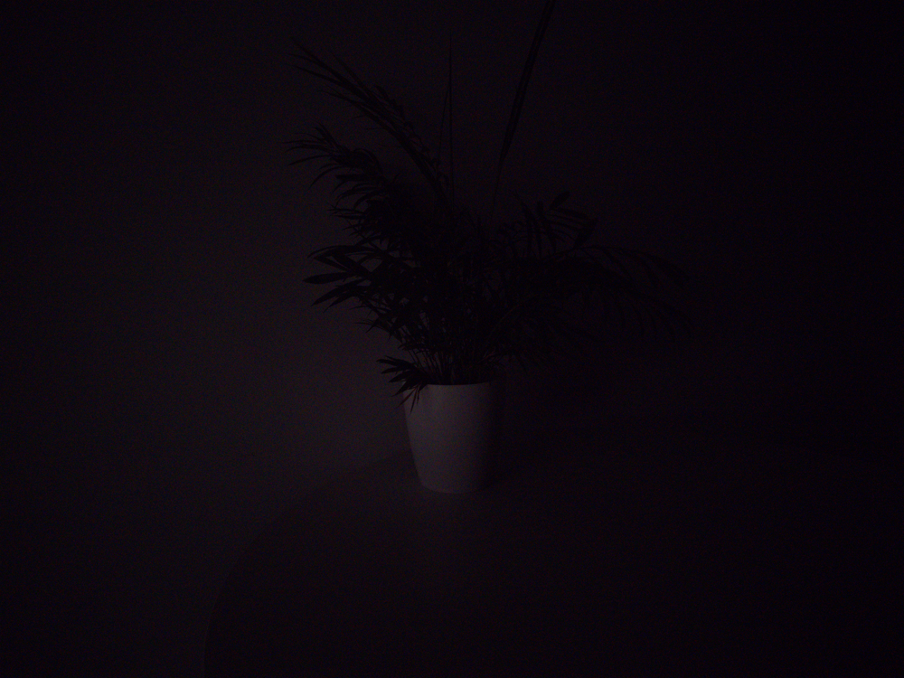
         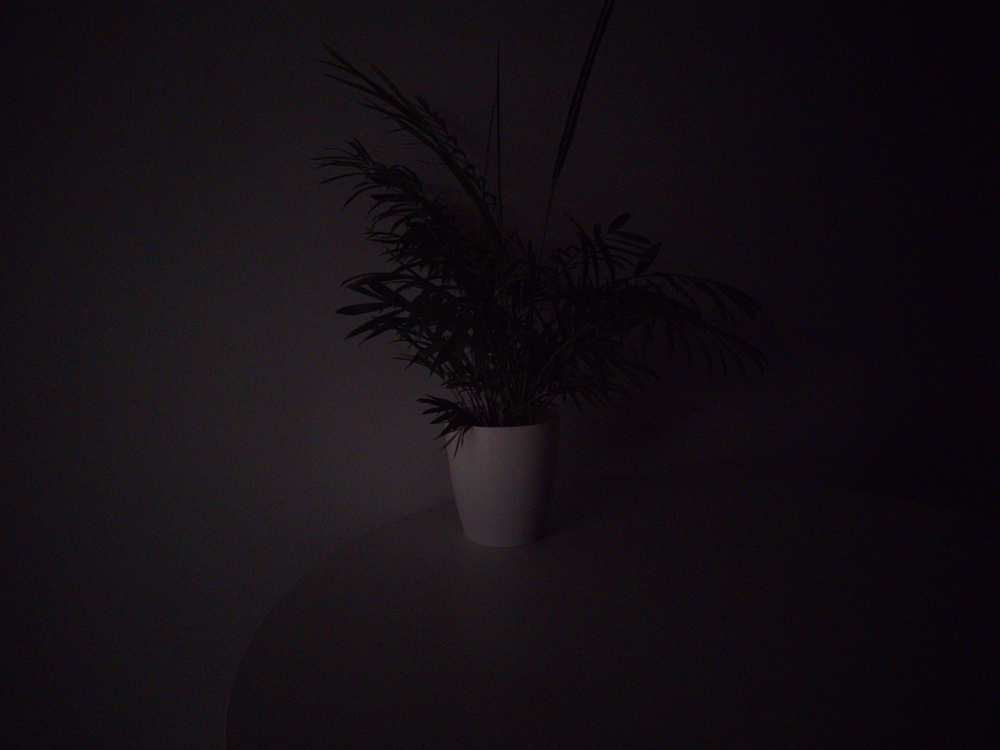
     

     

         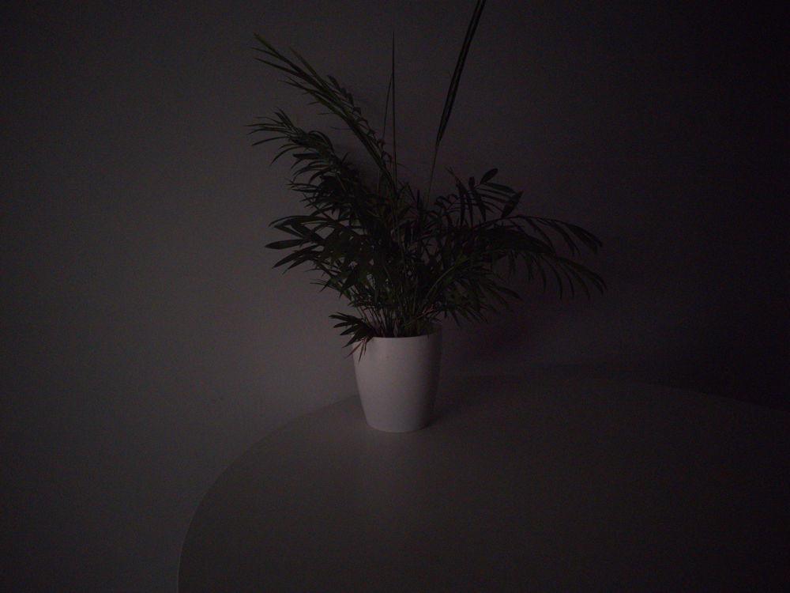
         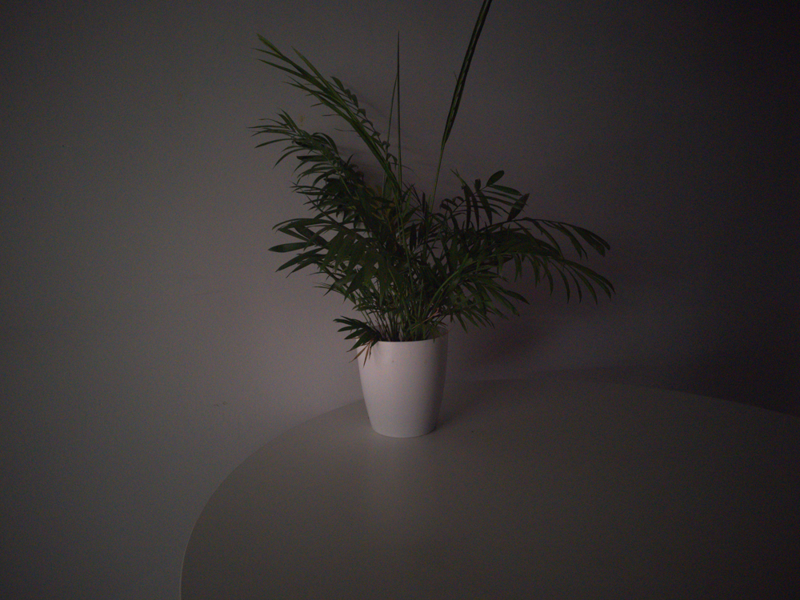
         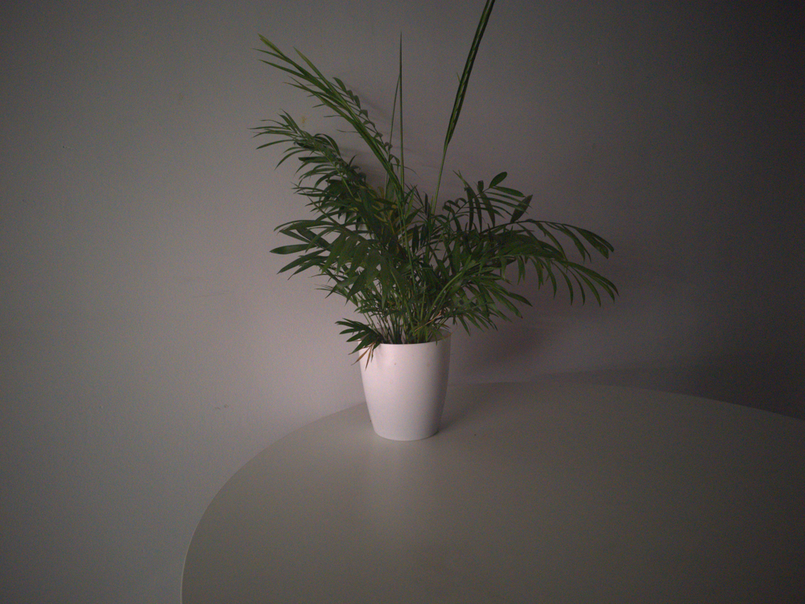
     

   - 室外椅子（处理结果在孙浩电脑上，这里只放raw预览图）

     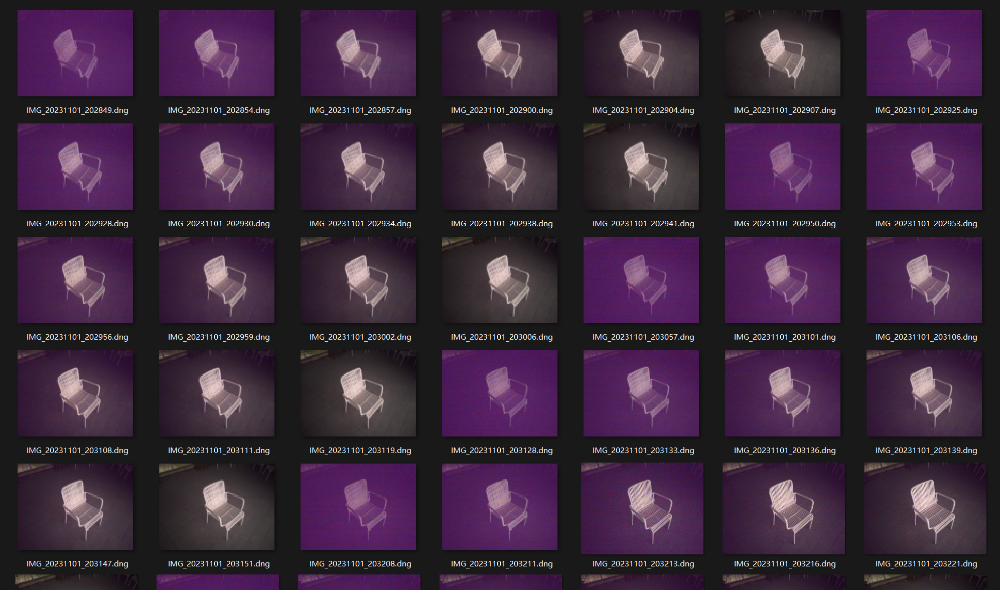

   - 室外草丛（处理结果在孙浩电脑上，这里只放raw预览图）

     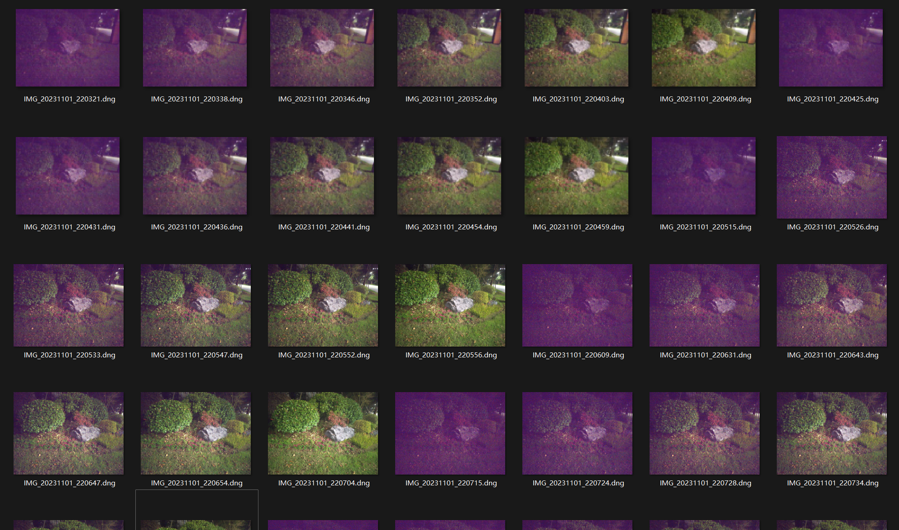

     