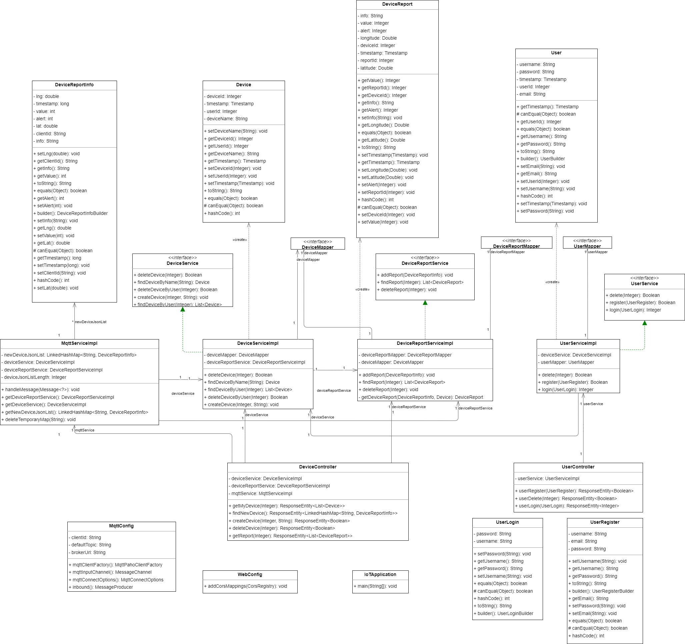
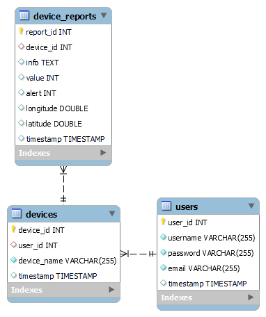
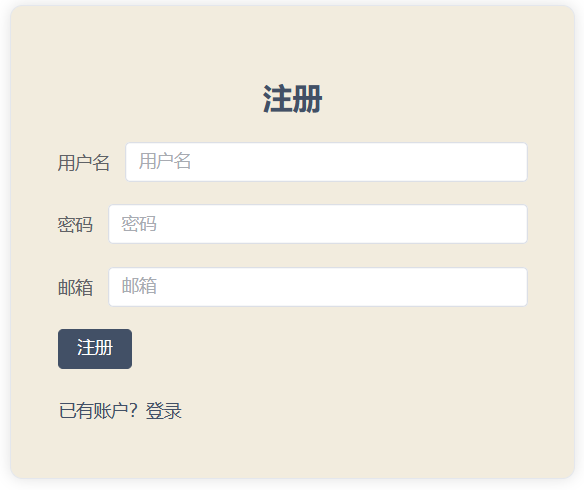
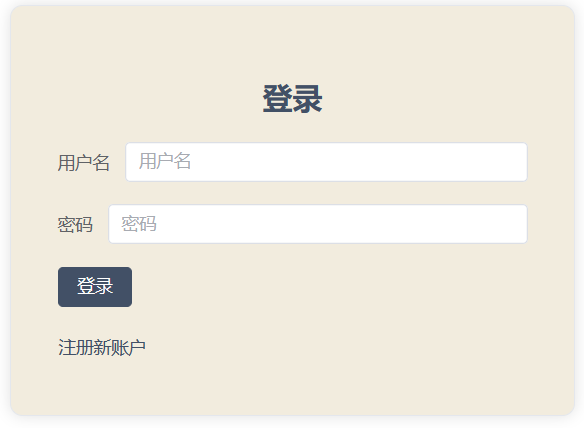
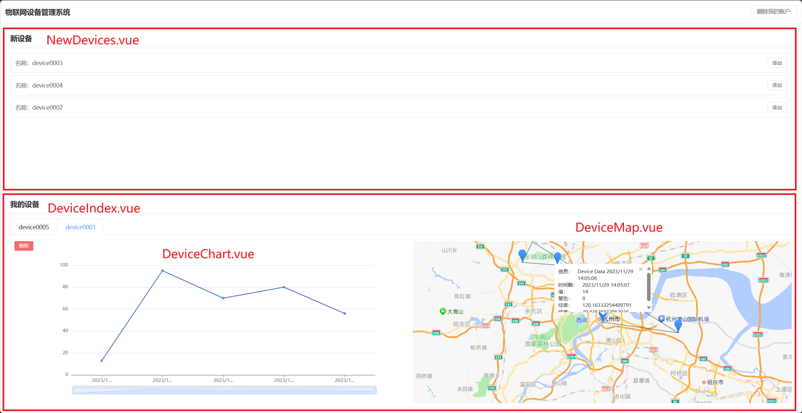
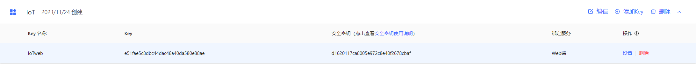

# 第五周周报


## 大致情况

1. 完成学校课程 BS 体系架构大作业：物联网设备管理平台，使用 docker 封装，完成设计文档、使用文档。


## 下周计划

1. 调研一篇关于点云渲染的论文。
2. 完成大作业演示视频。


## 详细情况

### 后端设计

#### 架构

根据 MVC 架构，项目后端主要分为 config、pojo、controller、service、mapper、entity 等层次。config 主要是一些配置文件，例如订阅的主题。pojo 定义了前端和后端、后端和 mqtt 服务器交互的数据格式。controller 负责总体的业务逻辑。service 负责的业务逻辑。mapper 和 entity 主要是为了定义和操作数据库。

后端项目目录如下：

```
.
├── IoTApplication.java
├── config
│   ├── MqttConfig.java
│   └── WebConfig.java
├── control
│   ├── DeviceController.java
│   └── UserController.java
├── entity
│   ├── Device.java
│   ├── DeviceReport.java
│   └── User.java
├── mapper
│   ├── DeviceMapper.java
│   ├── DeviceReportMapper.java
│   └── UserMapper.java
├── pojo
│   ├── DeviceReportInfo.java
│   ├── UserLogin.java
│   └── UserRegister.java
└── service
    ├── DeviceReportService.java
    ├── DeviceReportServiceImpl.java
    ├── DeviceService.java
    ├── DeviceServiceImpl.java
    ├── MqttServiceImpl.java
    ├── UserService.java
    └── UserServiceImpl.java
```

#### 类图



#### 数据库设计

ER图如下：



mysql创建语句如下：

```mysql
CREATE TABLE users
(
    user_id   INT AUTO_INCREMENT PRIMARY KEY,
    username  VARCHAR(255) UNIQUE NOT NULL,
    password  VARCHAR(255)        NOT NULL,
    email     VARCHAR(255) UNIQUE NOT NULL,
    timestamp TIMESTAMP DEFAULT CURRENT_TIMESTAMP
);

CREATE TABLE devices
(
    device_id   INT AUTO_INCREMENT PRIMARY KEY,
    user_id     INT,
    device_name VARCHAR(255) UNIQUE NOT NULL,
    timestamp   TIMESTAMP DEFAULT CURRENT_TIMESTAMP,
    FOREIGN KEY (user_id) REFERENCES users (user_id)
);

CREATE TABLE device_reports
(
    report_id INT AUTO_INCREMENT PRIMARY KEY,
    device_id INT,
    info      TEXT,
    value     INT,
    alert     INT,
    longitude double,
    latitude  double,
    timestamp TIMESTAMP DEFAULT CURRENT_TIMESTAMP,
    FOREIGN KEY (device_id) REFERENCES devices (device_id)
);
```

#### 用例

1. 用户注册

   接口：

   ```java
   @PostMapping("/register")
   public ResponseEntity<Boolean> userRegister(@RequestBody UserRegister userRegister) {
       Boolean success = userService.register(userRegister);
       return ResponseEntity.ok(success);
   }
   ```

   Post参数：

   ```java
   public class UserRegister {
       private String username;
       private String password;
       private String email;
   }
   ```

   返回：成功 / 失败。

2. 用户登录

   接口：

   ```java
   @PostMapping("/login")
   public ResponseEntity<Integer> userLogin(@RequestBody UserLogin userLogin) {
       Integer userId = userService.login(userLogin);
       return ResponseEntity.ok(userId);
   }
   ```

   Post参数：

   ```java
   public class UserLogin {
       private String username;
       private String password;
   }
   ```

   返回：user id（null即为登录失败）。

3. 用户查找新设备

   接口：

   ```java
   @RequestMapping("find_new_device")
   public ResponseEntity<LinkedHashMap<String, DeviceReportInfo>> findNewDevice() {
       return ResponseEntity.ok(mqttService.getNewDeviceJsonList());
   }
   ```

   返回：下列类的 LinkedHashMap。

   ```java
   public class DeviceReportInfo {
       //设备名称
       private String clientId;
       //上报信息
       private String info;
       //设备数据
       private int value;
       //是否告警，0-正常，1-告警
       private int alert;
       //设备位置，经度
       private double lng;
       //设备位置，纬度
       private double lat;
       //上报时间，ms
       private long timestamp;
   }
   ```

4. 用户添加新设备

   接口：

   ```java
   @RequestMapping("create_device")
   public ResponseEntity<Boolean> createDevice(@RequestParam(value = "user_id") Integer userId, @RequestParam(value = "device_name") String deviceName) {
       deviceService.createDevice(userId, deviceName);
       mqttService.deleteTemporaryMap(deviceName);
       return ResponseEntity.ok(Boolean.TRUE);
   }
   ```

   返回：成功 / 失败。

5. 用户查看自己已经添加的设备

   接口：

   ```java
   @RequestMapping("get_my_device")
   public ResponseEntity<List<Device>> getMyDevice(@RequestParam(value = "user_id") Integer userId) {
       List<Device> deviceList = deviceService.findDeviceByUser(userId);
       return ResponseEntity.ok(deviceList);
   }
   ```

   Get参数：user id。

   返回：下列类的List。

   ```java
   public class Device {
       private Integer deviceId;
       private Integer userId;
       private String deviceName;
       private Timestamp timestamp;
   }
   ```

6. 用户删除设备

   接口：

   ```java
   @RequestMapping("delete_device")
   public ResponseEntity<Boolean> deleteDevice(@RequestParam(value = "device_id") Integer deviceId) {
       Boolean result = deviceService.deleteDevice(deviceId);
       return ResponseEntity.ok(result);
   }
   ```

   Get参数：device id。

   返回：成功 / 失败。

7. 用户获取某个设备的报告列表

   接口：

   ```java
   @RequestMapping("get_report")
   public ResponseEntity<List<DeviceReport>> getReport(@RequestParam(value = "device_id") Integer deviceId) {
       List<DeviceReport> deviceReportList = deviceReportService.findReport(deviceId);
       return ResponseEntity.ok(deviceReportList);
   }
   ```

   Get参数：device id。

   返回：下列类的List。

   ```java
   public class DeviceReport {
       private Integer reportId;
       private Integer deviceId;
       private String info;
       private Integer value;
       private Integer alert;
       private Double longitude;
       private Double latitude;
       private Timestamp timestamp;
   }
   ```

8. 接受Mqtt订阅主题的消息

   接口：

   ```java
   @ServiceActivator(inputChannel = "mqttInputChannel")
   public void handleMessage(Message<?> message) {
       ...
   }
   ```

   说明：维护一个列表，每次有设备发送信息时，如果这个设备已经被登记了，那么将发送的信息添加进数据库，否则将这个设备的信息添加进列表。

   Mqtt消息格式示例：

   ```json
   {
       "alert":0,
       "clientId":"device0002",
       "info":"Device Data 2023/11/29 13:21:30",
       "lat":30.131670689582826,
       "lng":120.33948359489442,
       "timestamp":1701235290148,
       "value":49
   }
   ```


### 前端设计

前端采用 Vue，其结构目录如下：

```
.
├── DeviceReports.vue
├── DeviceTabs
│   ├── DeviceIndex.vue
│   └── components
│       ├── DeviceChart.vue
│       └── DeviceMap.vue
├── DevicesInfo.vue
├── MyDevices.vue
├── NewDevices.vue
├── UserLogin.vue
└── UserRegister.vue
```

#### 组件说明

UserRegister.vue 负责注册界面：



UserLogin.vue 负责登录界面：



DevicesInfo.vue 负责设备信息管理界面，该界面由两大组件构成，分别是发现新设备（NewDevices.vue）以及已经添加设备的信息展示（MyDevices.vue）。在 MyDevices.vue 中，会用标签选择已经添加的设备（DeviceIndex.vue），并且展示每个设备的折线图（DeviceChart.vue）和其在地图上的信息（DeviceMap.vue）：



#### 工具说明

整体界面使用 element-ui 制作；折线图使用 ECharts 制作；地图展示使用 vue-amap，接入的高德地图的 API。



