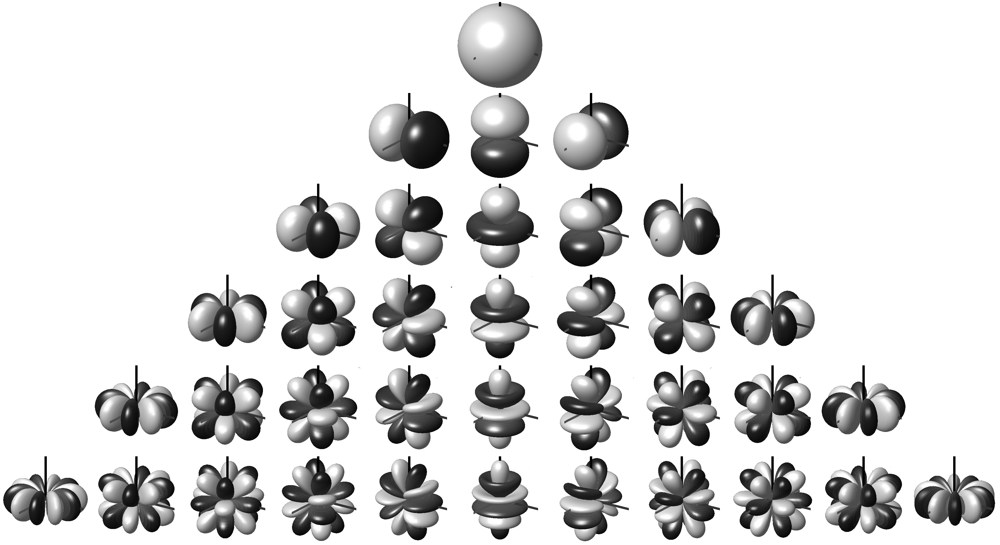

#  2023.11.27-2023.12.3

## 概述

1. 完成 3D Gaussian Splatting 中的数学推导。

## 下周计划

1. 3D Gaussian Splatting 论文梳理反思 ppt。
2. 调研论文 K-Planes: Explicit Radiance Fields in Space, Time, and Appearance。

## 详情

### 3D Gaussian Splatting 中的数学推导

#### Splatting（抛雪球算法）

抛雪球算法是一种用于体积渲染的技术，其使用 reconstruction kernels 来确定体素如何影响其周围空间。大致算法流程为：

1. 每个体素包含有关该点的信息，如颜色、不透明度和重建核等。
2. 视图投影：仿射变换从世界坐标系转到相机坐标系。
3. 透视投影：将每个体素映射到屏幕空间。
4. 对于每个体素，在屏幕空间生成一个 footprint，这是 reconstruction kernels 在屏幕上的投影。footprint 描述了体素对周围像素的影响。
5. 计算每个体素的重构核足迹与其他体素足迹的重叠部分。这涉及对足迹中的像素值进行积分，以确定最终像素的颜色和不透明度。
6. 将所有体素的影响合并起来，创建最终的渲染图像。这包括颜色和不透明度的混合。

#### 3D 高斯

- 一维高斯分布的 PDF：
  $$
  \begin{flalign}
  & x\thicksim \mathcal{N}(\mu,\sigma^2)\\
  & p(x)=\frac{1}{\sigma\sqrt{2\pi}}\exp(-\frac{(x-\mu)^2}{2\sigma^2})
  \end{flalign}
  $$

- 对于三维向量 $v=[a,b,c]^T\ a,b,c\thicksim\mathcal{N}(0,1)$，那么：
  $$
  \begin{flalign}
  & p(v)=p(a)p(b)p(c)=\\
  & \frac{1}{(2\pi)^{3/2}}\exp(-\frac{a^2+b^2+c^2}{2})=\frac{1}{(2\pi)^{3/2}}\exp(-\frac{1}{2}v^Tv)
  \end{flalign}
  $$

- 对于任意的可能互相不独立的、均值不一定为 0、方差不一定为 1 的三维向量 $x=[x,y,z]^T$，我们通过一个线性变换将其变换到 $v$：
  $$
  \begin{flalign}
  & v=A(x-\mu)\\
  & p(v)=\frac{1}{(2\pi)^{3/2}}\exp(-\frac{1}{2}v^Tv)=\frac{1}{(2\pi)^{3/2}}\exp(-\frac{1}{2}(x-\mu)^TA^TA(x-\mu))\\
  & 1=\int\int\int_{-\infty}^{+\infty}\frac{1}{(2\pi)^{3/2}}\exp(-\frac{1}{2}(x-\mu)^TA^TA(x-\mu))dv\\
  & \because dv = d(A(x-\mu))=dAx=|A|dx\\
  & \therefore 1=\int\int\int_{-\infty}^{+\infty}\frac{|A|}{(2\pi)^{3/2}}\exp(-\frac{1}{2}(x-\mu)^TA^TA(x-\mu))dx\\
  & \therefore p(x)=\frac{|A|}{(2\pi)^{3/2}}\exp(-\frac{1}{2}(x-\mu)^TA^TA(x-\mu))\\
  \end{flalign}
  $$

- 计算投影矩阵 $A$，记 $x$ 的协方差矩阵为 $\Sigma$，因为协方差矩阵是半正定的，因此有：
  $$
  \begin{align}
  & \Sigma x=\lambda x\\
  & \Sigma U=U\Lambda\\
  & \because\text{实对称矩阵的特征向量是正交的}\\
  & \therefore U^{-1}=U^T\\
  & \therefore \Sigma=U\Lambda U^T=U\Lambda^{1/2}(U\Lambda^{1/2})^T
  \end{align}
  $$
  其中 $U$ 是特征向量矩阵，列相互正交并且 $UU^T=I$，$\Lambda$ 是特征根矩阵。令：

$$
  A=\Lambda^{-1/2}U^T=(U\Lambda^{-1/2})^T
$$
  那么 $A$ 的行向量之间相互正交，并且：
$$
  \begin{align}
  & \Sigma^{-1}=U\Lambda^{-1/2}(U\Lambda^{-1/2})^T=A^TA\\
  & |\Sigma^{-1}|=\frac{1}{|\Sigma|}=|A^T||A|=|A|^2\\
  & \therefore p(x)=\frac{1}{|\Sigma|^{1/2}(2\pi)^{3/2}}\exp(-\frac{1}{2}(x-\mu)^T\Sigma^{-1}(x-\mu))\\
  \end{align}
$$

- **为什么形状是一个椭球**：
  $$
  \begin{flalign}
  & \Delta=(x-\mu)^T\Sigma^{-1}(x-\mu)\\
  & =(x-\mu)^T(U\Lambda U^T)^{-1}(x-\mu)\\
  & =(x-\mu)^T(
  \left[
  \begin{array}{cc}
  u_1\lambda_1 & u_2\lambda_2 & \cdots & u_n\lambda_n
  \end{array}
  \right]
  \left[
  \begin{array}{cc}
  u_1^T\\
  u_2^T\\
  \vdots\\
  u_n^T
  \end{array}
  \right]
  )^{-1}(x-\mu)\\
  & =(x-\mu)^T\sum u_i\frac{1}{\lambda_i}u_i^T(x-\mu)\\
  & =\sum (x-\mu)^Tu_i\frac{1}{\lambda_i}u_i^T(x-\mu)\\
  & =\sum y_i\frac{1}{\lambda_i} y_i^T\\
  \end{flalign}
  $$

  因为 $\Sigma$ 是半正定的，并且一般都是正定的，所以特征值$\lambda_i$都是正数。

  因此结果出来是椭球的表达式。并且协方差矩阵的特征向量是椭球轴的方向，特征值衡量了椭球在这个方向上的拉伸。

- 如何初始化这个协方差矩阵 $\Sigma$：

  **因为 $\Sigma$ 是一个半正定的实对称矩阵，因此不能直接随机初始化一个 $3\times 3$ 矩阵**，考虑到椭球的特性，其实 $A(x-\mu)$ 想把坐标系从椭球的局部坐标系转到世界坐标系，因此 $A$ 可以变成先做一个旋转，然后再做一个拉伸：
  $$
  \begin{align}
  & A=S'R'\\
  & \Sigma=(A^TA)^{-1}=R'^{-1}S'^{-1}(S'^{-1})^T(R'^{-1})^T\\
  \end{align}
  $$
  因为缩放矩阵的逆也是缩放矩阵，渲染矩阵的逆也是旋转矩阵，因此 $\Sigma$ 可以写为：
  $$
  \Sigma=RSS^TR^T
  $$
  其中缩放矩阵可以用一个三维数组表示，旋转矩阵可以用一个四元数表示：
  $$
  (\cos(\frac{\theta}{2})+\sin(\frac{\theta}{2})(ai+bj+ck))\times\\(xi+yj+zk)\times\\(\cos(\frac{\theta}{2})-\sin(\frac{\theta}{2})(ai+bj+ck))
  $$

- **高斯分布的性质**

  根据上述，多元高斯函数可以写为：
  $$
  \mathcal{G}^{(n)}_{\mu,\Sigma}(x)=\frac{1}{|\Sigma|^{1/2}(2\pi)^{n/2}}\exp(-\frac{1}{2}(x-\mu)^T\Sigma^{-1}(x-\mu))
  $$

  - **高斯函数和高斯函数的卷积还是高斯函数**

    计算高斯函数的傅里叶变换：
    $$
    \begin{align}
    & \mathcal{F}[\mathcal{G}^{(n)}_{\mu,\Sigma}(x)]=\frac{1}{|\Sigma|^{1/2}(2\pi)^{n/2}}\int_{-\infty}^{+\infty}\mathrm{e}^{-\frac{1}{2}(x-\mu)^T\Sigma^{-1}(x-\mu)}\mathrm{e}^{-jx^Tw}dx\\
    & =\frac{1}{|\Sigma|^{1/2}(2\pi)^{n/2}}\int_{-\infty}^{+\infty}\mathrm{e}^{-\frac{1}{2}(x-\mu)^TA^TA(x-\mu)}\mathrm{e}^{-jx^Tw}dx\\
    & \text{denote } y=A(x-\mu)\text{ then}\\
    & \mathcal{F}[\mathcal{G}^{(n)}_{\mu,\Sigma}(x)]=\frac{1}{|\Sigma|^{1/2}(2\pi)^{n/2}}\int_{-\infty}^{+\infty}\mathrm{e}^{-\frac{1}{2}y^Ty}\mathrm{e}^{-j(A^{-1}y+\mu)^Tw}dx\\
    & =\frac{1}{|\Sigma|^{1/2}(2\pi)^{n/2}}\int_{-\infty}^{+\infty}\mathrm{e}^{-\frac{1}{2}y^Ty}\mathrm{e}^{-j(A^{-1}y+\mu)^Tw}dx\\
    & =\frac{1}{|\Sigma|^{1/2}(2\pi)^{n/2}}\mathrm{e}^{-j\mu^Tw}\int_{-\infty}^{+\infty}\mathrm{e}^{-\frac{1}{2}y^Ty-jy^T{A^{-1}}^Tw}dx\\
    \end{align}
    $$
    注意到：
    $$
    \begin{align}
    & -\frac{1}{2}(y+j{A^{-1}}^Tw)^T(y+j{A^{-1}}^Tw)\\
    & =-\frac{1}{2}(y^Ty+jy^T{A^{-1}}^Tw+jw^TA^{-1}y-w^TA^{-1}{A^{-1}}^Tw)\\
    & =-\frac{1}{2}y^Ty-jy^T{A^{-1}}^Tw+\frac{1}{2}w^TA^{-1}{A^{-1}}^Tw\\
    \end{align}
    $$
    因此傅里叶变换可以更改为：
    $$
    \begin{align}
    & \mathcal{F}[\mathcal{G}^{(n)}_{\mu,\Sigma}(x)]=\\
    & \frac{1}{|\Sigma|^{1/2}(2\pi)^{n/2}}\mathrm{e}^{-j\mu^Tw}\mathrm{e}^{-\frac{1}{2}w^TA^{-1}{A^{-1}}^Tw}\int_{-\infty}^{+\infty}\mathrm{e}^{-\frac{1}{2}(y+j{A^{-1}}^Tw)^T(y+j{A^{-1}}^Tw)}\mathrm{d}x\\
    & \because \mathrm{d}y=\mathrm{d}A(x-\mu)=|A|\mathrm{d}x\\
    & \therefore \mathrm{d}x=\frac{1}{|A|}\mathrm{d}y=|\Sigma|^{1/2}\mathrm{d}y\\
    & \therefore \mathcal{F}[\mathcal{G}^{(n)}_{\mu,\Sigma}(x)]=\\
    & \frac{1}{(2\pi)^{n/2}}\mathrm{e}^{-j\mu^Tw}\mathrm{e}^{-\frac{1}{2}w^TA^{-1}{A^{-1}}^Tw}\int_{-\infty}^{+\infty}\mathrm{e}^{-\frac{1}{2}(y+j{A^{-1}}^Tw)^T(y+j{A^{-1}}^Tw)}\mathrm{d}y\\
    & \text{denote } z=y+j{A^{-1}}^Tw\text{ then}\\
    & \mathcal{F}[\mathcal{G}^{(n)}_{\mu,\Sigma}(x)]=\frac{1}{(2\pi)^{n/2}}\mathrm{e}^{-j\mu^Tw}\mathrm{e}^{-\frac{1}{2}w^TA^{-1}{A^{-1}}^Tw}\int_{-\infty}^{+\infty}\mathrm{e}^{-\frac{1}{2}z^Tz}\mathrm{d}z\\
    \end{align}
    $$
    对于积分 $\int_{-\infty}^{+\infty}\mathrm{e}^{-\frac{1}{2}z^Tz}\mathrm{d}z$：
    $$
    \begin{align}
    & \text{denote }\int_{-\infty}^{+\infty}\mathrm{e}^{-x^2}\mathrm{d}x=I\\
    & I^2=\int_{-\infty}^{+\infty}\mathrm{e}^{-x^2}\mathrm{d}x\int_{-\infty}^{+\infty}\mathrm{e}^{-x^2}\mathrm{d}x\\
    & =\int_{-\infty}^{+\infty}\mathrm{e}^{-x^2}\mathrm{d}x\int_{-\infty}^{+\infty}\mathrm{e}^{-y^2}\mathrm{d}y\\
    & =\int_{-\infty}^{+\infty}\int_{-\infty}^{+\infty}\mathrm{e}^{-(x^2+y^2)}\mathrm{d}x\mathrm{d}y\\
    & =\int_{0}^{2\pi}\mathrm{d}\theta\int_{0}^{+\infty}\mathrm{e}^{-r^2}r\mathrm{d}r\\
    & =\pi\\
    & \therefore \int_{-\infty}^{+\infty}\mathrm{e}^{-x^2}\mathrm{d}x=\sqrt{\pi}\\
    & \therefore \int_{-\infty}^{+\infty}\mathrm{e}^{\frac{-x^2}{2}}\mathrm{d}x=\sqrt{2\pi}\\
    & \therefore \int_{-\infty}^{+\infty}\mathrm{e}^{-\frac{1}{2}(\sum_{i=1}^n x_i^2)}\mathrm{d}x_1\mathrm{d}x_2\cdots \mathrm{d}x_n=(\sqrt{2\pi})^n\\
    \end{align}
    $$
    因此我们有：
    $$
    \begin{align}
    & \mathcal{F}[\mathcal{G}^{(n)}_{\mu,\Sigma}(x)]=\frac{1}{(2\pi)^{n/2}}\mathrm{e}^{-j\mu^Tw}\mathrm{e}^{-\frac{1}{2}w^TA^{-1}{A^{-1}}^Tw}\int_{-\infty}^{+\infty}\mathrm{e}^{-\frac{1}{2}z^Tz}\mathrm{d}z\\
    & =\frac{1}{(2\pi)^{n/2}}\mathrm{e}^{-j\mu^Tw}\mathrm{e}^{-\frac{1}{2}w^TA^{-1}{A^{-1}}^Tw}\sqrt{2\pi}^n\\
    & =\mathrm{e}^{-j\mu^Tw}\mathrm{e}^{-\frac{1}{2}w^TA^{-1}{A^{-1}}^Tw}\\
    & =\mathrm{e}^{-\frac{1}{2}w^T\Sigma w-j\mu^Tw}\\
    \end{align}
    $$
    所以高斯函数的傅里叶变换仍然是一个高斯函数，并且协方差矩阵从 $\Sigma^{-1}$ 变成了 $\Sigma$，均值在虚轴上。

    因为时域上的卷积对应于频域上的乘积，所以：
    $$
    \begin{align}
    & \mathcal{G}^{(n)}_{\mu_1,\Sigma_1}(x)\ast \mathcal{G}^{(n)}_{\mu_2,\Sigma_2}(x)\\
    & =\mathcal{F}^{-1}[\mathrm{e}^{-\frac{1}{2}w^T\Sigma_1 w-j\mu_1^Tw}\cdot \mathrm{e}^{-\frac{1}{2}w^T\Sigma_2 w-j\mu_2^Tw}]\\
    & =\mathcal{G}^{(n)}_{\mu_1+\mu_2,\Sigma_1+\Sigma_2}(x)
    \end{align}
    $$

  - **高斯函数的仿射变换还是高斯函数**
    $$
    \begin{align}
    & \text{denote }\phi(x)=Mx+b\text{ then}\\
    & \mathcal{G}_{\mu,\Sigma}^{(n)}(x)=\frac{1}{|\Sigma|^{1/2}(2\pi)^{n/2}}\mathrm{e}^{-\frac{1}{2}(x-\mu)^T\Sigma^{-1}(x-\mu)}\\
    & =\frac{1}{|\Sigma|^{1/2}(2\pi)^{n/2}}\mathrm{e}^{-\frac{1}{2}(M^{-1}(\phi(x)-b)-\mu)^T\Sigma^{-1}(M^{-1}(\phi(x)-b)-\mu)}\\
    & =\frac{1}{|\Sigma|^{1/2}(2\pi)^{n/2}}\mathrm{e}^{-\frac{1}{2}[M^{-1}(\phi(x)-b-M\mu)]^T\Sigma^{-1}[M^{-1}(\phi(x)-b-M\mu)]}\\
    & =\frac{|M|}{|M|^{1/2}|\Sigma|^{1/2}|M|^{1/2}(2\pi)^{n/2}}\mathrm{e}^{-\frac{1}{2}(\phi(x)-b-M\mu)^T{M^{-1}}^T\Sigma^{-1}M^{-1}(\phi(x)-b-M\mu)}\\
    & =|M|\mathcal{G}_{\phi(\mu),M\Sigma M^T}^{(n)}(\phi(x))
    \end{align}
    $$

  - **多元高斯分布的边缘分布还是高斯分布**

    首先规定：
    $$
    \begin{align}
    & \text{for n-dimention vector } x^{(n)}=
    \left[
    \begin{array}{cc}
    x_1\\x_2\\\vdots \\x_n
    \end{array}
    \right]
    \text{, denote } x^{(n)}=
    \left[
    \begin{array}{cc}
    x^{(n-1)}\\x_n
    \end{array}
    \right]\\
    
    & \text{for the expectation } \mu^{(n)}=
    \left[
    \begin{array}{cc}
    \mu_1\\\mu_2\\\vdots \\\mu_n
    \end{array}
    \right]
    \text{, denote } \mu^{(n)}=
    \left[
    \begin{array}{cc}
    \mu^{(n-1)}\\\mu_n
    \end{array}
    \right]\\
    
    & \text{for the covariance matrix } \Sigma^{(n)}=
    \left[
    \begin{array}{cc}
    \sigma_{11} & \sigma_{12} & \cdots & \sigma_{1n}\\
    \sigma_{21} & \sigma_{22} & \cdots & \sigma_{2n}\\
    \vdots & \vdots & \ddots & \vdots\\
    \sigma_{n1} & \sigma_{n2} & \cdots & \sigma_{nn}
    \end{array}
    \right]\\
    & \text{, denote } \Sigma^{(n)}=
    \left[
    \begin{array}{cc}
    \Sigma_{11} & \Sigma_{12}\\
    \Sigma_{21} & \Sigma_{22}
    \end{array}
    \right]
    \text{ where $\Sigma_{11}$ is a $(n-1)\times(n-1)$ matrix}\\
    
    & \text{for positive definite symmetric matrix $\Sigma$, }\Sigma^{-1}=
    \left[
    \begin{array}{cc}
    A & B\\
    C & D
    \end{array}
    \right]
    \text{ where}\\
    & A = \Sigma_{11}^{-1} + \Sigma_{11}^{-1} \Sigma_{12} (\Sigma_{22} - \Sigma_{21} \Sigma_{11}^{-1} \Sigma_{12})^{-1} \Sigma_{21} \Sigma_{11}^{-1}\\
    & B = -\Sigma_{11}^{-1} \Sigma_{12} (\Sigma_{22} - \Sigma_{21} \Sigma_{11}^{-1} \Sigma_{21})^{-1}\\
    & C = -(\Sigma_{22} - \Sigma_{21} \Sigma_{11}^{-1} \Sigma_{12})^{-1} \Sigma_{21} \Sigma_{11}^{-1}\\
    & D = (\Sigma_{22} - \Sigma_{21} \Sigma_{11}^{-1} \Sigma_{12})^{-1}\\
    \end{align}
    $$
    于是积分可以表示为：
    $$
    \begin{align}
    & \int \mathcal{G}_{\mu,\Sigma}^{(n)}(x^{(n)})\mathrm{d}x_n\\
    & =\int \frac{1}{|\Sigma|^{1/2}(2\pi)^{n/2}}\mathrm{e}^{-\frac{1}{2}(x^{(n)}-\mu)^T\Sigma^{-1}(x^{(n)}-\mu)}\mathrm{d}x_n\\
    
    & =\int \frac{1}{|\Sigma|^{1/2}(2\pi)^{n/2}}\\
    & \exp{(-\frac{1}{2}
    \left[
    \begin{array}{cc}
    x^{(n-1)}-\mu^{(n-1)}\\x_n-\mu_n
    \end{array}
    \right]^T
    \left[
    \begin{array}{cc}
    \Sigma_{11} & \Sigma_{12}\\
    \Sigma_{21} & \Sigma_{22}
    \end{array}
    \right]^{-1}
    \left[
    \begin{array}{cc}
    x^{(n-1)}-\mu^{(n-1)}\\x_n-\mu_n
    \end{array}
    \right]
    )}\mathrm{d}x_n\\
    
    & =\frac{1}{|\Sigma|^{1/2}(2\pi)^{n/2}}\\
    & \int \exp{(-\frac{1}{2}
    \left[
    \begin{array}{cc}
    x^{(n-1)}-\mu^{(n-1)}\\x_n-\mu_n
    \end{array}
    \right]^T
    \left[
    \begin{array}{cc}
    A & B\\
    C & D
    \end{array}
    \right]
    \left[
    \begin{array}{cc}
    x^{(n-1)}-\mu^{(n-1)}\\x_n-\mu_n
    \end{array}
    \right]
    )}\mathrm{d}x_n\\
    
    & =\frac{1}{|\Sigma|^{1/2}(2\pi)^{n/2}}\\
    & \int \exp{(-\frac{1}{2}
    \left(
    \begin{array}{cc}
    (x^{(n-1)}-\mu^{(n-1)})^T A (x^{(n-1)}-\mu^{(n-1)}) -\\
    (x_n-\mu_n)^T C (x^{(n-1)}-\mu^{(n-1)}) +\\
    (x^{(n-1)}-\mu^{(n-1)})^T B (x_n-\mu_n) -\\
    (x_n-\mu_n)^T D (x_n-\mu_n)
    \end{array}
    \right)
    )}\mathrm{d}x_n\\
    
    & =\frac{1}{|\Sigma|^{1/2}(2\pi)^{n/2}}\exp(-\frac{1}{2}(x^{(n-1)}-\mu^{(n-1)})^T A (x^{(n-1)}-\mu^{(n-1)}))\\
    & \int \exp{(-\frac{1}{2}
    \left(
    \begin{array}{cc}
    -C (x^{(n-1)}-\mu^{(n-1)}) +\\
    (x^{(n-1)}-\mu^{(n-1)})^T B -\\
    (x_n-\mu_n)^T D
    \end{array}
    \right)(x_n-\mu_n)
    )}\mathrm{d}x_n\\
    
    & \text{let }T=-C (x^{(n-1)}-\mu^{(n-1)}) + (x^{(n-1)}-\mu^{(n-1)})^T B - (x_n-\mu_n)^T D\\
    & \therefore \int \mathcal{G}_{\mu,\Sigma}^{(n)}(x^{(n)})\mathrm{d}x_n=-\frac{2}{T}\exp(-\frac{1}{2}T(x_n-\mu_n))\cdot\\
    & \frac{1}{|\Sigma|^{1/2}(2\pi)^{n/2}}\exp(-\frac{1}{2}(x^{(n-1)}-\mu^{(n-1)})^T A (x^{(n-1)}-\mu^{(n-1)}))\\
    \end{align}
    $$

#### 透视投影

考虑相机坐标系的坐标 $t=(t_0,t_1,t_2)^T$，透视投影可以表示为：
$$
\begin{bmatrix}
x_0\\x_1\\x_2
\end{bmatrix}
=\phi(t)=
\begin{bmatrix}
t_0/t_2\\t_1/t_2\\||(t_0,t_1,t_2)||_2
\end{bmatrix}
$$
第三维用 $||(t_0,t_1,t_2)||_2$ 而不是 $t_2$ 的原因是这样做可以保证在不同方向的光线上和相机保持相同距离的物体在经过透视投影后依然在第三维度有相同的距离，这么做能更好的保持高斯重建核对周围像素影响的一致性。

然而，高斯椭球经过这种传统的 Projection 打到相机平面上后不再是一个二维高斯（椭圆），究其原因是因为透视投影不是一个仿射变换，那么高斯重建核的性质就被打破了。

对此，EWA Volume Splatting 提出 Local Affine Approximation（局部线性近似），即对于体素 $k$ 周边的空间，我们使用公式：
$$
\phi_k(t)=\phi_k(t_k)+J_k(t-t_k)
$$
来进行透视投影。这个公式相当于在体素 $k$ 的周围用泰勒展开来近似。其中 $t_k$ 是体素 $k$ 的位置，$J_k$ 是投影矩阵的 Jacobian 矩阵：
$$
J_k=
\begin{bmatrix}
\frac{\partial x_0}{\partial t_0} & \frac{\partial x_0}{\partial t_1} & \frac{\partial x_0}{\partial t_2} \\
\frac{\partial x_1}{\partial t_0} & \frac{\partial x_1}{\partial t_1} & \frac{\partial x_1}{\partial t_2} \\
\frac{\partial x_2}{\partial t_0} & \frac{\partial x_2}{\partial t_1} & \frac{\partial x_2}{\partial t_2} \\
\end{bmatrix}
=
\begin{bmatrix}
\frac{1}{t_{k,2}} & 0 & \frac{-t_{k,0}}{t_{k,2}^2}\\
0 & \frac{1}{t_{k,2}} & \frac{-t_{k,1}}{t_{k,2}^2}\\
\frac{t_{k,0}}{||t_k||} & \frac{t_{k,1}}{||t_k||} & \frac{t_{k,2}}{||t_k||}
\end{bmatrix}
$$
不妨设世界坐标系下某个坐标 $u$，经过 $\Phi$ 转到相机坐标系下 $t$，再经过 Local Affine Approximation 转到屏幕空间 $x$：
$$
\begin{align}
& t=\Phi(u)=Mu+b\\
& x=\phi_k(t)=\phi_k(t_k)+J_K(t-t_k)=\phi_k(t_k)+J_k(Mu+b-t_k)\\
& =J_kMu+\phi_k(t_k)+J_k(b-t_k)\\
& =m_k(u)
\end{align}
$$
之前推导过：
$$
\begin{align}
& \text{for }\phi(x)=Mx+b\text{ we have }\mathcal{G}_{\mu,\Sigma}^{(n)}(x)=|M|\mathcal{G}_{\phi(\mu),M\Sigma M^T}^{(n)}(\phi(x))
\end{align}
$$
因此原本的高斯重建核经过 View-Projection 视图转换有：
$$
\mathcal{G}_{\mu,\Sigma}^{(n)}(x)=|J_kM|\mathcal{G}_{m_k(u),J_kM\Sigma M^TJ_k^T}^{(n)}(m_k(x))
$$
均值从 $u$ 转变到 $J_kMu+\phi_k(t_k)+J_k(b-t_k)$，协方差矩阵从原来的 $\Sigma$ 转变到 $J_kM\Sigma M^TJ_k^T$。

然后计算高斯函数的边缘分布以及进行 alpha composition。

#### 球谐函数

球面谐波函数是一系列定义在球面上的二维基函数：

表达式为：
$$
\begin{align}
& y_l^m(\theta,\phi)=
\left \{
\begin{array}{lcl}
\sqrt{2}K_l^m\cos(m\phi)P_l^m(\cos\theta),&m\gt 0\\
\sqrt{2}K_l^m\sin(-m\phi)P_l^{-m}(\cos\theta),&m\lt 0\\
K_l^0P_l^0(\cos\theta),&m=0
\end{array}
\right.\\
& where\\
& P_l^m(x)=(-1)^m(1-x^2)^{m/2}\frac{d^m}{dx^m}(P_l(x))\\
& P_n(x)=\frac{1}{2^n\cdot n!}\frac{d^n}{dx^n}[(x^2-1)^n]\\
& K_l^m=\sqrt{\frac{(2l+1)}{4\pi}\frac{(l-|m|)!}{(l+|m|)!}}
\end{align}
$$
性质：

1. 正交性，一个基函数在另一个基函数上投影是 0，投影到自己结果是 1。

2. 前 $n$ 阶基函数个数为 $n^2$。

3. 如果我们有旋转操作 $R$，那么如果我们有一个定义在单位球面上的原函数 $f(s)$，假设旋转之后是 $g(s)$，那么：
   $$
   \begin{align}
   & g(s)=R(f(s))\\
   & g(s)=f(R(s))
   \end{align}
   $$
   这条性质的作用在于，当环境光旋转（或者模型旋转）的时候，通过简单地将矩阵变换作用在球谐系数上就可以获得新的环境光的球谐系数。

4. 假设两个球面函数 $a(s)$ 和 $b(s)$ 的乘积是 $c(s)$，那么 $c(s)$ 的球谐系数 $c_i$ 可以看作是 $b_i$ 经过变换 $\hat{a}$ 后的值：
   $$
   \begin{align}
   & c_i=\int c(s)y_i(s)ds\\
   & =\int a(s)[\Sigma_jb_jy_j(s)]y_i(s)ds\\
   & =\Sigma_jb_j\int a(s)y_j(s)y_i(s)ds\\
   & =\Sigma_jb_j\int [\Sigma_ka_ky_k(s)]y_j(s)y_i(s)ds\\
   & =\Sigma_j\Sigma_kb_ja_k\int y_k(s)y_j(s)y_i(s)ds\\
   & =\Sigma_j(\Sigma_ka_k\int y_k(s)y_j(s)y_i(s)ds)b_j\\
   & =\Sigma_j\ \widehat{a_ij}\ b_j
   \end{align}
   $$

对于任何一个球面函数 $f(x)$，我们可以用球谐函数的线性组合来表示：
$$
f(x)=\Sigma c_iB_i(x)
$$
求 $c_i$ 系数也很简单（可以看作求投影）：
$$
c_i=\int f(x)B_i(x) dx
$$
在恢复的时候，可以保留低频部分，舍去高频部分来近似。

