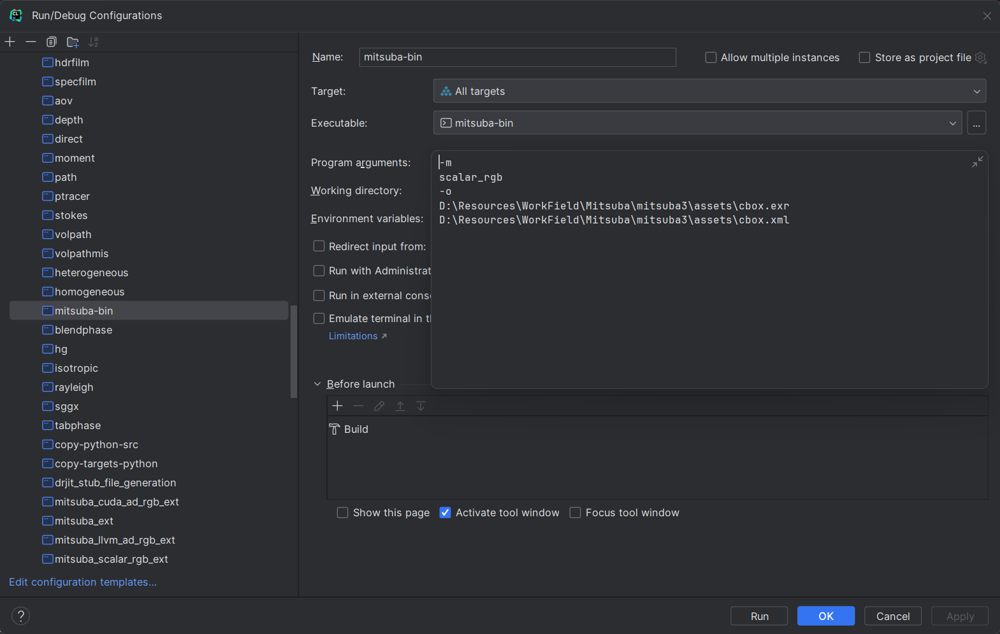
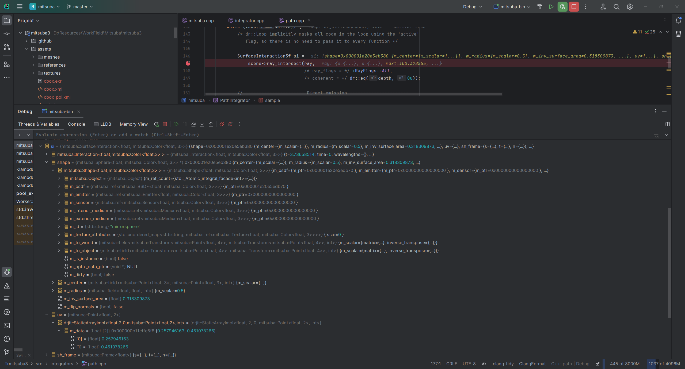

# 第四周周报

## 概述

1. 调研论文 Fantasia3D。
2. 通过打断点找到 mitsuba 中光线相交处的信息。
3. NeRF数据集拍摄，对比试验的完成。

## 下周计划

1. 了解 mitsuba wavefront 实现机制，尝试着写 buffer。

## 详细情况

1. 调研论文 Fantasia3D。

   见[Weekly-Report/总-调研报告汇总/Fantasia3D 调研_11.11 at main · Aixm-Lab/Weekly-Report (github.com)](https://github.com/Aixm-Lab/Weekly-Report/tree/main/总-调研报告汇总/Fantasia3D 调研_11.11)

2. 通过打断点找到 mitsuba 中光线相交处的信息。

   configuration 配置如下：

   

   在 Path Integrator 中的 sample 函数打断点，其中 si 包含了光线的方向、打到的物体id、uv 坐标等信息。

   

3. NeRF数据集拍摄，对比试验的完成。

   略