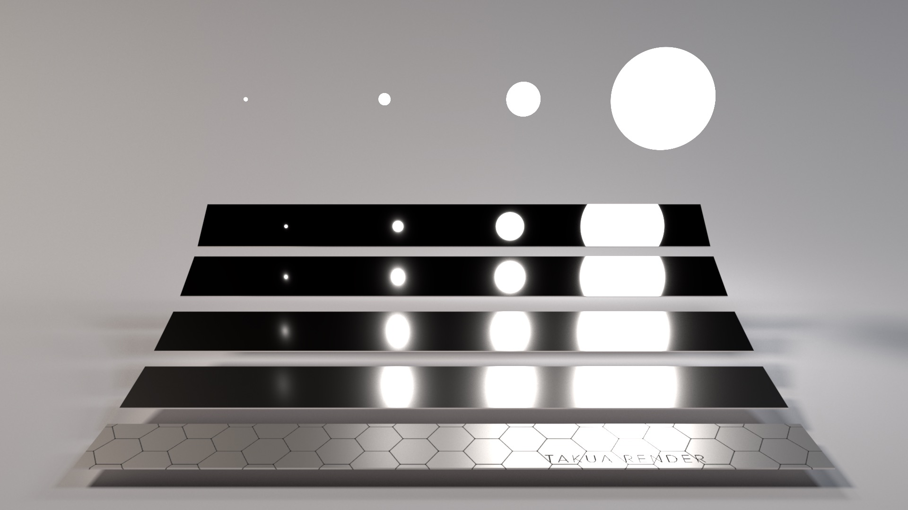

# 第八周周报


[TOC]


本周主要看了 Mitsuba 中路径追踪的具体实现，没有看完，细节如下：

## Mitsuba 中路径追踪的具体实现


### 理论


#### 多重重要性采样

很多时候只使用一种采样方法并不能让画面较快地收敛，例如以下场景：



场景中有四个球形光源，最左面的光源最小也有最大的光强，最右面的光源最大也有最小的光强。场景中的五个金属条由上到下粗糙度依次增加。在这个场景下，用任何采样方式进行采样都结果收敛得都很慢。

使用 bsdf 的 64spp 结果如下。bsdf 重要性采样对于光滑的金属条来说效率较高。因为光滑物体 bsdf lobe 很小，采样范围很小。在这种情况下，要么光源对其没有贡献，我们看到的是黑色，要么光源对其贡献很大，而我们很容易就采样到贡献大的方向；而对于较粗糙的金属条来说，bsdf lobe 很大，采样范围很大，很难恰好生成出打到光源的方向，方差就大，所以下方金属条噪点就多。


使用对光源采样结果如下。对于较粗糙的金属条来说，因为不再用 bsdf lobe 作为生成采样的范围，只根据光源生成采样方向，这样效率就高，所以下方金属条噪点就少；对于光滑的金属条来说，bsdf lobe 很小，而根据光源生成采样方向的话，很多采样方向都不在 bsdf lobe 范围内，效率就低，所以上方金属条噪点就多。


多重重要性采样允许我们把多种不同的采样方法结合起来，其仍然是蒙特卡洛采样方法，只是对每种采样方法都乘上一个权重 $w_i$，预测结果仍然是无偏的。假设有 $m$ 种采样方法，并且每种分布采样 $n_i$ 次，结果为：
$$
\sum_{i=1}^m\frac{1}{n_i}\sum_{j=1}^{n_i}w_i(X_{i,j})\frac{f(X_{i,j})}{p_i(X_{i,j})}
$$
为了满足无偏性，$w_i$ 应该满足：
$$
\begin{align}
& \forall x\quad\sum_{j=1}^mw_j(x)=1\\
& p_j(x)=0\rightarrow w_j(x)=0\\
& \text{$\therefore$ $w_i$ can be defined as } w_i(x)=\frac{[n_ip_i(x)]^\beta}{\sum_j^m[n_jp_j(x)]^\beta}
\end{align}
$$
多重重要性采样的结果为：


#### Path Tracing 递归转循环

BSDF 方程为：
$$
L_o(p,w_o)=L_e(p,w_o)+\int_\Omega f_s(p,w_i,w_o)L_i(p,w_i)(n\cdot w_i)dw_i
$$
采用蒙特卡洛积分：
$$
\begin{align}
& L_o(p,w_o)=L_e(p,w_o)+\sum_{j=0}^N\frac{f_s(p,w_{ij},w_o)L_i(p,w_{ij})(n\cdot w_{ij})}{\mathrm{pdf}(w_{ij})}
\end{align}
$$
对于 delta 分布的表面仅会对 bsdf 采样一个 lobe：
$$
\begin{align}
& L_o(p,w_o)=L_e(p,w_o)+\frac{f_s(p,w_i,w_o)L_i(p,w_i)(n\cdot w_i)}{\mathrm{pdf_{BSDF}}(w_i)}
\end{align}
$$
对于 diffuse 或者 glossy 的表面除了对 bsdf 采样外，还会对光源采一次样：
$$
\begin{align}
& L_o(p,w_o)=L_e(p,w_o)+\frac{f_s(p,w_i,w_o)L_i(p,w_i)(n\cdot w_i)}{\mathrm{pdf_{BSDF}}(w_i)}\cdot w_{\mathrm{MIS_{BSDF}}}\\
& +\frac{f_s(p,w_{il},w_o)L_e(p_l,w_{il})(n\cdot w_{il})}{\mathrm{pdf_{light}}(w_{il})}\cdot w_{\mathrm{MIS_{light}}}\\
\end{align}
$$
转换为循环就是每一次迭代：
$$
\begin{align}
& \text{throughput}=\text{throughput}\times\frac{f_s(p,w_i,w_o)(n\cdot w_i)}{\mathrm{pdf_{BSDF}}(w_i)}\\
\end{align}
$$


```pseudocode
function PathTracing(scene, sampler, initial_ray, max_depth)
    ray = initial_ray
    throughput = 1.0
    result = 0.0
    depth = 0

    while depth < max_depth
        si = scene.Intersect(ray)

        if si.HitEmitter()
            result += throughput * EmitterContribution(si)

        if depth + 1 == max_depth or si is invalid
            break

        (ds, em_weight) = scene.SampleEmitter(si, sampler)
        (bsdf_val, bsdf_pdf, bsdf_sample, bsdf_weight) = si.bsdf.EvalSample(si, ray.direction, sampler)

        if EmitterSampleValid(ds)
            result += throughput * bsdf_val * em_weight * MISWeight(ds, bsdf_pdf)

        throughput *= bsdf_weight
        ray = si.SpawnRay(bsdf_sample.direction)

        depth += 1
        if RussianRoulette(throughput, depth, sampler)
            break

    return result
```


### 代码细节


#### 初始化路径追踪循环的状态

```cpp
std::pair<Spectrum, Bool> sample(const Scene *scene,
                                 Sampler *sampler,
                                 const RayDifferential3f &ray_,
                                 const Medium * /* medium */,
                                 Float * /* aovs */,
                                 Bool active) const override {
    MI_MASKED_FUNCTION(ProfilerPhase::SamplingIntegratorSample, active);

    if (unlikely(m_max_depth == 0))
        return { 0.f, false };

    // --------------------- Configure loop state ----------------------

    Ray3f ray                     = Ray3f(ray_);
    Spectrum throughput           = 1.f;
    Spectrum result               = 0.f;
    Float eta                     = 1.f;
    UInt32 depth                  = 0;

    // If m_hide_emitters == false, the environment emitter will be visible
    Mask valid_ray                = !m_hide_emitters && dr::neq(scene->environment(), nullptr);

    // Variables caching information from the previous bounce
    Interaction3f prev_si         = dr::zeros<Interaction3f>();
    Float         prev_bsdf_pdf   = 1.f;
    Bool          prev_bsdf_delta = true;
    BSDFContext   bsdf_ctx;
```

- `Ray3f ray` 表示一个原始的光线。
- `Spectrum throughput 初始化第 n 次 bounce  radiance 需要乘上的系数。
- `Spectrum result 初始化渲染颜色。
- `Float eta` 初始化介质的相对折射率。
- `UInt32 depth` 初始化路径深度。
- `Mask valid_ray` 表示光线是否有效。


#### 设置 Dr.Jit 循环

```cpp
	/* Set up a Dr.Jit loop. This optimizes away to a normal loop in scalar
       mode, and it generates either a megakernel (default) or
       wavefront-style renderer in JIT variants. This can be controlled by
       passing the '-W' command line flag to the mitsuba binary or
       enabling/disabling the JitFlag.LoopRecord bit in Dr.Jit.
       The first argument identifies the loop by name, which is helpful for
       debugging. The subsequent list registers all variables that encode
       the loop state variables. This is crucial: omitting a variable may
       lead to undefined behavior. */
    dr::Loop<Bool> loop("Path Tracer", sampler, ray, throughput, result,
                        eta, depth, valid_ray, prev_si, prev_bsdf_pdf,
                        prev_bsdf_delta, active);

    /* Inform the loop about the maximum number of loop iterations.
       This accelerates wavefront-style rendering by avoiding costly
       synchronization points that check the 'active' flag. */
    loop.set_max_iterations(m_max_depth);

    while (loop(active)) {
        /* dr::Loop implicitly masks all code in the loop using the 'active'
               flag, so there is no need to pass it to every function */
```

- `dr::Loop<Bool> loop(...)` 一个 Dr.Jit 循环，用于优化路径追踪的计算。
- `while (loop(active)) { ... }` 是路径追踪的主循环。


#### 第 n 次 bounce 的光线和场景相交得到交点 `si`

```cpp
		SurfaceInteraction3f si =
            scene->ray_intersect(ray,
                                 /* ray_flags = */ +RayFlags::All,
                                 /* coherent = */ dr::eq(depth, 0u));
```


#### 处理 `si` 是发光体的情况

```cpp
		// ---------------------- Direct emission ----------------------

        /* dr::any_or() checks for active entries in the provided boolean
           array. JIT/Megakernel modes can't do this test efficiently as
           each Monte Carlo sample runs independently. In this case,
           dr::any_or<..>() returns the template argument (true) which means
           that the 'if' statement is always conservatively taken. */
        if (dr::any_or<true>(dr::neq(si.emitter(scene), nullptr))) {
            DirectionSample3f ds(scene, si, prev_si);
            Float em_pdf = 0.f;

            if (dr::any_or<true>(!prev_bsdf_delta))
                em_pdf = scene->pdf_emitter_direction(prev_si, ds,
                                                      !prev_bsdf_delta);

            // Compute MIS weight for emitter sample from previous bounce
            Float mis_bsdf = mis_weight(prev_bsdf_pdf, em_pdf);

            // Accumulate, being careful with polarization (see spec_fma a * b + c in src/emitter/area.cpp)
            result = spec_fma(
                throughput,
                ds.emitter->eval(si, prev_bsdf_pdf > 0.f) * mis_bsdf,
                result);
        }
```

光线打到发光体又有两种情况：

1. 上一个打到的交点表面是 delta 分布：

   那么此次发出的光线肯定是基于 bsdf 采样的，因此对于光源采样的 pdf 是 0，`mis_bsdf = 1`。

2. 上一个打到的交点表面不是 delta 分布：

   `mis_weight` 函数如下：

   ```cpp
   Float mis_weight(Float pdf_a, Float pdf_b) const {
           pdf_a *= pdf_a;
           pdf_b *= pdf_b;
           Float w = pdf_a / (pdf_a + pdf_b);
           return dr::detach<true>(dr::select(dr::isfinite(w), w, 0.f));
       }
   ```

   $$
   \text{mis\_bsdf}=\frac{\text{prev\_bsdf\_pdf}^2}{\text{prev\_bsdf\_pdf}^2+\text{em\_pdf}^2}
   $$

   因为上一个打到的交点表面不是 delta 分布，因此上一个交点除了会进行本轮路径追踪外，还会对光源进行采样（见后）。因此此处的光源贡献会乘上一个 `mis_bsdf`。


#### 决定是否继续追踪路径

```cpp
		// Continue tracing the path at this point?
        Bool active_next = (depth + 1 < m_max_depth) && si.is_valid();

        if (dr::none_or<false>(active_next))
            break; // early exit for scalar mode
```


#### 获取交点处的 BSDF

```cpp
		BSDFPtr bsdf = si.bsdf(ray);
```


#### 相交点处是 Smooth 的情况，会对光源进行采样并计算贡献：

```cpp
		// ---------------------- Emitter sampling ----------------------

        // Perform emitter sampling?
        Mask active_em = active_next && has_flag(bsdf->flags(), BSDFFlags::Smooth);

        DirectionSample3f ds = dr::zeros<DirectionSample3f>();
        Spectrum em_weight = dr::zeros<Spectrum>();
        Vector3f wo = dr::zeros<Vector3f>();

        if (dr::any_or<true>(active_em)) {
            // Sample the emitter
            std::tie(ds, em_weight) = scene->sample_emitter_direction(
                si, sampler->next_2d(), true, active_em);
            active_em &= dr::neq(ds.pdf, 0.f);

            /* Given the detached emitter sample, recompute its contribution
                   with AD to enable light source optimization. */
            if (dr::grad_enabled(si.p)) {
                ds.d = dr::normalize(ds.p - si.p);
                Spectrum em_val = scene->eval_emitter_direction(si, ds, active_em);
                em_weight = dr::select(dr::neq(ds.pdf, 0), em_val / ds.pdf, 0);
            }

            wo = si.to_local(ds.d);
        }
```

Mitsuba 中对于 flag 的定义如下：

```cpp
enum class BSDFFlags : uint32_t {
    Empty                = 0x00000,
    Null                 = 0x00001,
    DiffuseReflection    = 0x00002,
    DiffuseTransmission  = 0x00004,
    GlossyReflection     = 0x00008,
    GlossyTransmission   = 0x00010,
    DeltaReflection      = 0x00020,
    DeltaTransmission    = 0x00040,
    Delta1DReflection    = 0x00080,
    Delta1DTransmission  = 0x00100,
    Anisotropic          = 0x01000,
    SpatiallyVarying     = 0x02000,
    NonSymmetric         = 0x04000,
    FrontSide            = 0x08000,
    BackSide             = 0x10000,
    NeedsDifferentials   = 0x20000,
    Reflection   = DiffuseReflection | DeltaReflection |
                   Delta1DReflection | GlossyReflection,
    Transmission = DiffuseTransmission | DeltaTransmission |
                   Delta1DTransmission | GlossyTransmission | Null,
    Diffuse      = DiffuseReflection | DiffuseTransmission,
    Glossy       = GlossyReflection | GlossyTransmission,
    Smooth       = Diffuse | Glossy,
    Delta        = Null | DeltaReflection | DeltaTransmission,
    Delta1D      = Delta1DReflection | Delta1DTransmission,
    All          = Diffuse | Glossy | Delta | Delta1D
};
```

材质类型主要分为三类：Diffuse、Glossy、Delta，其中 Delta1D 是指那些只在一个方向上有响应的材料，这意味着它们的反射或透射是沿着某个特定的线或轴进行的。这可以用来模拟诸如细丝等表面结构，它们沿一个方向有镜面反射或透射，但在垂直于该方向的其他方向上则表现得不那么定向。

另外光线的传播方式还分为了反射（Reflection）和投射（Transmission）两种光线传播方式。

相交点处是 Diffuse 或者是 Glossy 时，采样光源并得到采样信息 `ds` 和权重 `em_weight`。`ds` 在 Mitsuba 中类型为 `DirectionSample3f`，包含 position、normal、uv、pdf、vector、dist 等参数，包含了采样的各种信息。

采样光源方法如下：

如果是多个光源，就随机选择一个光源；如果只有一个光源，就选择该光源；如果没有光源，`ds` 和 `weight` 均为 0。然后做遮挡测试，如果中间有遮挡，那么 `weight`  和 `ds.pdf` 均为 0。


#### BSDF 评估和采样

```cpp
// ------ Evaluate BSDF * cos(theta) and sample direction -------
        Float sample_1 = sampler->next_1d();
        Point2f sample_2 = sampler->next_2d();

        auto [bsdf_val, bsdf_pdf, bsdf_sample, bsdf_weight]
            = bsdf->eval_pdf_sample(bsdf_ctx, si, wo, sample_1, sample_2);
```

`auto [bsdf_val, bsdf_pdf, bsdf_sample, bsdf_weight] = bsdf->eval_pdf_sample(...);` 评估 BSDF 并采样新的方向。


#### 处理发光体采样的贡献

```cpp
		// --------------- Emitter sampling contribution ----------------

        if (dr::any_or<true>(active_em)) {
            bsdf_val = si.to_world_mueller(bsdf_val, -wo, si.wi);

            // Compute the MIS weight
            Float mis_em =
                dr::select(ds.delta, 1.f, mis_weight(ds.pdf, bsdf_pdf));

            // Accumulate, being careful with polarization (see spec_fma)
            result[active_em] = spec_fma(
                throughput, bsdf_val * em_weight * mis_em, result);
        }

		// ---------------------- BSDF sampling ----------------------

        bsdf_weight = si.to_world_mueller(bsdf_weight, -bsdf_sample.wo, si.wi);

        ray = si.spawn_ray(si.to_world(bsdf_sample.wo));

        /* When the path tracer is differentiated, we must be careful that
               the generated Monte Carlo samples are detached (i.e. don't track
               derivatives) to avoid bias resulting from the combination of moving
               samples and discontinuous visibility. We need to re-evaluate the
               BSDF differentiably with the detached sample in that case. */
        if (dr::grad_enabled(ray)) {
            ray = dr::detach<true>(ray);

            // Recompute 'wo' to propagate derivatives to cosine term
            Vector3f wo_2 = si.to_local(ray.d);
            auto [bsdf_val_2, bsdf_pdf_2] = bsdf->eval_pdf(bsdf_ctx, si, wo_2, active);
            bsdf_weight[bsdf_pdf_2 > 0.f] = bsdf_val_2 / dr::detach(bsdf_pdf_2);
        }
```

- `if (dr::any_or<true>(active_em)) { ... }` 计算发光体采样的贡献。


#### 更新路径状态

```cpp
		// ------ Update loop variables based on current interaction ------

        throughput *= bsdf_weight;
        eta *= bsdf_sample.eta;
        valid_ray |= active && si.is_valid() &&
            !has_flag(bsdf_sample.sampled_type, BSDFFlags::Null);

        // Information about the current vertex needed by the next iteration
        prev_si = si;
        prev_bsdf_pdf = bsdf_sample.pdf;
        prev_bsdf_delta = has_flag(bsdf_sample.sampled_type, BSDFFlags::Delta);
```


- `throughput *= bsdf_weight;` 更新吞吐量。
- `eta *= bsdf_sample.eta;` 更新介质的相对折射率。
- `valid_ray |= ...` 更新有效光线掩码。
- 更新其他路径状态变量。


#### 俄罗斯轮盘赌

```cpp
		// -------------------- Stopping criterion ---------------------

        dr::masked(depth, si.is_valid()) += 1;

        Float throughput_max = dr::max(unpolarized_spectrum(throughput));

        Float rr_prob = dr::minimum(throughput_max * dr::sqr(eta), .95f);
        Mask rr_active = depth >= m_rr_depth,
        rr_continue = sampler->next_1d() < rr_prob;
```

- `Float rr_prob = ...;` 计算俄罗斯轮盘赌的概率。
- `Mask rr_active = ...;` 判断是否进行俄罗斯轮盘赌。
- `throughput[rr_active] *= ...;` 应用俄罗斯轮盘赌。


#### 更新活动掩码

```cpp
		/* Differentiable variants of the renderer require the russian
               roulette sampling weight to be detached to avoid bias. This is a
               no-op in non-differentiable variants. */
        throughput[rr_active] *= dr::rcp(dr::detach(rr_prob));

        active = active_next && (!rr_active || rr_continue) &&
            dr::neq(throughput_max, 0.f);
    }
```

- `active = active_next && ...;` 更新活动掩码以决定是否继续追踪路径。


#### 返回结果

```cpp
    return {
        /* spec  = */ dr::select(valid_ray, result, 0.f),
        /* valid = */ valid_ray
    };
}
```

- `return { dr::select(valid_ray, result, 0.f), valid_ray };` 返回光谱结果和有效性掩码。


### Mitsuba 的入口以及分块

mitsuba.cpp 中 render 入口为：

```cpp
integrator->render(scene, (uint32_t) sensor_i,
                   0 /* seed */,
                   0 /* spp */,
                   false /* develop */,
                   true /* evaluate */);
```

其中 integrator 包装了多种渲染方式，path tracing 的 integrator 实现位于 src/integrators/path.cpp 中，类 PathInterestingrator 继承了 MonteCarloIntegrator，MonteCarloIntegrator 继承了 SamplingIntegrator，在 SamplingIntegrator 中实现了基类 Integrator 的 render 方法：

```cpp
MI_VARIANT typename SamplingIntegrator<Float, Spectrum>::TensorXf
SamplingIntegrator<Float, Spectrum>::render(Scene *scene,
                                            Sensor *sensor,
                                            uint32_t seed,
                                            uint32_t spp,
                                            bool develop,
                                            bool evaluate) {
    ScopedPhase sp(ProfilerPhase::Render);
    m_stop = false;

    // Render on a larger film if the 'high quality edges' feature is enabled
    Film *film = sensor->film();
    ScalarVector2u film_size = film->crop_size();
    if (film->sample_border())
        film_size += 2 * film->rfilter()->border_size();

    // Potentially adjust the number of samples per pixel if spp != 0
    Sampler *sampler = sensor->sampler();
    if (spp)
        sampler->set_sample_count(spp);
    spp = sampler->sample_count();

    uint32_t spp_per_pass = (m_samples_per_pass == (uint32_t) -1)
                                    ? spp
                                    : std::min(m_samples_per_pass, spp);

    if ((spp % spp_per_pass) != 0)
        Throw("sample_count (%d) must be a multiple of spp_per_pass (%d).",
              spp, spp_per_pass);

    uint32_t n_passes = spp / spp_per_pass;

    // Determine output channels and prepare the film with this information
    size_t n_channels = film->prepare(aov_names());

    // Start the render timer (used for timeouts & log messages)
    m_render_timer.reset();

    TensorXf result;
    if constexpr (!dr::is_jit_v<Float>) {
        // Render on the CPU using a spiral pattern
        uint32_t n_threads = (uint32_t) Thread::thread_count();

        Log(Info, "Starting render job (%ux%u, %u sample%s,%s %u thread%s)",
            film_size.x(), film_size.y(), spp, spp == 1 ? "" : "s",
            n_passes > 1 ? tfm::format(" %u passes,", n_passes) : "", n_threads,
            n_threads == 1 ? "" : "s");

        if (m_timeout > 0.f)
            Log(Info, "Timeout specified: %.2f seconds.", m_timeout);

        // If no block size was specified, find size that is good for parallelization
        uint32_t block_size = m_block_size;
        if (block_size == 0) {
            block_size = MI_BLOCK_SIZE; // 32x32
            while (true) {
                // Ensure that there is a block for every thread
                if (block_size == 1 || dr::prod((film_size + block_size - 1) /
                                                 block_size) >= n_threads)
                    break;
                block_size /= 2;
            }
        }

        Spiral spiral(film_size, film->crop_offset(), block_size, n_passes);

        std::mutex mutex;
        ref<ProgressReporter> progress;
        Logger* logger = mitsuba::Thread::thread()->logger();
        if (logger && Info >= logger->log_level())
            progress = new ProgressReporter("Rendering");

        // Total number of blocks to be handled, including multiple passes.
        uint32_t total_blocks = spiral.block_count() * n_passes,
                 blocks_done = 0;

        // Grain size for parallelization
        uint32_t grain_size = std::max(total_blocks / (4 * n_threads), 1u);

        // Avoid overlaps in RNG seeding RNG when a seed is manually specified
        seed *= dr::prod(film_size);

        ThreadEnvironment env;
        dr::parallel_for(
            dr::blocked_range<uint32_t>(0, total_blocks, grain_size),
            [&](const dr::blocked_range<uint32_t> &range) {
                ScopedSetThreadEnvironment set_env(env);
                // Fork a non-overlapping sampler for the current worker
                ref<Sampler> sampler = sensor->sampler()->fork();

                ref<ImageBlock> block = film->create_block(
                    ScalarVector2u(block_size) /* size */,
                    false /* normalize */,
                    true /* border */);

                std::unique_ptr<Float[]> aovs(new Float[n_channels]);

                // Render up to 'grain_size' image blocks
                for (uint32_t i = range.begin();
                     i != range.end() && !should_stop(); ++i) {
                    auto [offset, size, block_id] = spiral.next_block();
                    Assert(dr::prod(size) != 0);

                    if (film->sample_border())
                        offset -= film->rfilter()->border_size();

                    block->set_size(size);
                    block->set_offset(offset);

                    render_block(scene, sensor, sampler, block, aovs.get(),
                                 spp_per_pass, seed, block_id, block_size);

                    film->put_block(block);

                    /* Critical section: update progress bar */
                    if (progress) {
                        std::lock_guard<std::mutex> lock(mutex);
                        blocks_done++;
                        progress->update(blocks_done / (float) total_blocks);
                    }
                }
            }
        );

        if (develop)
            result = film->develop();
    } else {
        // render on GPU
        // ...
    }

    if (!m_stop && (evaluate || !dr::is_jit_v<Float>))
        Log(Info, "Rendering finished. (took %s)",
            util::time_string((float) m_render_timer.value(), true));

    return result;
}
```

render 方法中使用 dr::parallel_for 多线程渲染分块，在本台机器中（24 线程），渲染图像分辨率为 $256\times 256$，块大小为 $32\times 32$ 时，每次迭代每个线程处理一个块，处理完后返回任务池去处理仍未处理的块。

对于每个块的渲染，在 CPU 处理时其使用 render_block 函数，其中 `ImageBlock *block` 是需要渲染的块，渲染完后统一提交到 `Film *film` 中：

```cpp
MI_VARIANT void SamplingIntegrator<Float, Spectrum>::render_block(
    const Scene *scene,
    const Sensor *sensor,
    Sampler *sampler,
    ImageBlock *block,
    Float *aovs,
    uint32_t sample_count,
    uint32_t seed,
    uint32_t block_id,
    uint32_t block_size
) const {
    if constexpr (!dr::is_array_v<Float>) {
        uint32_t pixel_count = block_size * block_size;

        // Avoid overlaps in RNG seeding RNG when a seed is manually specified
        seed += block_id * pixel_count;

        // Scale down ray differentials when tracing multiple rays per pixel
        Float diff_scale_factor = dr::rsqrt((Float) sample_count);

        // Clear block (it's being reused)
        block->clear();

        for (uint32_t i = 0; i < pixel_count && !should_stop(); ++i) {
            sampler->seed(seed + i);

            Point2u pos = dr::morton_decode<Point2u>(i);
            if (dr::any(pos >= block->size()))
                continue;

            Point2f pos_f = Point2f(Point2i(pos) + block->offset());
            for (uint32_t j = 0; j < sample_count && !should_stop(); ++j) {
                render_sample(scene, sensor, sampler, block, aovs, pos_f,
                              diff_scale_factor);
                sampler->advance();
            }
        }
    } else {
        DRJIT_MARK_USED(scene);
        DRJIT_MARK_USED(sensor);
        DRJIT_MARK_USED(sampler);
        DRJIT_MARK_USED(block);
        DRJIT_MARK_USED(aovs);
        DRJIT_MARK_USED(sample_count);
        DRJIT_MARK_USED(seed);
        DRJIT_MARK_USED(block_id);
        DRJIT_MARK_USED(block_size);
        Throw("Not implemented for JIT arrays.");
    }
}
```

该方法对每个像素进行渲染，对于每个像素，他会采样 sample_count 次。每个像素的每个 sample 使用 render_sample 计算：

```cpp
MI_VARIANT void
SamplingIntegrator<Float, Spectrum>::render_sample(const Scene *scene,
                                                   const Sensor *sensor,
                                                   Sampler *sampler,
                                                   ImageBlock *block,
                                                   Float *aovs,
                                                   const Vector2f &pos,
                                                   ScalarFloat diff_scale_factor,
                                                   Mask active) const {
    const Film *film = sensor->film();
    const bool has_alpha = has_flag(film->flags(), FilmFlags::Alpha);
    const bool box_filter = film->rfilter()->is_box_filter();

    ScalarVector2f scale = 1.f / ScalarVector2f(film->crop_size()),
                   offset = -ScalarVector2f(film->crop_offset()) * scale;

    Vector2f sample_pos   = pos + sampler->next_2d(active),
             adjusted_pos = dr::fmadd(sample_pos, scale, offset);

    Point2f aperture_sample(.5f);
    if (sensor->needs_aperture_sample())
        aperture_sample = sampler->next_2d(active);

    Float time = sensor->shutter_open();
    if (sensor->shutter_open_time() > 0.f)
        time += sampler->next_1d(active) * sensor->shutter_open_time();

    Float wavelength_sample = 0.f;
    if constexpr (is_spectral_v<Spectrum>)
        wavelength_sample = sampler->next_1d(active);

    auto [ray, ray_weight] = sensor->sample_ray_differential(
        time, wavelength_sample, adjusted_pos, aperture_sample);

    if (ray.has_differentials)
        ray.scale_differential(diff_scale_factor);

    const Medium *medium = sensor->medium();

    auto [spec, valid] = sample(scene, sampler, ray, medium,
               aovs + (has_alpha ? 5 : 4) /* skip R,G,B,[A],W */, active);

    UnpolarizedSpectrum spec_u = unpolarized_spectrum(ray_weight * spec);

    if (unlikely(has_flag(film->flags(), FilmFlags::Special))) {
        film->prepare_sample(spec_u, ray.wavelengths, aovs,
                             /*weight*/ 1.f,
                             /*alpha */ dr::select(valid, Float(1.f), Float(0.f)),
                             valid);
    } else {
        Color3f rgb;
        if constexpr (is_spectral_v<Spectrum>)
            rgb = spectrum_to_srgb(spec_u, ray.wavelengths, active);
        else if constexpr (is_monochromatic_v<Spectrum>)
            rgb = spec_u.x();
        else
            rgb = spec_u;

        aovs[0] = rgb.x();
        aovs[1] = rgb.y();
        aovs[2] = rgb.z();

        if (likely(has_alpha)) {
            aovs[3] = dr::select(valid, Float(1.f), Float(0.f));
            aovs[4] = 1.f;
        } else {
            aovs[3] = 1.f;
        }
    }

    // With box filter, ignore random offset to prevent numerical instabilities
    block->put(box_filter ? pos : sample_pos, aovs, active);
}
```

render_sample 中调用 sample 方法计算颜色。
