# 第七周周报

## 学习概述

1. 看论文 3D Gaussian  Splatting。
2. 看论文 K-Planes。

## 下周计划

1. 继续完成毕设。

## 详情

### 3D Gaussian Splatting

#### 工作

高质量、低训练成本、实时渲染的三维重建。

它是用 Point 表征几何、基于 Splatting 方法进行渲染的三维重建。

#### 贡献

1. 在辐射场中引入 3D 高斯。（其实 EWA Volume Splatting 这篇论文已经钦定 3D 高斯作为重建核了，这应该并不是一个创新点）
2. 用球谐函数表征每个点的颜色。（像 Plenoxels 等论文都用过球谐函数来表征点，这其实也不是独创的）
3. 对点云密度的自适应优化以及对点云参数的优化。
4. 快速并且可微的渲染算法。

#### 大致思路

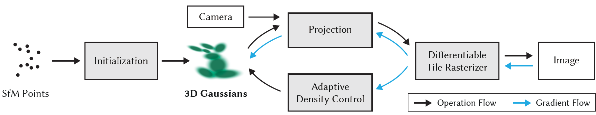

1. 录一段视频或者拍一组不同角度的照片，用 SfM 估计点云。
2. 点云中的每一个点代表着一个 3D 高斯，初始化均值，协方差，不透明度，颜色（用球谐系数表征）等参数。细节见[每个点的表征](#每个点的表征)。
3. 进行快速渲染算法，渲染出一张图像。细节见[快速渲染算法](#快速渲染算法)。
4. 和 ground truth 做损失，对每个点的位置、不透明度、协方差、球谐系数做优化，同时会添加或者删除一些点。细节见[优化算法](#优化算法)。

#### 细节

##### 每个点的表征

1. 3D 高斯的均值和协方差，具体推导见下：[3D 高斯](#3D 高斯) 以及 [局部线性近似的透视投影](#局部线性近似的透视投影)
   $$
   \mathcal{G}_{\mu,\Sigma}(x)\thicksim\exp(-\frac{1}{2}(x-\mu)^T\Sigma^{-1}(x-\mu))
   $$
   可以将 3D 高斯想象成一个个椭球，这里协方差矩阵 $\Sigma$ 控制了椭球的形状和朝向。

   这个 3D 高斯经过 View-Projection 变换后还是 3D 高斯。这个 3D 高斯沿着深度积分后是一个 2D 高斯。

2. 球谐函数，具体推导见下：[球谐函数](#球谐函数)

   球谐函数使得每个点的颜色为各向异性。根据一个点和相机位置的对应关系很容易得到该点在相机视角下的颜色。

##### 快速渲染算法

最基本的渲染公式见下：[基于点的渲染](#基于点的渲染)

这种算法的目标（优点）：

1. 快速。
2. 可微，并且能够梯度下降的点的数量不受限制。

正向渲染流程：

1. 将屏幕空间分为一个个 $16\times 16$ 的块（tiles）。
2. 挑选出每个 tile 的视锥包裹的 3D 高斯，并且舍去相机近平面附近的点以及太远的点。
3. 实例化每个高斯点，为每个实例分配 tile ID 以及 View Space Depth 作为 Key。
4. 使用 fast GPU Radix sort 对实例进行排序。
5. 根据排序结果和 tile ID，为每个 tile 生成一个列表，里面是每个 tile 从近到远需要 splat 的 3D 高斯。
6. 为每个 tile 开启一个线程块，首先每个线程块将需要 splat 的高斯点加载到共享内存中，然后对每个像素，顺序遍历列表并将高斯点一一抛射上去，同时累积不透明度。一旦不透明度达到 1，就停止对应像素的线程。当一个 tile 中所有像素的线程都停止了，那么停止对应 tile 的线程块。

反向传播流程：

1. 之前的方法是开一个动态大小的内存，每抛一个点往里面加一个点。这篇论文的做法是复用之前的列表：正向渲染时当不透明度饱和时记录最深点的 index，然后对每个 tile 从后往前遍历参与渲染的点。
2. 再次将这些点加载到共享内存。对于每个像素，反向传播那些对该像素的 alpha blending 有贡献的点。

#### 优化算法

1. 损失函数
   $$
   \mathcal{L}=(1-\lambda)\mathcal{L}_1+\lambda \mathcal{L}_{D-SSIM}\quad \lambda=0.2
   $$

2. 对参数的梯度下降

   对于不透明度以及颜色的反向传播是比较简单的。对于旋转缩放的反向传播见下：[梯度的反向传播](#梯度的反向传播)。

3. 自适应密度控制

   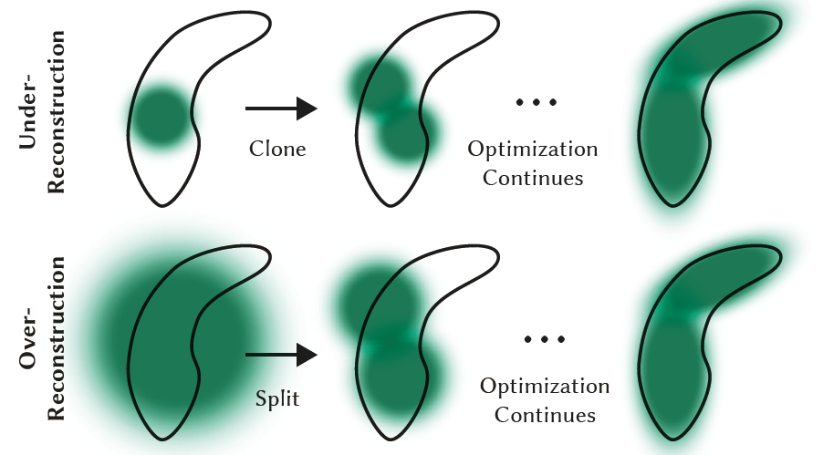

   - 每一百次迭代移除不透明度小于阈值的点。
   - 重建不充分的点往往有比较大的梯度，梯度大于阈值就要做 densify，这时候看这个点的协方差矩阵的特征值：
     - 如果特征值很大，说明 3D 高斯的粒度太大，需要 split。具体做法是首先确定是 scale 大小为原来的 $1/1.6$，然后用原来的 3D 高斯作为 PDF 来确定两个点的初始位置。
     - 如果特征值很小，说明 3D 高斯的粒度太小，需要 clone。具体做法是 position 梯度方向 clone 一个一模一样的点。
   - 每 3000 次迭代将不透明度重置为接近 0，这样可以有效抑制点数量的增长以及相机附近存在 floater 的现象。
   - 周期性地移除比较大的高斯点以避免重叠和点数量的快速增长。

#### 实验

##### 渲染效果对比

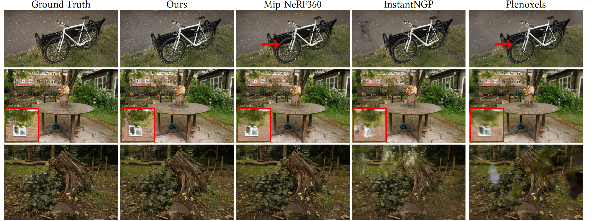

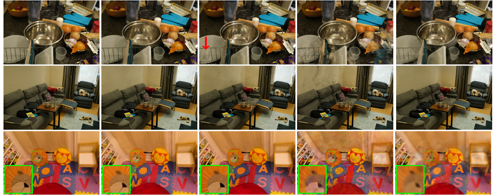

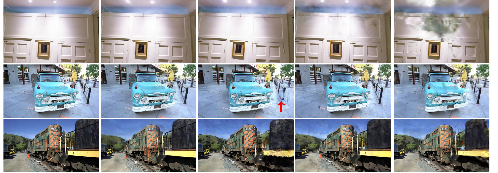

可以看出，这个方法主要的有点在于：

1. floaters 基本没有。
2. 一些比较细长的物体，例如自行车的辐条、树干的纹理等表现的比较好。
3. 对一些 glossy 的反射，例如第四个数据集中的铁碗，表现比较好（应该是采用了球谐函数的原因，Plenoxels 这些表现也比较好）

##### 训练时间、渲染时间对比

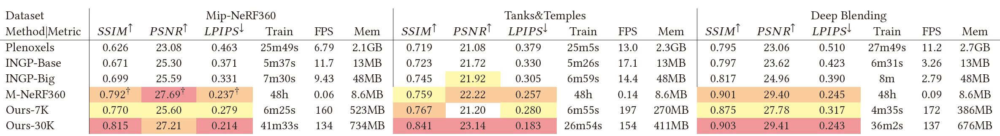

可以看到训练时间和 Instant-NGP 差不多，属于最快的那一个梯队。（里面多少 K 指训练了多少 K Iteration）

同时渲染的 FPS 是最高的，完全达到了实时渲染的要求。

##### 消融实验

他们分别进行了点云随机初始化、取消 Split 点、取消 Clone 点、限制反向传播点的数目、高斯形状各向同性、颜色表达各项同性等消融实验，结果如图：

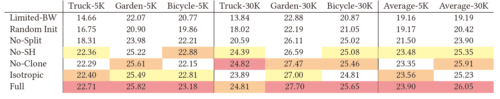

1. 点云随机初始化与 SfM 输入点云对比：

   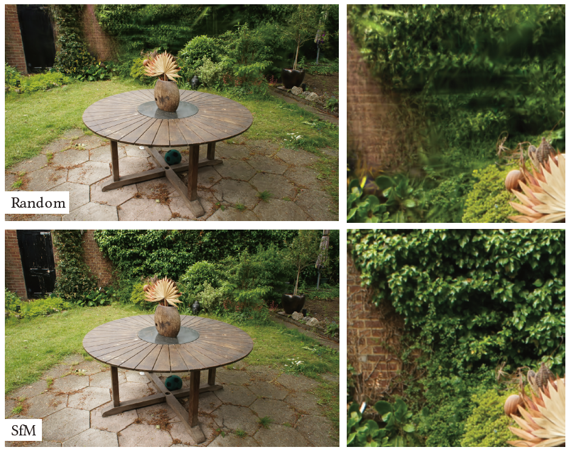

2. densify 两种方法消融实验的对比：

   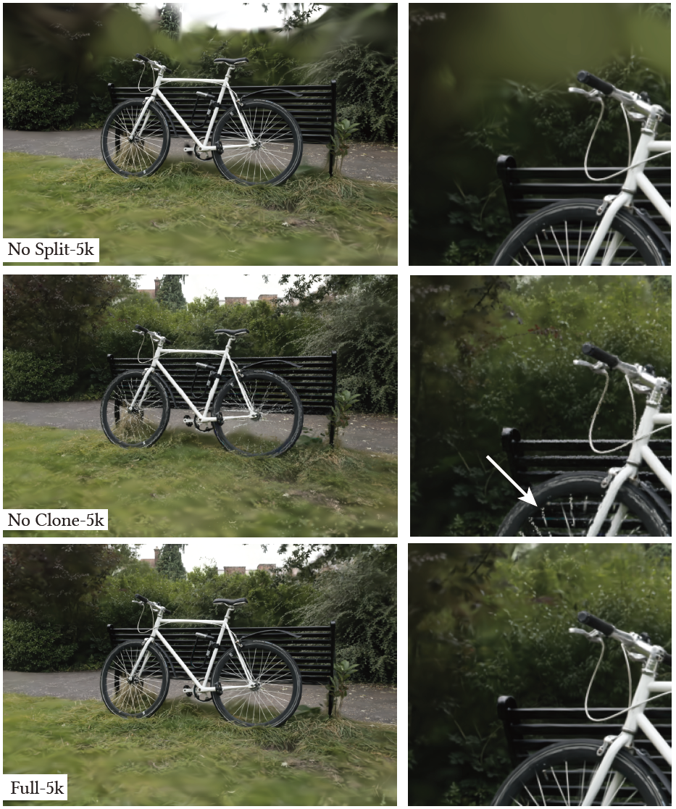

3. 梯度下降点数目限制与没有限制效果对比

   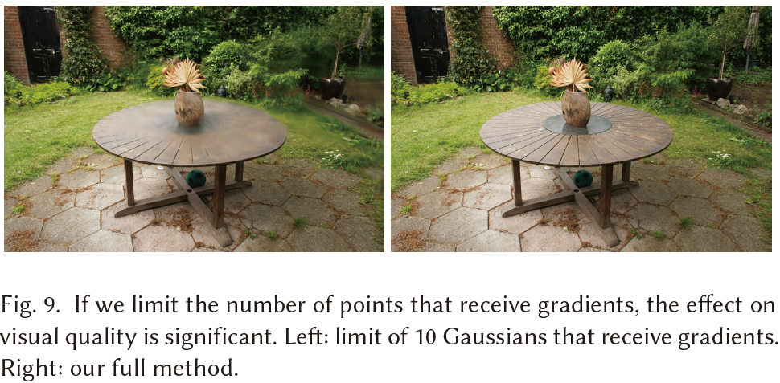

4. 高斯协方差矩阵各向同性和各向异性效果对比：

   

#### 讨论

##### 为什么选择 3D 高斯

对于重建核的选择，肯定是要选那些随着距离增大逐渐下降的函数。并且根据下降的幅度是否随距离的方向变化而变化可以将重建核分为各项同性和各向异性。

显然，一个各项异性的函数来建模空间中的几何比用一个各项同性的球 fit 更好，毕竟各项异性的函数可以退化为各项同性的函数，并且对于细长的物体各项异性的重建核能更好的拟合。他们在上述实验中也证明了这一点。

在各项异性的函数中，3D 高斯的表达方式非常 elegant，根据下面的推导，3D 高斯在经过 View-Projection 视图变换、然后对深度积分后的结果还是一个高斯函数，并且这个 2D 高斯的协方差矩阵对原本的 3D 高斯的协方差矩阵的梯度也能够较快的算出来。除此之外 3D 高斯还有傅里叶变换后依然是高斯、与高斯卷积后依然是高斯等一系列优良性质。

最后，3D 高斯能用于他们提出的基于排序的快速渲染算法，所以最终就选择了 3D 高斯。

##### 为什么使用球面谐波函数

在 PBR 渲染中，一个点的颜色除了与物体本身的材质相关外，还与光线的入射方向和出射方向相关：
$$
L_0(p,\omega_0)=\int_\Omega f_r(p,\omega_i,\omega_0)L_i(p,\omega_i)(n\cdot\omega_i)d\omega_i
$$
而目前三维重建的体渲染理论没有考虑光线的外散射和内散射，只考虑了发光和遮挡，这导致了从任意视角看一个点，这个点的颜色是不变的。

想让一个点的颜色在各个方向上是不同的，我们可以通过打表形式来离散地建模一个点在不同方向的发射光线。但是一个场景有几百万个点，每个点就算只使用 $8\times 8$ 个 float 来表征需要几百个 GB，这肯定是不行的。

另一种方式是用球面函数来拟合，那么就自然而然想到球谐函数。一个点只需要 10 个（四阶球谐）系数就能表征，并且计算方便，梯度下降也能够综合优化所有的系数，是一个非常好的选择。

##### 还有哪些可以改进的地方

1. 首先因为论文使用的是球谐函数，并且为了显存和渲染速度的考虑不能使用高阶球谐，因此它基本上只能重建 diffuse 或者是部分 glossy 的物体，而对于镜面、玻璃这种基本上是很难重建的。这个其实看 [渲染效果对比](#渲染效果对比) 倒数第二个数据集对于汽车玻璃的重建就能看出来。

2. 论文中提到，对于没有充分拍摄到的物体（比如就一张或者几张图像覆盖的区域），重建会出现污点，并且这一点应该也是目前 NeRF 的通病。

   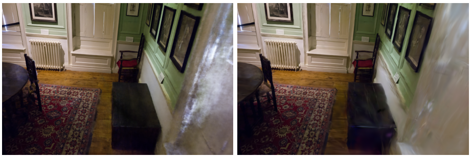

3. 对 GPU 的显存消耗巨大，对于一个大场景他们会消耗超过 20G 的显存。

4. 另外他们的排序算法可能也有些问题，他们对点的排序是按照均值来排的，而对于某些像素均值比较远的点不一定会排在比较近的高斯点后面，比如：

   

### K-Planes

#### 工作

静态场景、动态场景、外观变化场景的重建，可解释（？）并且内存开销小。

#### 大致思路

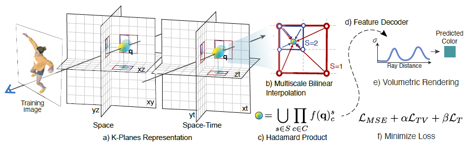

1. 对于 $4$ 维场景（$x,y,z,t$），初始化 $C_4^2=6$ 个平面（$xy,xz,yz,xt,yt,zt$）。每个平面的大小为 $N\times N\times M$，其中 $N$ 是分辨率，$M$ 是特征向量维度。
2. 对于一个点 $q=(i,j,k,\tau)$，将 $q$ 的坐标投影到六个平面上然后做双线性插值得到每个平面的特征向量 $f(q)_c$。然后对 $f(q)_c$ 做 Hadamard 积得到这个点的特征向量 $f(q)=\prod_{c\in C}f(q)_c$。
3. 然后使用一个 Decoder 得到这个点的颜色和密度，之后就是传统的体渲染方法。

#### 实现细节

##### 压缩

它使用了 Multiscale Layer，每个平面采用 LoD 的想法，分为 $64,128,256\cdots$ 等分辨率的多个平面。每次取特征向量的时候是在所有层分别计算特征向量，然后合并成一个特征向量。

这个做法减少了最高分辨率需要存储的特征维度。同时经过实验发现，Multiscale Layer 对空间三平面有作用，对时空三平面没啥作用。

##### 优化

- Total variation in space

  它希望空间上的表达是连续的，因此引入正则化：
  $$
  \mathcal{L}_{TV}(P)=\frac{1}{|C|n^2}\sum_{c,i,j}(||P_c^{i,j}-P_c^{i-1,j}||_2^2+||P_c^{i,j}-P_c^{i,j-1}||_2^2)
  $$
  尽管总体上鼓励平滑性，但通过适当的正则化强度，模型仍然可以保留场景中的关键特征和边缘。

- Smoothness in time

  它希望物体的移动是平滑的，不会突变：
  $$
  \mathcal{L}_{smooth}(P)=\frac{1}{|C|n^2}\sum_{c,i,t}||P_c^{i,t-1}-2P_c^{i,t}+P_c^{i,t+1}||_2^2
  $$
  一阶导代表速度，二阶导代表加速度。

- Sparse transients

  鼓励空间-时间平面的特征向量在静态区域保持恒定，来帮助模型区分场景中的静态和动态部分：
  $$
  \mathcal{L}_{sep}(P)=\sum_c||1-P_c||_1
  $$

##### 解码

1. 线性解码器

   之前的 view-dependent color 都是用球谐函数来表达的，但是球谐函数比较难优化，并且球谐函数的阶数限制了其表征能力。

   线性解码器使用学习到的基（basis）来解码。其通过一个小型 MLP 来映射每个视角方向 $d$ 到红色 $b_R(d)$、绿色 $b_G(d)$ 和蓝色 $b_B(d)$ 的基向量。然后使用
   $$
   c(q,d)=\bigcup_{i\in\{R,G,B\}}f(q)\cdot b_i(d)
   $$
   然后用同种方式生成密度 $\sigma$。

2. MLP 解码器
   $$
   \begin{align}
   & \sigma(q),\hat{f}(q)=g_\sigma(f(q))\\
   & c(q,d)=g_{GRB}(\hat{f}(q),\gamma(d))
   \end{align}
   $$

使用线性解码器可以处理那些几何结构不变但外观（如光照或颜色）变化的特殊动态场景：

1. 全局外观代码：作者引入了一种全局外观代码的概念。对于每个训练图像，都有一个相应的外观代码，这是一个 M 维向量。这个外观代码用于捕捉图像中的光照、颜色等外观特征。
2. 外观代码与解码器的结合：这个外观代码被用作额外的输入，传递给模型的颜色解码器，而不传递给密度解码器。因此模型可以在不改变场景形状的前提下，调整场景的光照和颜色。
3. 外观插值：通过在不同的外观代码之间进行插值，模型可以模拟场景在不同外观条件下的样子。例如，可以在白天和夜晚的外观代码之间进行插值，来展示场景在不同时间的外观。

#### 结果

##### 静态场景

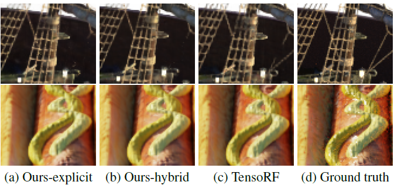

##### 动态场景

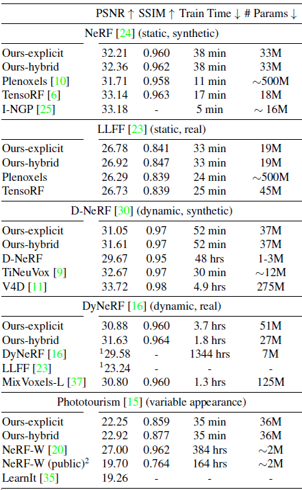

##### 几何不变的动态场景

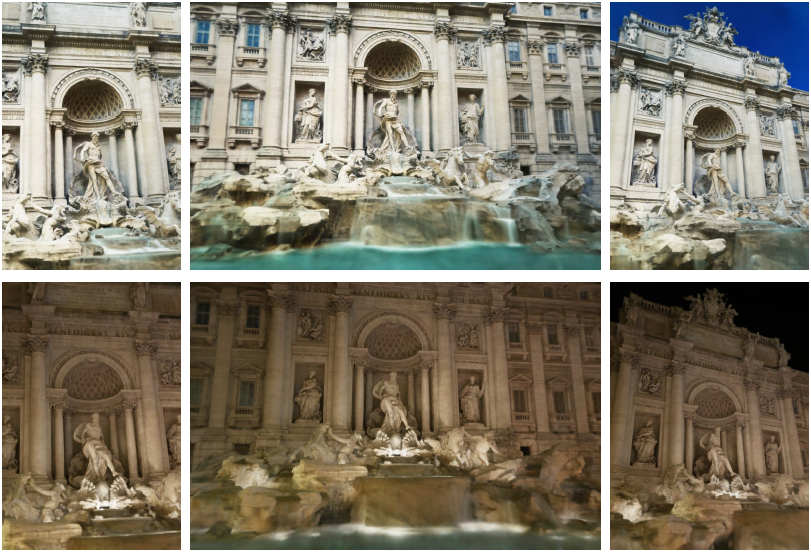

#### 讨论

##### 为什么使用 Hadamard 积？

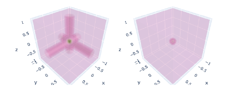

Hadamard 积就是对应元素相乘。论文中给出的解释是：如果空间中只有一个点，其他地方没有点，那么这个点向三个平面上投影得到的特征向量才不为 0，而其他地方向三个平面上投影得到的特征向量至少有一个为 0，因此相乘也为 0。他们认为 Hadamard 积类似于求交，Add 类似于求并。

我感觉不太对，如果空间中充满了点，那么随便一个点向其他方向投影都是不为 0 的特征向量，那么这样 Hadamard 积的意义是什么？

##### 可解释性体现在哪里？

1. 空间中：如果空间中只有一个点，其他地方没有点，那么这个点向三个平面上投影得到的特征向量才不为 0，而其他地方向三个平面上投影得到的特征向量至少有一个为 0，因此相乘也为 0。
2. 时空中：如果一个区域没有变化过，那么他在 $xt,yt,zt$ 平面上的特征向量一定是 $1$，这样才能在经过 Hadamard 积后不改变原来的值。