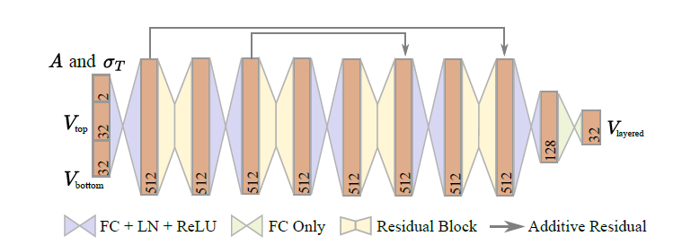

# 2024.1.15-2024.1.21


## 本周概要

1. 阅读论文 Learning Neural Radiance Fields with Whitted Ray Tracing。
2. 毕设规划。


## 下周计划

1. 开始毕设。


## 完成细节


### 阅读论文 Learning Neural Radiance Fields with Whitted Ray Tracing

笔记链接：[Paper/Mirror NeRF/note.md at main · xu-hui-yao/Paper (github.com)](https://github.com/xu-hui-yao/Paper/blob/main/Mirror NeRF/note.md)


### 毕设规划


#### 任务描述

实现论文 [Neural Layered BRDFs](https://arxiv.org/pdf/2111.03797.pdf)，并进行一些改进。


##### 论文概述

1. 背景：目前计算多层材质（例如皮肤、上漆的木头）BRDF 的方法多是基于蒙特卡洛随机游走，但是这种方法太慢。

2. 本文工作：将材质信息转换为隐式表达，通过神经网络来得到 BRDF 和对应的 pdf，这种方法牺牲了一定的精确度，但是提升了计算速度。

3. 具体过程：

   1. 将材质表征为隐式向量：

      

      这是一个 decoder，根据材质的饮食向量、光线的入射出射方向得到 BRDF 值。

      在训练 decoder 阶段，使用数据集中所有数据同时优化神经网络权重和隐式向量；decoder 训练好后，对于一个新材质，固定神经网络权重只优化隐式向量。

   2. 通过两个单层材质的隐式向量计算多层材质的隐式向量：

      

      其中 $A$ 是 single-scattering albedo，$\sigma_T$ 是 extinction coefficients，是中间层介质的参数。Ground truth 是 [Position-Free Monte Carlo Simulation for Arbitrary Layered BSDFs](https://dl.acm.org/doi/abs/10.1145/3272127.3275053)。

   3. 通过隐式向量、入射方向、出射方向计算 BRDF 值以及对应的 pdf：

      求 BRDF 值用的是上面的 decoder，求 pdf 用的是另外一个小的神经网络（在补充材料中）。

   4. 渲染流程

      使用 path tracing。将所有光线打到的交点信息、入射方向、出射方向存到一个 buffer 中，如果 buffer 中的材质信息是 Neural BRDF 类型的，那么就用神经网络推断。不是的话就用普通的 BRDF 计算方式。


##### 改进方向

1.   数据集方面：数据集采集范围扩展到 BSDF 而不是 BRDF。同时他们论文只用了两种材质（粗糙导体和粗糙绝缘体），可以扩展到更多种。
2.   神经网络结构方面：修改神经网路使得结构更简单（蒸馏）、添加正则项使得偏差更小、给方向添加编码使得其能更好拟合 delta 分布的材质等等。
3.   渲染方面：
     1. 对神经网络的推导过程进行加速。
     2. 优化采样策略，比如使用 MIS 或者是 ReSTIR，使得我们能用较少的 SPP 生成质量更高的图像，进而进行加速。


#### 目前已有的资源

1. 论文（但是没 supplemental material，因此像算 pdf 的神经网络结构都不知道，需要自己尝试）
2. 许老师给的代码，这个代码应该只是用 python 来加载神经网络模型并且调用 CUDA cutlass 推导，没有给神经网络的格式以及对应的数据，我不太会用。


#### 任务分解以及难点分析

当前先不管创新，实现了再说。

##### 采集数据集

1. 单层材质数据的采集使用 Mitsuba，Mitsuba 的材质有以下类型：

   ```
   ├── blendbsdf
   ├── bumpmap
   ├── circular
   ├── conductor
   ├── dielectric
   ├── diffuse
   ├── hair
   ├── mask
   ├── measured_polarized
   ├── normalmap
   ├── null
   ├── plastic
   ├── polarizer
   ├── pplastic
   ├── principled
   ├── principledthin
   ├── retarder
   ├── roughconductor
   ├── roughdielectric
   ├── roughplastic
   ├── thindielectric
   └── twosided
   ```

   只使用 rough conductors 和 rough dielectrics，其中 rough conductors 有两个参数：粗糙度 $\alpha_2$ 和菲涅尔项在 0 度时的反射率 $R_0$；rough dielectrics 有两个参数：粗糙度 $\alpha_1$ 和折射率 $\eta$。每种大类个采取了 300 种材质，每种材质采样 $25^4$ 对入射角-出射角对。

2. 多层材质的采集需要实现论文 [Position-Free Monte Carlo Simulation for Arbitrary Layered BSDFs](https://dl.acm.org/doi/abs/10.1145/3272127.3275053) 中的代码，这篇论文在 Github 上是有仓库的，但是能不能跑不知道。

   我们需要随机采样之前的单层材质，组合为 12720 个双层材质、1800 个三层材质。并且每个材质同样采样 $25^4$ 对入射角-出射角对。并使用上述方法计算 pdf 和 BRDF 值。

困难评估：该步骤的困难主要在于实现论文 [Position-Free Monte Carlo Simulation for Arbitrary Layered BSDFs](https://dl.acm.org/doi/abs/10.1145/3272127.3275053) 中的代码。如果仓库代码能跑通那问题自然不存在。除此之外采集材质的策略也有待商榷，是均匀采集还是随机采集还是按照主流材质的参数采集。


##### 搭建神经网络以及训练

论文没有写他们使用什么工具训练的神经网络，我打算使用 Pytorch 训练神经网络。根据论文，我需要训练三种神经网络：

1. 将材质压缩为隐式向量并将隐式向量解码为 BRDF 值的网络（记为 A）；
2. 通过两个单层材质的隐式向量计算多层材质的隐式向量的神经网络（记为 B）；
3. 根据隐式向量、入射出射角推导 pdf 的神经网络（记为 C）。

其中，每种神经网络有三个，分别对应 RGB 三通道。

对于神经网络 A，使用 12000 个双层材质做训练集，720 个双层材质做测试集。

对于神经网络 B，首先将之前采集的 600 个单层材质通过神经网络 A 转换为隐式向量，然后同样使用12000 个双层材质做训练集，720 个双层材质做测试集。最后使用 1800 个三层材质对 B 进行微调。

对于神经网络 C，论文中没有给相关描述（在补充材料中但网上没有）。需要探索网络结构以及训练方式。

困难评估：该步骤的困难主要在于如何搭建训练神经网络 C，我觉得可以询问作者本人。


##### 用 CUDA 写一个 Path Tracing 并将 BRDF 的计算方式换成神经网络推导

这一步的实行我比较迟疑，因为他们没说他们具体是怎么做的。他们原文的描述是：通过 NVIDIA Cutlass CUDA Templates 推导模型并且将其编译为 Python 库。但是具体 Path Tracing 还有其他轮子的实现没说。原本的打算是在 Mitsuba 3 的基础上修改，但是他代码考虑的东西太多了我怕会改出问题。我认为既然可以通过 Cutlass CUDA Templates 推导模型并且网上有用 CUDA 写的 Path Tracing 代码，我能不能在这个代码基础上把 Cutlass 的推导嵌进去。

这个环节主要分为两个方面：

1. 在网上找到一个比较简单、好用的实现了 Path Tracing 的代码仓库。比如 https://github.com/straaljager/GPU-path-tracing-with-CUDA-tutorial-4 或者 https://github.com/HummaWhite/ReSTIR。（还没有仔细看）
2. 学习 CUDA 编程使得我能根据毕设要求修改代码。我准备看这个系列：[【CUDA 基础】0.0 腾讯云CUDA环境搭建 | 谭升的博客 (face2ai.com)](https://face2ai.com/CUDA-F-0-0-Tencent-GPU-Cloud/)。然后想办法把 Path Tracing 的代码改成 Wavefront 的（即同一轮 bounce 的光线同时计算）。
3. 研究 Cutlass 如何推导神经网络并且想办法把这个过程嵌入到代码中。

困难评估：该步骤的困难主要在于最后一步，实际的可行性和困难度是未知的。另外整体的工作量也比较大。学习 CUDA 需要从现在就开始。


##### 准备测试场景

这个的困难点主要在于找对应的多层材质的场景（比如喷了漆的汽车、人的皮肤等等）。除此之外 SVBRDF 材质以及对应隐式向量的存储、读取方式也有待商榷。


#### 初步规划（激进版）

毕设工作准备从本周日开始，期望在开题报告（3 月 25 日）前复现论文，起码能用。之后再想着改进优化。除此之外需要在开题前一个月开始写开题报告。

1. CUDA 教程有 33 章，从本周日开始学，平均一天 2 章，预计在 2 月初能够学习完。
2. 第一周（1.21-1.27）：数据集的采集：单层材质的材质的采集（主要是搬运写一个批量采集的脚本，照抄 Mitsuba 的代码）、实现 [Position-Free Monte Carlo Simulation for Arbitrary Layered BSDFs](https://dl.acm.org/doi/abs/10.1145/3272127.3275053) 。
3. 第二周（1.28-2.3）：采集双层和三层材质的数据集。搭建神经网络 A 和神经网络 B。
4. 第三周（2.4-2.17，之后是春节，春节期间会断断续续做一些工作但是主要以休息为主）：先尝试搭建一个神经网络 C 并且训练神经网络 A B C。
5. 第五周（2.18-2.24）：返校，挑选一个合适的 CUDA 实现的 Path Tracing 仓库看懂代码并尝试修改。
6. 第六周（2.25-3.2）：将代码改为 Wavefront 并且组成一个 Buffer。并且准备测试场景。
7. 第七周（3.3-3.9）：准备开题报告，探索 CUDA Cutlass 推导神经网络的方法并且将其嵌入到代码中。
8. 第八周（3.10-3.16）：准备开题报告，并且将测试场景中可以用多层材质表达的部分换成隐式向量看效果。

总结：预留了一周半的时间给各种突发情况和困难，不过想要在开题报告前把东西做出来还是比较困难的。

