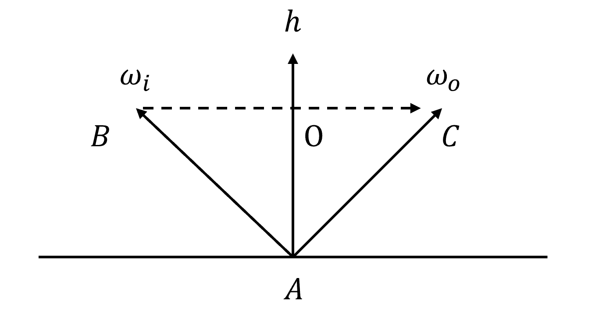

# 2024.1.22-2024.1.28


## 大概工作

开始毕设，主要包括：

1. 阅读Mitsuba 3 的理论论文 Microfacet Models for Refraction through Rough Surfaces 以及多层材质的论文 Position-Free Monte Carlo Simulation for Arbitrary Layered BSDFs。
2. 完成了单层材质 Rough Dielectric 和 Rough Conductor 的采样、计算 BSDF 值、计算 PDF 的 python 实现。并且随便找了几个值与 Mitsuba 3 对比，结果应该正确。


## 下周计划

1. 用 python 复现论文 Position-Free Monte Carlo Simulation for Arbitrary Layered BSDFs。
2. 开始搭建神经网络。


## 详情


### 单层材质 BSDF 实现

单层材质 BSDF 实现借鉴 Mitsuba 3 的粗糙导体和粗糙绝缘体。因为需要用到多层材质 BSDF 的情况不多，比如喷了漆的汽车就是导体+绝缘体；上了油的木头是绝缘体+绝缘体，并且论文本身也只是用了导体和绝缘体，因此我目前只实现简化版的粗糙绝缘体和导体 BSDF，之后可以再扩充。

Mitsuba 3 材质基类定义在 bsdf.h，Rough Conductor 和 Rough Dielectric 是子类，有以下接口：

- eval：即给定入射角出射角，计算 BSDF 值。

- pdf：即给定入射角出射角，计算如此采样的概率。

而我准备用 Python 实现两种材质的这两个接口，并且减去光的偏振等计算。

理论论文链接：[microfacetbsdf.pdf (cornell.edu)](https://www.graphics.cornell.edu/~bjw/microfacetbsdf.pdf)。


#### Rough Conductor

类型为粗糙导体，在 Mitsuba 3 中的主要参数有：

 - eta, k：

   介质折射率的实部和虚部。主要是为了计算菲涅尔项。

 - distribution：

   指定是 GGX 分布还是 beckman 分布。我准备统一使用 GGX 分布。

 - alpha, alpha_u, alpha_v：

   粗糙度，u 和 v 主要是为了各向异性材质。这里默认各项同性。


##### BSDF

其 eval 函数简化如下：

```cpp
Spectrum eval(const BSDFContext &ctx, const SurfaceInteraction3f &si,
              const Vector3f &wo, Mask active) const override {
    Float cos_theta_i = Frame3f::cos_theta(si.wi),
    cos_theta_o = Frame3f::cos_theta(wo);

    // Calculate the half-direction vector
    Vector3f H = dr::normalize(wo + si.wi);

    /* Construct a microfacet distribution matching the
           roughness values at the current surface position. */
    MicrofacetDistribution distr(m_type,
                                 m_alpha_u->eval_1(si, active),
                                 m_alpha_v->eval_1(si, active),
                                 m_sample_visible);

    // Evaluate the microfacet normal distribution
    Float D = distr.eval(H);

    // Evaluate Smith's shadow-masking function
    Float G = distr.G(si.wi, wo, H);

    // Evaluate the full microfacet model (except Fresnel)
    UnpolarizedSpectrum result = D * G / (4.f * Frame3f::cos_theta(si.wi));

    // Evaluate the Fresnel factor
    dr::Complex<UnpolarizedSpectrum> eta_c(m_eta->eval(si, active),
                                           m_k->eval(si, active));

    Spectrum F = fresnel_conductor(UnpolarizedSpectrum(dr::dot(si.wi, H)), eta_c);

    return F * result;
}
```

值得注意的是，原本的微表面模型渲染方程为：
$$
L_o(p,\omega_o) =\int_\Omega \frac{DFG}{4(\omega_o\cdot n)(\omega_i\cdot n)}L_i(p,\omega_i)(n\cdot\omega_i)d\omega_i\\
$$
但是这里只计算了：
$$
\frac{DFG}{4(\omega_i\cdot n)}
$$
是因为理论的微表面模型渲染方程考察的是从光源发出光线到相机，而实际渲染中是从相机发出光线。因此 $w_i$ 和 $w_o$ 需要互换；另外 Mitsuba 为了加速，将分子分母约分，进而简化了一个乘法计算。==我会在实现的时候与 Mitsuba 3 保持一致，进行简化，这里着重记录一方后面改 Path Tracing 的时候忘掉。==

下面分别梳理菲涅尔项、几何遮挡项和法线分布项：

1. 菲涅尔项

   Mitsuba 3 为了严格的物理正确使用了复折射率，下面是 Mitsuba 3 对导体菲涅尔项的实现：

   ```cpp
   template <typename Float>
   Float fresnel_conductor(Float cos_theta_i, dr::Complex<Float> eta) {
       // Modified from "Optics" by K.D. Moeller, University Science Books, 1988
       Float cos_theta_i_2 = cos_theta_i * cos_theta_i,
             sin_theta_i_2 = 1.f - cos_theta_i_2,
             sin_theta_i_4 = sin_theta_i_2 * sin_theta_i_2;
   
       auto eta_r = dr::real(eta),
            eta_i = dr::imag(eta);
   
       Float temp_1   = eta_r * eta_r - eta_i * eta_i - sin_theta_i_2,
             a_2_pb_2 = dr::safe_sqrt(temp_1*temp_1 + 4.f * eta_i * eta_i * eta_r * eta_r),
             a        = dr::safe_sqrt(.5f * (a_2_pb_2 + temp_1));
   
       Float term_1 = a_2_pb_2 + cos_theta_i_2,
             term_2 = 2.f * cos_theta_i * a;
   
       Float r_s = (term_1 - term_2) / (term_1 + term_2);
   
       Float term_3 = a_2_pb_2 * cos_theta_i_2 + sin_theta_i_4,
             term_4 = term_2 * sin_theta_i_2;
   
       Float r_p = r_s * (term_3 - term_4) / (term_3 + term_4);
   
       return 0.5f * (r_s + r_p);
   }
   ```

   使用这种复折射率的 3D 资产可能比较难找，因此可能难以实现 SVBRDF。但是好处是我可以通过网站 [RefractiveIndex.INFO - Refractive index database](https://refractiveindex.info/) 找到大多数金属的复折射率从而训练神经网络。经过考虑后我准备在采集数据集和训练神经网络时使用复折射率。

2. 几何遮挡项

   Mitsuba 3 应该是使用了 Smith Shadowing-Masking Term 的一种变种，其同样分开考虑了 Shadowing 和 Masking，但是考虑了各向异性的材质：
   $$
   \begin{align}
   & G(w_i,w_o,n)= G_1(w_i,n)G_1(w_o,n)\\
   & G_1(w_i,n)=\frac{2}{1+\sqrt{1+\frac{\alpha_x^2\cos^2\theta_{ix}+\alpha_y^2\cos^2\theta_{iy}}{\cos^2\theta_i}}}\\
   & G_1(w_o,n)=\frac{2}{1+\sqrt{1+\frac{\alpha_x^2\cos^2\theta_{ox}+\alpha_y^2\cos^2\theta_{oy}}{\cos^2\theta_i}}}\\
   \end{align}
   $$
   因为在我的毕设中只考虑各项同性，因此我打算复现最简单的公式：
   $$
   \begin{align}
   & G(w_i,w_o,h)= G_1(w_i,nh)G_1(w_o,h)\\
   & G_1(w_i,h)=\frac{2}{1+\sqrt{1+\alpha^2\tan^2\theta_i}}\\
   & G_1(w_o,h)=\frac{2}{1+\sqrt{1+\alpha^2\tan^2\theta_o}}\\
   \end{align}
   $$

3. 法线分布项

   Mitsuba 3 同样考虑了各向异性，基于上面原因我还是打算实现各向同性 GGX 法线分布：
   $$
   D(h)=\frac{\alpha^2}{\pi((h\cdot n)^2(\alpha^2-1)+1)^2}
   $$


##### Sample

为了理解他 pdf 的函数，这是 Mitsuba 3 在粗糙导体上在各向同性下的一个简化实现：

```cpp
h = distr.sample(sample2);
bs.wo = reflect(si.wi, h);

std::pair<Normal3f, Float> sample(const Point2f &sample) const {
    Float sin_phi, cos_phi, cos_theta, cos_theta_2, alpha_2, pdf;

    std::tie(sin_phi, cos_phi) = dr::sincos((2.f * dr::Pi<Float>) * sample.y());
    alpha_2 = m_alpha_u * m_alpha_u;

    Float tan_theta_m_2 = alpha_2 * sample.x() / (1.f - sample.x());
    cos_theta = dr::rsqrt(1.f + tan_theta_m_2);
    cos_theta_2 = dr::sqr(cos_theta);

    Float sin_theta = dr::sqrt(1.f - cos_theta_2);

    return Normal3f(cos_phi * sin_theta, sin_phi * sin_theta, cos_theta);
}
```

他是根据 GGX 法线分布函数作为概率密度函数生成半程向量 $h$，再加上入射方向 $w_i$ 生成采样到的出射方向 $w_o$，代码中 sample2 是两个介于随机数 $\sim\mathcal{U}(0,1)$。
$$
\begin{align}
& \because D(h)=\frac{\alpha^2}{\pi(\cos^2\theta_h(\alpha^2-1)+1)^2}\\
& \therefore p(h)=\cos\theta_h D(h)\\
& \because d\omega=\sin\theta d\theta d\phi ,\quad \theta=\theta_h\\
& \therefore p(\theta,\phi)=\sin\theta p(h)=\frac{\alpha^2\cos\theta\sin\theta}{\pi(\cos^2\theta(\alpha^2-1)+1)^2}\\
& p(\phi)=\int_0^{\frac{\pi}{2}}\frac{\alpha^2\cos\theta\sin\theta}{\pi(\cos^2\theta(\alpha^2-1)+1)^2}d\theta\\
& =\frac{\alpha^2}{\pi}\int_0^1\frac{x}{((\alpha^2-1)x^2+1)^2}dx\\
& =\frac{\alpha^2}{\pi}\{\frac{1}{-2(\alpha^2-1)[(\alpha^2-1)x^2+1]}\}\vert_0^1\\
& =\frac{1}{2\pi}\\
& p(\theta\vert\phi)=\frac{p(\theta,\phi)}{p(\phi)}=\frac{2\alpha^2\cos\theta\sin\theta}{(\cos^2\theta(\alpha^2-1)+1)^2}\\
& cdf(\theta)=\int_0^\theta \frac{p(\theta,\phi)}{p(\phi)}=\int_0^\theta\frac{2\alpha^2\cos\theta\sin\theta}{(\cos^2\theta(\alpha^2-1)+1)^2}d\theta\\
& =\frac{\tan^2\theta}{\alpha^2+\tan^2\theta}\\
& \therefore \phi=cdf_\phi^{-1}(\xi_1)=2\pi\xi_1\\
& \therefore \theta=cdf_\theta^{-1}(\xi_2)=\arctan\sqrt{\frac{\alpha^2\xi_2}{1-\xi_2}}\\
\end{align}
$$
在这种采样方式下，给定了入射角、出射角，其 pdf 函数计算方式为：


$$
\begin{align}
& p(w_o)=\frac{D(h)\cos\theta_h}{\vert J\vert}= \frac{D(h)\cos\theta_h}{4(w_o\cdot h)}
\end{align}
$$


在 Mitsuba 3 中，他们也是这么计算 pdf 的：

```cpp
Float pdf(const BSDFContext &ctx, const SurfaceInteraction3f &si,
          const Vector3f &wo, Mask active) const override {
    Float cos_theta_i = Frame3f::cos_theta(si.wi),
    cos_theta_o = Frame3f::cos_theta(wo);

    Vector3f m = dr::normalize(wo + si.wi);

    MicrofacetDistribution distr(m_type,
                                 m_alpha_u->eval_1(si, active),
                                 m_alpha_v->eval_1(si, active),
                                 m_sample_visible);

    return distr.pdf(si.wi, m) / (4.f * dr::dot(wo, m));
}
// distr.pdf
Float pdf(const Vector3f &wi, const Vector3f &m) const {
    Float result = eval(m);
    result *= Frame3f::cos_theta(m);
    return result;
}
```


#### Rough Dielectric

类型为粗糙绝缘体，在 Mitsuba 3 中的主要参数有：

- eta：

  相对折射率，定义为介质内部的折射率（例如玻璃：1.5046） / 介质外部的折射率（例如空气：1.000277）。

- distribution：

  指定是 GGX 分布还是 beckman 分布。我准备统一使用 GGX 分布。

 - alpha, alpha_u, alpha_v：

   粗糙度，u 和 v 主要是为了各向异性材质。这里默认各项同性。

 - 


##### BSDF

和导体不同，绝缘体不仅考虑了反射的情况，还考虑了透射的情况（例如玻璃）：


其 eval 函数简化如下：

```cpp
Spectrum eval(const BSDFContext &ctx, const SurfaceInteraction3f &si,
              const Vector3f &wo, Mask active) const override {
    Float cos_theta_i = Frame3f::cos_theta(si.wi),
    cos_theta_o = Frame3f::cos_theta(wo);

    // Determine the type of interaction
    bool has_reflection = ctx.is_enabled(BSDFFlags::GlossyReflection, 0),
    has_transmission = ctx.is_enabled(BSDFFlags::GlossyTransmission, 1);

    Mask reflect = cos_theta_i * cos_theta_o > 0.f;

    // Determine the relative index of refraction
    Float eta     = dr::select(cos_theta_i > 0.f, m_eta, m_inv_eta),
    inv_eta = dr::select(cos_theta_i > 0.f, m_inv_eta, m_eta);

    // Compute the half-vector
    Vector3f m = dr::normalize(si.wi + wo * dr::select(reflect, Float(1.f), eta));

    // Ensure that the half-vector points into the same hemisphere as the macrosurface normal
    m = dr::mulsign(m, Frame3f::cos_theta(m));

    /* Construct the microfacet distribution matching the
           roughness values at the current surface position. */
    MicrofacetDistribution distr(m_type,
                                 m_alpha_u->eval_1(si, active),
                                 m_alpha_v->eval_1(si, active),
                                 m_sample_visible);

    // Evaluate the microfacet normal distribution
    Float D = distr.eval(m);

    // Fresnel factor
    Float F = std::get<0>(fresnel(dr::dot(si.wi, m), m_eta));

    // Smith's shadow-masking function
    Float G = distr.G(si.wi, wo, m);

    UnpolarizedSpectrum result(0.f);

    Mask eval_r = Mask(has_reflection) && reflect,
    eval_t = Mask(has_transmission) && !reflect;

    if (dr::any_or<true>(eval_r)) {
        UnpolarizedSpectrum value = F * D * G / (4.f * dr::abs(cos_theta_i));
        result[eval_r] = value;
    }

    if (dr::any_or<true>(eval_t)) {
        /* Missing term in the original paper: account for the solid angle
           compression when tracing radiance -- this is necessary for
           bidirectional methods. */
        Float scale = (ctx.mode == TransportMode::Radiance) ? dr::sqr(inv_eta) : Float(1.f);

        // Compute the total amount of transmission
        UnpolarizedSpectrum value = dr::abs(
            (scale * (1.f - F) * D * G * eta * eta * dr::dot(si.wi, m) * dr::dot(wo, m)) /
            (cos_theta_i * dr::sqr(dr::dot(si.wi, m) + eta * dr::dot(wo, m))));
        result[eval_t] = value;
    }

    return depolarizer<Spectrum>(result);
}
```

1. 半程向量

   在投射时，半程向量的定义和反射不同：

   
   $$
   \begin{align}
   & h_{\text{reflection}}=\text{norm}(w_i+w_o)\\
   & h_{\text{transmittance}}=\text{norm}(w_i+w_o\times\text{eta})\\
   \end{align}
   $$
   这样做求出来的半程向量才是透射面的法线方向。

   最后需要让半程向量指向和整体的法线是同一方向：
   $$
   h=\cos\theta_h>0\ ?\ (h:-h)
   $$

2. 法线分布项

   同粗糙导体。

3. 几何遮挡项

   同粗糙导体。

4. 菲涅尔项

   和导体的计算方式不同，绝缘体菲涅尔项计算如下：

   ```cpp
   Float fresnel(Float cos_theta_i, Float eta) {
       auto outside_mask = cos_theta_i >= 0.f;
   
       Float rcp_eta = dr::rcp(eta),
             eta_it = dr::select(outside_mask, eta, rcp_eta),
             eta_ti = dr::select(outside_mask, rcp_eta, eta);
   
       /* Using Snell's law, calculate the squared sine of the
          angle between the surface normal and the transmitted ray */
       Float cos_theta_t_sqr =
           dr::fnmadd(dr::fnmadd(cos_theta_i, cos_theta_i, 1.f), eta_ti * eta_ti, 1.f);
   
       /* Find the absolute cosines of the incident/transmitted rays */
       Float cos_theta_i_abs = dr::abs(cos_theta_i);
       Float cos_theta_t_abs = dr::safe_sqrt(cos_theta_t_sqr);
   
       auto index_matched = dr::eq(eta, 1.f),
            special_case  = index_matched || dr::eq(cos_theta_i_abs, 0.f);
   
       Float r_sc = dr::select(index_matched, Float(0.f), Float(1.f));
   
       /* Amplitudes of reflected waves */
       Float a_s = dr::fnmadd(eta_it, cos_theta_t_abs, cos_theta_i_abs) /
                   dr::fmadd(eta_it, cos_theta_t_abs, cos_theta_i_abs);
   
       Float a_p = dr::fnmadd(eta_it, cos_theta_i_abs, cos_theta_t_abs) /
                   dr::fmadd(eta_it, cos_theta_i_abs, cos_theta_t_abs);
   
       Float r = 0.5f * (dr::sqr(a_s) + dr::sqr(a_p));
   
       dr::masked(r, special_case) = r_sc;
   
       return r;
   }
   ```

5. 计算 BSDF 流程

   首先根据入射方向和出射方向判断这是反射还是透射。

   如果是反射，计算：
   $$
   \frac{FDG}{4\abs{w_i\cdot n}}
   $$
   如果是透射，首先考虑立体角的压缩：
   $$
   \begin{align}
   & dw=\sin\theta d\theta d\phi\\
   & \frac{dw_o}{dw_i}=\frac{\sin\theta_o}{\sin\theta_i}=\frac{n_1}{n_2}=\frac{1}{eta}\\
   & \therefore \text{scale}=\frac{1}{eta}
   \end{align}
   $$
   然后计算：
   $$
   \begin{align}
   & \abs{
   \frac{\text{scale}(1-F) D G\ \text{eta}^2 (w_i\cdot h)(w_o\cdot h)}{(w_i\cdot n)(w_i\cdot h+\text{eta}\ w_o\cdot h)^2}
   }
   \end{align}
   $$
   ==这个公式的推导在 [microfacetbsdf.pdf (cornell.edu)](https://www.graphics.cornell.edu/~bjw/microfacetbsdf.pdf) 有提到，涉及到立体角转换的雅可比，但是我没太看懂是怎么推导出来的，暂时先抄着，之后再看。==

   

##### Sample

为了理解这种材质的反射和透射方式，我先从采样函数入手，下面是 Mitsuba 3 sample 函数的简化：

```cpp
BSDFSample3f sample(const BSDFContext &ctx,
                    const SurfaceInteraction3f &si,
                    Float sample1,
                    const Point2f &sample2,
                    Mask active) const override {
    bool has_reflection    = ctx.is_enabled(BSDFFlags::GlossyReflection, 0),
         has_transmission  = ctx.is_enabled(BSDFFlags::GlossyTransmission, 1);
    BSDFSample3f bs = dr::zeros<BSDFSample3f>();
    Float cos_theta_i = Frame3f::cos_theta(si.wi);
    
    MicrofacetDistribution distr(m_type,
                                 m_alpha_u->eval_1(si, active),
                                 m_alpha_v->eval_1(si, active),
                                 m_sample_visible);

    /* Trick by Walter et al.: slightly scale the roughness values to
       reduce importance sampling weights. Not needed for the
       Heitz and D'Eon sampling technique. */
    MicrofacetDistribution sample_distr(distr);

    // Sample the microfacet normal
    Normal3f m;
    std::tie(m, bs.pdf) = sample_distr.sample(dr::mulsign(si.wi, cos_theta_i), sample2);

    auto F = fresnel(dr::dot(si.wi, m), m_eta);

    // Select the lobe to be sampled
    Mask selected_r, selected_t;
    if (has_reflection && has_transmission) {
        selected_r = sample1 <= F;
    } else {
        if (has_reflection || has_transmission) {
            selected_r = Mask(has_reflection);
        } else {
            return { bs, 0.f };
        }
    }

    selected_t = !selected_r;

    // Reflection sampling
    if (dr::any_or<true>(selected_r)) {
        // Perfect specular reflection based on the microfacet normal
        bs.wo[selected_r] = reflect(si.wi, m);
    }

    // Transmission sampling
    if (dr::any_or<true>(selected_t)) {
        bs.wo[selected_t]  = refract(si.wi, m, cos_theta_t, eta_ti);
    }

    return bs;
}
```

同样是和上面导体一样的方法采样一个半程向量。然后以 $Fresnel$ 的概率将这个半程向量当作反射的半程向量；以 $1-Fresnel$ 的概率将这个半程向量当作透射的半程向量。最后算出一个出射方向。当然，如果规定了这个物体只能反射，那么就直接将这个半程向量当作反射的半程向量。

基于此，他们 pdf 是这么计算的：

```cpp
Float pdf(const BSDFContext &ctx, const SurfaceInteraction3f &si,
          const Vector3f &wo, Mask active) const override {
    Float cos_theta_i = Frame3f::cos_theta(si.wi),
    cos_theta_o = Frame3f::cos_theta(wo);

    Mask reflect = cos_theta_i * cos_theta_o > 0.f;

    // Determine the relative index of refraction
    Float eta = dr::select(cos_theta_i > 0.f, m_eta, m_inv_eta);

    // Compute the half-vector
    Vector3f m = dr::normalize(si.wi + wo * dr::select(reflect, Float(1.f), eta));

    // Ensure that the half-vector points into the same hemisphere as the macrosurface normal
    m = dr::mulsign(m, Frame3f::cos_theta(m));

    // Jacobian of the half-direction mapping
    Float dwh_dwo = dr::select(reflect, dr::rcp(4.f * dr::dot(wo, m)),
                               (eta * eta * dr::dot(wo, m)) /
                               dr::sqr(dr::dot(si.wi, m) + eta * dr::dot(wo, m)));

    /* Construct the microfacet distribution matching the
           roughness values at the current surface position. */
    MicrofacetDistribution sample_distr(
        m_type,
        m_alpha_u->eval_1(si, active),
        m_alpha_v->eval_1(si, active),
        m_sample_visible
    );

    // Evaluate the microfacet model sampling density function
    Float prob = sample_distr.pdf(dr::mulsign(si.wi, Frame3f::cos_theta(si.wi)), m);

    if (has_transmission && has_reflection) {
        Float F = std::get<0>(fresnel(dr::dot(si.wi, m), m_eta));
        prob *= dr::select(reflect, F, 1.f - F);
    }

    return dr::select(active, prob * dr::abs(dwh_dwo), 0.f);
}
```

首先根据入射方向和出射方向判断采样的情况是反射还是折射。并且算出对应的半程向量。

然后算出采样出这个半程向量的概率，和上面导体的过程一样。

然后计算雅可比行列式 $\frac{\partial w_h}{\partial w_o}$ 这个根据反射还是折射结果不同。

然后对于那些既可能反射有可能折射的材质概率要乘上 $Fresnel$ 或者 $1-Fresnel$。

最后将概率和雅可比行列式相乘得到结果。


### 复现结果

Rough Conductor 代码如下：

```python
import numpy as np


class RoughConductor:
    def __init__(self, eta: float, k: float, alpha: float):
        """
        :param eta: Real components of the material's index of refraction.
        :param k: Imaginary components of the material's index of refraction.
        :param alpha: Specifies the roughness.
        """
        self.eta = eta
        self.k = k
        self.alpha = alpha

    def smith_g1(self, v: np.array, h: np.array):
        """
        Smith's shadowing-masking function for a single direction.
        """
        cos_theta = v @ h
        sin_theta = np.sqrt(1 - cos_theta ** 2)
        tan_theta = sin_theta / cos_theta
        temp = np.sqrt(1 + self.alpha ** 2 * tan_theta ** 2)
        return 2 / (1 + temp)

    def geometry(self, wi: np.array, wo: np.array, h: np.array):
        """
        Smith's separable shadowing-masking approximation.
        """
        return self.smith_g1(wi, h) * self.smith_g1(wo, h)

    def ggx_distribution(self, h: np.array, n: np.array):
        """
        Evaluate the micro-facet distribution function
        """
        alpha_2 = self.alpha ** 2
        cos_h = h @ n
        temp = cos_h ** 2 * (alpha_2 - 1) + 1
        return alpha_2 / (np.pi * (temp ** 2))

    def fresnel_conductor(self, wi: np.array, h: np.array):
        """
        Calculates the Fresnel reflection coefficient of a conductor.
        """
        cos_theta_i = wi @ h
        cos_theta_i_2 = cos_theta_i * cos_theta_i
        sin_theta_i_2 = 1.0 - cos_theta_i_2
        sin_theta_i_4 = sin_theta_i_2 * sin_theta_i_2

        eta_r = self.eta
        eta_i = self.k

        temp_1 = eta_r * eta_r - eta_i * eta_i - sin_theta_i_2
        a_2_pb_2 = np.sqrt(temp_1 * temp_1 + 4.0 * eta_i * eta_i * eta_r * eta_r)
        a = np.sqrt(0.5 * (a_2_pb_2 + temp_1))

        term_1 = a_2_pb_2 + cos_theta_i_2
        term_2 = 2.0 * cos_theta_i * a

        r_s = (term_1 - term_2) / (term_1 + term_2)

        term_3 = a_2_pb_2 * cos_theta_i_2 + sin_theta_i_4
        term_4 = term_2 * sin_theta_i_2

        r_p = r_s * (term_3 - term_4) / (term_3 + term_4)

        return 0.5 * (r_s + r_p)

    def eval(self, wi: np.array, wo: np.array, n: np.array):
        """
        Evaluate the micro-facet distribution function.
        :param wi: initial ray.
        :param wo: sampled ray.
        :param n: the normal vector of the surface, default: [0, 0, 1].
        """
        wi = wi / np.linalg.norm(wi)
        wo = wo / np.linalg.norm(wo)
        n = n / np.linalg.norm(n)
        h = (wi + wo) / np.linalg.norm(wi + wo)

        f = self.fresnel_conductor(wi, h)
        g = self.geometry(wi, wo, h)
        d = self.ggx_distribution(h, n)

        return f * g * d / (4.0 * (wi @ n))

    def pdf(self, wi: np.array, wo: np.array, n: np.array):
        """
        Given the initial ray and sampled ray, calculate the probability to sample this direction.
        :param wi: initial ray.
        :param wo: sampled ray.
        :param n: the normal vector of the surface, default: [0, 0, 1].
        """
        wi = wi / np.linalg.norm(wi)
        wo = wo / np.linalg.norm(wo)
        n = n / np.linalg.norm(n)
        h = (wi + wo) / np.linalg.norm(wi + wo)

        h_pdf = self.ggx_distribution(h, n) * (h @ n)
        wo_pdf = h_pdf / (4.0 * (wo @ h))

        return wo_pdf

    @staticmethod
    def reflect(v: np.array, h: np.array):
        return 2 * (v @ h) * h - v

    def sample_h(self, random1: float, random2: float):
        """
        GGX importance sampling.
        :param random1: a random float number~U[0,1].
        :param random2: a random float number~U[0,1].
        :return: sampled direction.
        """
        phi = 2.0 * np.pi * random1
        alpha_2 = self.alpha ** 2

        tan_theta_m_2 = alpha_2 * random2 / (1.0 - random2)
        cos_theta = 1.0 / np.sqrt(1.0 + tan_theta_m_2)
        sin_theta = np.sqrt(1.0 - cos_theta ** 2)

        direction = np.array([np.cos(phi) * sin_theta, np.sin(phi) * sin_theta, cos_theta], dtype=np.float32)
        return direction

    def sample(self, random1: float, random2: float, wi: np.array):
        wi = wi / np.linalg.norm(wi)
        h = self.sample_h(random1, random2)
        h = h / np.linalg.norm(h)
        wo = self.reflect(wi, h)
        return wo

```

Rough Dielectric 复现如下：

```python
import numpy as np


class RoughDielectric:
    def __init__(self, eta: float, alpha: float, has_transmittance: bool):
        """
        :param eta: Relative refractive index, defined as the interior refractive index (e.g. glass: 1.5046)
                    / the exterior refractive index (e.g. air: 1.000277).
        :param alpha: Specifies the roughness.
        :param has_transmittance: Whether this material transmit light.
        """
        self.eta = eta
        self.alpha = alpha
        self.has_transmittance = has_transmittance

    def smith_g1(self, v: np.array, h: np.array):
        """
        Smith's shadowing-masking function for a single direction.
        """
        cos_theta = v @ h
        sin_theta = np.sqrt(1 - cos_theta ** 2)
        tan_theta = sin_theta / cos_theta
        temp = np.sqrt(1 + self.alpha ** 2 * tan_theta ** 2)
        return 2 / (1 + temp)
        # xy_alpha_2 = (self.alpha * v[0]) ** 2 + (self.alpha * v[1]) ** 2
        # tan_theta_alpha_2 = xy_alpha_2 / (v[2] ** 2)
        # result = 2.0 / (1.0 + np.sqrt(1.0 + tan_theta_alpha_2))
        # return result

    def geometry(self, wi: np.array, wo: np.array, h: np.array):
        """
        Smith's separable shadowing-masking approximation.
        """
        return self.smith_g1(wi, h) * self.smith_g1(wo, h)

    def ggx_distribution(self, h: np.array, n: np.array):
        """
        Evaluate the micro-facet distribution function
        """
        alpha_2 = self.alpha ** 2
        cos_h = h @ n
        temp = cos_h ** 2 * (alpha_2 - 1) + 1
        return alpha_2 / (np.pi * (temp ** 2))

    def fresnel_dielectric(self, wi: np.array, h: np.array):
        """
        Calculates the Fresnel reflection coefficient at a planar interface between two dielectrics.
        """
        cos_theta_i = wi @ h
        outside_mask = cos_theta_i >= 0.0

        rcp_eta = 1.0 / self.eta
        eta_it = self.eta if outside_mask else rcp_eta
        eta_ti = rcp_eta if outside_mask else self.eta

        cos_theta_t_sqr = -(-cos_theta_i * cos_theta_i + 1.0) * (eta_ti ** 2) + 1.0
        cos_theta_i_abs = np.abs(cos_theta_i)
        # safe sqrt
        if cos_theta_t_sqr > 0:
            cos_theta_t_abs = np.sqrt(cos_theta_t_sqr)
        else:
            cos_theta_t_abs = 0

        index_matched = self.eta == 1.0
        special_case = index_matched or cos_theta_i_abs == 0.0

        r_sc = 0.0 if index_matched else 1.0

        a_s = (-eta_it * cos_theta_t_abs + cos_theta_i_abs) / (eta_it * cos_theta_t_abs + cos_theta_i_abs)
        a_p = (-eta_it * cos_theta_i_abs + cos_theta_t_abs) / (eta_it * cos_theta_i_abs + cos_theta_t_abs)

        r = 0.5 * (a_s ** 2 + a_p ** 2)

        if special_case:
            r = r_sc

        cos_theta_t = -cos_theta_t_abs if cos_theta_i >= 0.0 else cos_theta_t_abs

        return r, cos_theta_t, eta_ti

    def eval(self, wi: np.array, wo: np.array, n: np.array):
        """
        Evaluate the micro-facet distribution function.
        :param wi: initial ray.
        :param wo: sampled ray.
        :param n: the normal vector of the surface, default: [0, 0, 1].
        """
        wi = wi / np.linalg.norm(wi)
        wo = wo / np.linalg.norm(wo)
        n = n / np.linalg.norm(n)

        cos_theta_i = wi @ n
        cos_theta_o = wo @ n

        reflect = cos_theta_i * cos_theta_o > 0.0

        # Determine the relative index of refraction
        eta = self.eta if cos_theta_i > 0.0 else 1.0 / self.eta
        inv_eta = 1.0 / self.eta if cos_theta_i > 0.0 else self.eta

        # Compute the half-vector
        # Ensure that the half-vector points into the same hemisphere as the macro surface normal
        h = wi + wo if reflect else wi + wo * eta
        h = h if h @ n > 0.0 else -h
        h = h / np.linalg.norm(h)

        f, _, _ = self.fresnel_dielectric(wi, h)
        g = self.geometry(wi, wo, h)
        d = self.ggx_distribution(h, n)

        if reflect:
            return f * g * d / (4.0 * np.abs(wi @ n))
        elif self.has_transmittance:
            scale = inv_eta ** 2
            value = np.abs((scale * (1.0 - f) * d * g * eta * eta * (wi @ h) * (wo @ h)) /
                           (cos_theta_i * ((wi @ h) + eta * (wo @ h)) ** 2))
            return value
        else:
            return 0.0

    def pdf(self, wi: np.array, wo: np.array, n: np.array):
        """
        Given the initial ray and sampled ray, calculate the probability to sample this direction.
        :param wi: initial ray.
        :param wo: sampled ray.
        :param n: the normal vector of the surface, default: [0, 0, 1].
        """
        wi = wi / np.linalg.norm(wi)
        wo = wo / np.linalg.norm(wo)
        n = n / np.linalg.norm(n)

        cos_theta_i = wi @ n
        cos_theta_o = wo @ n

        reflect = cos_theta_i * cos_theta_o > 0.0

        # Determine the relative index of refraction
        eta = self.eta if cos_theta_i > 0.0 else 1.0 / self.eta

        # Compute the half-vector
        # Ensure that the half-vector points into the same hemisphere as the macro surface normal
        h = wi + wo if reflect else wi + wo * eta
        h = h if h @ n > 0.0 else -h
        h = h / np.linalg.norm(h)

        dwh_dwo = 1.0 / (4.0 * (wo @ h)) if reflect else (eta * eta * (wo @ h)) / (((wi @ h) + eta * (wo @ h)) ** 2)

        prob = self.ggx_distribution(h, n) * (h @ n)

        if self.has_transmittance:
            f, _, _ = self.fresnel_dielectric(wi, h)
            prob = prob * f if reflect else prob * (1 - f)
        elif not reflect:
            return 0.0

        return prob * np.abs(dwh_dwo)

    @staticmethod
    def reflect(v: np.array, h: np.array):
        return 2 * (v @ h) * h - v

    @staticmethod
    def refract(v: np.array, h: np.array, cos_theta_t: float, eta_ti: float):
        """
        :param v: Direction to refract.
        :param h: Surface normal.
        :param cos_theta_t: Cosine of the angle between the normal the transmitted ray.
        :param eta_ti: Relative index of refraction (transmitted / incident).
        """
        return h * ((v @ h) * eta_ti + cos_theta_t) - v * eta_ti

    def sample_h(self, random1: float, random2: float):
        """
        GGX importance sampling.
        :param random1: a random float number~U[0,1].
        :param random2: a random float number~U[0,1].
        :return: sampled direction.
        """
        phi = 2.0 * np.pi * random1
        alpha_2 = self.alpha ** 2

        tan_theta_m_2 = alpha_2 * random2 / (1.0 - random2)
        cos_theta = 1.0 / np.sqrt(1.0 + tan_theta_m_2)
        sin_theta = np.sqrt(1.0 - cos_theta ** 2)

        direction = np.array([np.cos(phi) * sin_theta, np.sin(phi) * sin_theta, cos_theta], dtype=np.float32)
        return direction

    def sample(self, random1: float, random2: float, random3: float, wi: np.array):
        wi = wi / np.linalg.norm(wi)
        h = self.sample_h(random1, random2)
        h = h / np.linalg.norm(h)

        f, cos_theta_t, eta_ti = self.fresnel_dielectric(wi, h)

        if self.has_transmittance:
            select_r = random3 <= f
        else:
            select_r = True

        if select_r:
            wo = self.reflect(wi, h)
        else:
            wo = self.refract(wi, h, cos_theta_t, eta_ti)

        return wo

```

随便采样了四个参数与 Mitsuba 3 的结果作为对比，BSDF 值与 PDF 值基本吻合，但有一定误差（最大 4% 左右），目前推断的原因是：

1. 它实现的是各向异性版本的，和各向同性的计算公式稍微有些不同。
2. 数值精度会不断累计。

总体来看，计算 BSDF 和 PDF 的过程是没有问题的，但是目前复现的代码对一些特殊情况（例如除以 0）等欠缺全面考虑，因此需要在采集数据集的时候不断修正。