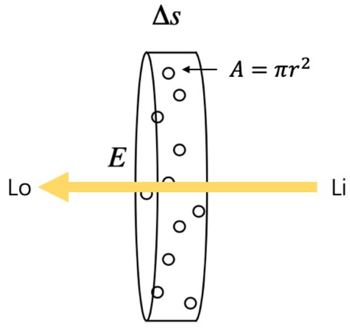
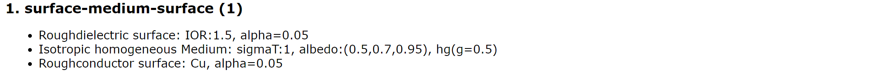
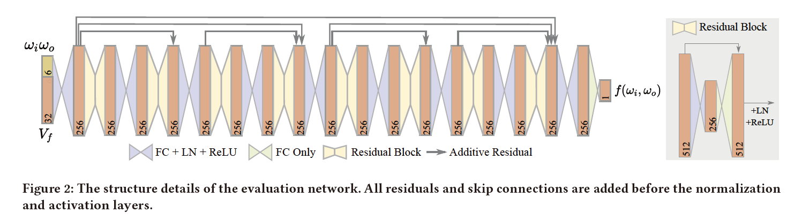
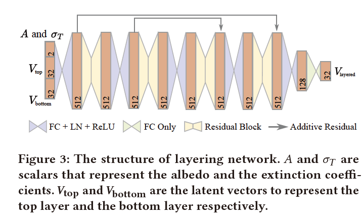

# 2024.1.22-2024.1.28


2. 搭建神经网络，算 bsdf 和算多层材质隐式向量的神经网络按照论文来的，算 pdf 的因为论文没写基本上照抄的算 bsdf 的神经网络。
2. Position-Free Monte Carlo Simulation for Arbitrary Layered BSDFs 论文实现了一大半，包括 phase function 采样和 pdf 计算、particating medium 的距离采样、算透过率、pdf 等、以及他们方法随机采样一条路径的部分。


## 下周计划

1. 学习 CUDA 编程。
2. 继续复现论文。


## 详情


### Participating Media


#### 简介

参与介质可以分为各向同性参与介质和各项异性参与介质，它们通过散射或吸收来影响通过它们的光。

体渲染把光子与粒子发生作用的过程，进一步细化为四种类型：

- 吸收 (absorption)：光子被粒子吸收，会导致入射光的辐射强度减弱

  

  假设例子的投影面积为 $A$，密度为 $\rho$，圆柱厚度为 $\Delta s$（很小，因此例子不会重叠），圆柱底面积为 $E$，因此光通过圆柱被遮挡的概率为：
  $$
  E\Delta s\rho A / E=\Delta s\rho A
  $$
  因此：
  $$
  \begin{align}
  & \Delta I=I_o-I_i=((1-\Delta s\rho A)-1)I_i=-\rho(s)AI(s)\Delta s\\
  & \frac{d I}{d s}=-\rho(s)AI(s)=-\sigma_a(s)I(s)\\
  & I(s)=I_0\exp(-\int_0^s\sigma_a(s)ds)
  \end{align}
  $$
  如果粒子群是均匀的，那么 $\sigma_a$ 是常量，呈指数衰减。

- 放射 (emission)：粒子本身可能发光，比如气体加热到一定程度就会离子化发光。这会进一步增大辐射强度。

- 外散射 (out-scattering)：光子在撞击到粒子后，可能会发生弹射，导致方向发生偏移，会减弱入射光强度

  同吸收一样，外散射对光线的削弱程度，也跟光学厚度相关，不过过程相对吸收来说又复杂一些，因此我们用 $\sigma_s$ 来表示外散射对光线的削弱比例，以区别于 $\sigma_a$。

  同样的，这一过程可以表示为：
  $$
  \frac{dI}{ds}=-\sigma_s(s)I(s)
  $$
  考虑吸收和外散射，假设 $\sigma_a$ 和 $\sigma_s$ 是常数，$\sigma_t=\sigma_a+\sigma_s$，那么经过距离 $d$ 后残留光线的比例为：
  $$
  L=\exp(-\sigma_td)
  $$
  这被称为朗伯-比尔定律（Lambert-Beer law）。

- 内散射 (in-scattering)：其他方向的光子在撞到粒子后，可能和当前方向上的光子重合，从而增强当前光路上的辐射强度。


#### 公式推导

1. 辐射能传输方程（Radiative Transfer Equation，RTE）

   光子会因为吸收（$\sigma_a$）和外散射（$\sigma_s$）而不沿着直线传播，因此使用 $\sigma_t=\sigma_a+\sigma_s$ 代表光线衰减的整个过程。而散射和吸收系数决定了介质的反照率（albedo）$\rho$，其被定义为：
   $$
   \rho=\frac{\sigma_s}{\sigma_s+\sigma_a}=\frac{\sigma_s}{\sigma_t}
   $$
   $\rho$ 表示了光谱范围内介质中相对于吸收散射的重要程度，$\rho$ 接近 $0$ 的值表示大部分光线被吸收，导致介质浑浊，如深色的尾气烟雾。$\rho$ 接近 $1$​ 的值表示大部分光线是散射的，而不是被吸收的，从而产生更明亮的介质，如空气、云或地球的大气层。

   ```cpp
   if (hasSigmaAS && hasSigmaTAlbedo)
       SLog(EError, "You can either specify sigmaS & sigmaA *or* "
            "sigmaT & albedo, but no other combinations!");
   ```

   Mitsuba 中也实现了这两种参数体系，即 $\sigma_s$，$\sigma_a$ 和 $\sigma_t$，$\rho$，这两组参数可以根据上述公式相互转换，在我实现的就只传入参数 $\sigma_s$，$\sigma_a$​​​​。

   综上所述，RTE 为：
   $$
   \begin{align}
   & L_o(p,\omega)=\\
   & \begin{matrix} \underbrace{-\sigma_a(p,\omega)L_i(p,\omega)} \\\text{光线被粒子吸收}\end{matrix}\\
   & \begin{matrix} \underbrace{-\sigma_s(p,\omega)L_i(p,\omega)}\\\text{光线被粒子散射到其他方向}\end{matrix}\\
   & \begin{matrix} \underbrace{+\sigma_s(p,\omega)\int_{\mathcal{S}^2}f_p(p,\omega_i\rightarrow\omega)L_i(p,\omega_i)\mathrm{d}\omega_i}\\\text{其他方向的光线被粒子散射到当前方向}\end{matrix}\\
   & \begin{matrix} \underbrace{+L_e(p,\omega)}\\\text{粒子自发光}\end{matrix}\\
   & =-\sigma_t(p,\omega)L_i(p,\omega)+\sigma_s(p,\omega)\int_{\mathcal{S}^2}f_p(p,\omega_i\rightarrow\omega)L_i(p,\omega_i)\mathrm{d}\omega_i+L_e(p,\omega)
   \end{align}
   $$
   其中 $f_p$ 是相函数（Phase function），将在后面说明。

2. 蒙特卡罗方法估计辐射传输方程：

   一方面，透射比可以看作光线在介质内被吸收、散射后，抵达介质内距离 $d$ 处残留的能量比例；另一方面，透射比也可以看作是光线在介质内没有被吸收、散射而直接抵达介质内距离 $d$​ 处的概率。于是，可以考虑结合蒙特卡罗方法估计光线在均匀介质内部的交互，基本的流程如下：

   1. 从均匀分布中生成随机数，$\xi\sim\mathcal{U}(0,1)$。

   2. 如果 $\xi\lt $ 抽样散射的权重 $\text{pdf}_a$​：

      光线在进入在介质中后发生了散射。

      抽样得到的光线在散射前于介质中传播的距离：
      $$
      d=\frac{-\log(1-\frac{\xi}{\text{pdf}_a})}{\sigma_t}
      $$
      $d$ 应该小于光线在介质中能传播的最大距离 $d_{max}$。

      在 $d$ 处发生散射的概率 $\text{pdf}(d)=\sigma_t\cdot\exp(-\sigma_t d)\cdot \text{pdf}_a$。

   3. 否则：

      光线在进入介质后，直到离开介质前都没有发生散射。

      相应的概率 $\text{pdf}(d_{max})=\exp(-\sigma_t d_{max})\cdot \text{pdf}_a+(1-\text{pdf}_a)$​。

   推导：
   $$
   \begin{align}
   & \text{the posibility of scattering is }\text{pdf}(d)=\sigma_t\cdot\exp(-\sigma_t d)\cdot \text{pdf}_a\\
   & \text{cdf}(d_0)=\int_0^{d_0}\sigma_t\cdot\exp(-\sigma_t d)\cdot \text{pdf}_a\mathrm{d}d\\
   & =-(\exp(-\sigma_t d)\cdot \text{pdf}_a)\vert_0^{d_0}=\text{pdf}_a-\text{pdf}_a\exp(-\sigma_t d_0)\\
   & \text{cdf}(d_0)^{-1}=\frac{-\ln(1-\frac{d_0}{\text{pdf}_a})}{\sigma_t}\\
   & \text{the posibility of not scattering is }\\
   & 1-\int_0^{d_{max}}\sigma_t\cdot\exp(-\sigma_t d)\cdot \text{pdf}_a\mathrm{d}d\\
   & =1-(\text{pdf}_a-\text{pdf}_a\exp(-\sigma_t d_{max}))\\
   & =\exp(-\sigma_t d_{max})\cdot \text{pdf}_a+(1-\text{pdf}_a)
   \end{align}
   $$
   抽样散射的权重 $\text{pdf}_a$ 可以考虑从反照率 $\rho=\frac{\sigma_s}{\sigma_s+\sigma_a}=\frac{\sigma_s}{\sigma_t}$ 推导得出。

   

#### Homogeneous Medium 代码复现

Python 实现如下：

```python
class HomogeneousMedium:
    def __init__(self, sigma_s: np.array, sigma_a: np.array):
        """
        Homogeneous participating medium.
        :param sigma_s, sigma_a: Scattering and absorption coefficients of the medium in inverse scene units.
        """
        self.sigma_s = sigma_s
        self.sigma_a = sigma_a
        """
        This is implemented in Mitsuba 0.6:
        self.sigma_s *= np.array([1.0, 1.0, 1.0], dtype=np.float32) - phase_g;
        But it does not make sense because whether the rays are scattered or 
        not is irrelevant to which direction the rays are scattered.
        """
        self.sigma_t = sigma_s + sigma_a

        """
        Calculate the medium sampling weight.
        Ensure that the medium sampling weight is at least 0.5
        because otherwise we will render lots of spatially varying noise where
        one pixel has a medium interaction and the neighbors don't.
        """
        self.medium_sampling_weight = 0.5
        for i in range(3):
            if self.sigma_t[i] != 0:
                albedo = self.sigma_s[i] / self.sigma_t[i]
                self.medium_sampling_weight = max(albedo, self.medium_sampling_weight)

    def sample(self, rand1: float, rand2: float):
        """
        Sample a distance along the ray segment.
        Should ideally importance sample with respect to the transmittance.
        :param rand1: A random number between [0, 1].
        :param rand2: A random number between [0, 1].
        :return:
            1. Success flag: false if the maximum distance was exceeded,
            or if no interaction inside the medium could be sampled.
            2. Sampled distance.
        """
        if rand1 < self.medium_sampling_weight:
            channel = min(int(rand2 * 3), 2)
            sampling_density = self.sigma_t[channel]
            distance = -np.log(1 - rand1 / self.medium_sampling_weight) / sampling_density
            success = True
        else:  # Don't generate a medium interaction
            distance = np.inf
            success = False

        return success, distance

    def pdf(self, success: bool, distance: float):
        """
        Compute the 1D density of sampling distance.

        The function computes the continuous densities in the case of
        a successful invocation (in both directions) and the Dirac delta density associated with a failure.
        :param success: Whether the ray is scattered in the medium.
        :param distance: Sampled distance.
        :return: Pdf.
        """
        if success:
            pdf_success = 0
            for i in range(3):
                temp = np.exp(-self.sigma_t[i] * distance)
                pdf_success += self.sigma_t[i] * temp
            pdf_success /= 3
            pdf_success *= self.medium_sampling_weight
            return pdf_success
        else:
            pdf_failure = 0
            for i in range(3):
                temp = np.exp(-self.sigma_t[i] * distance)
                pdf_failure += temp
            pdf_failure /= 3
            pdf_failure = self.medium_sampling_weight * pdf_failure + (1 - self.medium_sampling_weight)
            return pdf_failure

    def eval(self, distance: float):
        """
        Compute the transmittance along the supplied ray segment with the sampled distance.

        :param distance: Sampled distance.
        :return: Transmittance.
        """
        transmittance = np.exp(-self.sigma_t * distance)
        return transmittance
```


### Phase function


#### 简介

相函数有很多，在 Mitsuba 0.6 中，其实现了 Henyey-Greenstein phase function、Micro-flake phase function、Rayleigh phase function、von Mises-Fisher Phase Function、Mixture phase function、Kajiya-Kay phase function、Isotropic phase function 等。因为在论文 Position-Free Monte Carlo Simulation for Arbitrary Layered BSDFs 中其主要采用了 Henyey-Greenstein phase function，并且论文的重点不在相函数上，因此我只实现 Henyey-Greenstein phase function。



以后如果有需要（比如数据集），可能会复现其他的相函数。


#### Henyey-Greenstein phase function 公式推导

相函数 $p(\omega_i,\omega_o)$ 表示 $\omega_i$ 方向射入的光散射到 $\omega_o$ 方向的概率密度。满足球面积分为 $1$。

Henyey-Greenstein phase function 最初被用来模拟星际尘埃中的光散射。 该函数不能捕获每个真实世界复杂的散射行为，但它可以很好地匹配代表一个相位函数 lobe，即主要散射方向。 它可以用来表示任何烟、雾或粉尘样的参与介质。 这种介质可以表现出强烈的向后或向前散射，导致光源周围出现大的视觉 halos。

Henyey-Greenstein phase function 公式为：
$$
p_{hg}(\theta,g)=\frac{1-g^2}{4\pi(1+g^2-2g\cos\theta)^{1.5}}
$$
其中 $g$ 参数可以用来表示向后（$g\lt 0$）、各向同性（$g= 0$）或向前（$g\gt 0$）散射，其中 $g$ 在 $(−1,1)$ 范围。 $\cos\theta$ 表示入射光方向和散射光方向的余弦角。

就采样而言，同样采用分布逆变换的思路：
$$
\begin{align}
pdf(\phi)
&=\frac{1}{2\pi}\\
cdf(\phi)
&=\frac{\phi}{2\pi}\\
cdf(\phi)^{-1}
&=2\pi\xi_1\\

pdf(\theta\vert\phi)
& =\frac{pdf(\theta,\phi)}{pdf(\phi)}\\
& =\frac{1-g^2}{2(1+g^2-2g\cos\theta)^{1.5}}\\

cdf(\theta\vert\phi)
& =\int_0^{\theta_0}\frac{1-g^2}{2(1+g^2-2g\cos\theta)^{1.5}}\sin\theta\mathrm{d}\theta\\
& =\frac{g^2-1}{2}\int_0^{\theta_0}\frac{1}{(1+g^2-2g\cos\theta)^{1.5}}\mathrm{d}\cos\theta\\
& =\frac{g^2-1}{2}\int_1^{\cos\theta_0}\frac{1}{(1+g^2-2gx)^{1.5}}\mathrm{d}x\\
& =\frac{g^2-1}{2} \frac{1}{g\sqrt{1+g^2-2gx}}\vert_1^{\cos\theta_0}\\
& =\frac{g^2-1}{2g}(\frac{1}{\sqrt{1+g^2-2g\cos\theta_0}}-\frac{1}{1-g})\\

cdf(\theta\vert\phi)^{-1}
& =\arccos (\frac{1+g^2-(\frac{1-g^2}{1+g-2g\xi_2})^2}{2g})
\end{align}
$$
在 Mitsuba 中，因为 $\xi\sim\mathcal{U}(0,1)$，所以他做了个变换，即 $\xi_2'=1-\xi_2$，因此公式变为：
$$
cdf(\theta\vert\phi)^{-1}=\arccos (\frac{1+g^2-(\frac{1-g^2}{1-g+2g\xi_2'})^2}{2g})
$$


#### Henyey-Greenstein phase function 代码复现

Python 实现如下：

```python
epsilon = 1e-4


class HGPhase:
    """
    Henyey-Greenstein phase function.
    """

    def __init__(self, g: float):
        """
        :param g: This parameter is in (-1, 1).
        It denotes the mean cosine of scattering interactions.
        A value greater than zero indicates that medium interactions predominantly.
        scatter incident light into a similar direction (i.e. the medium is forward-scattering),
        whereas values smaller than zero cause the medium to be scatter more light in the opposite direction.
        """
        assert -1 < g < 1, 'The asymmetry parameter must lie in the interval (-1, 1)'
        self.g = g

    def sample(self, wi: np.array, rand1: float, rand2: float):
        """
        Sample the phase function and return the wo.
        :param wi: Direction of incident light.
        :param rand1: a random number between [0, 1].
        :param rand2: a random number between [0, 1].
        :return: wo.
        """
        if np.abs(self.g) < epsilon:
            cos_theta = 1 - 2 * rand1
        else:
            sqr_term = (1 - self.g * self.g) / (1 - self.g + 2 * self.g * rand1)
            cos_theta = (1 + self.g * self.g - sqr_term * sqr_term) / (2 * self.g)
        sin_theta = np.sqrt(1 - cos_theta ** 2)

        sin_phi = np.sin(2 * np.pi * rand2)
        cos_phi = np.cos(2 * np.pi * rand2)
		
        # local to world
        wo_local = np.array([sin_theta * cos_phi, sin_theta * sin_phi, cos_theta], dtype=np.float32)
        world_x, world_y, world_z = coordinate_system(-wi)
        wo_world = world_x * wo_local[0] + world_y * wo_local[1] + world_z * wo_local[2]

        return wo_world

    def eval(self, wi: np.array, wo: np.array):
        """
        Evaluate the pdf of phase function for an outward-pointing pair of directions (wi, wo).
        :param wi: Incident light direction. Note that wi points to the source.
        :param wo: Emergent light direction.
        :return: pdf.
        """
        # Formula is temp = 1.0 + self.g ** 2 - 2.0 * self.g * np.dot(wi, wo),
        # but in Mitsuba, wi points to the source, therefore '-' turns to '+'.
        temp = 1.0 + self.g ** 2 + 2.0 * self.g * np.dot(wi, wo)
        return 1.0 / (4.0 * np.pi) * (1 - self.g ** 2) / (temp * np.sqrt(temp))
```


### 神经网络

1. 算 bsdf 的神经网络

   

   ```python
   class ResidualBlock(nn.Module):
       """
       A general residual block that can be nested to a specified depth.
       Skip connections are added before the normalization and activation layers.
       """
       def __init__(self, io_dim: int, middle_dim: int, depth: int):
           """
           :param io_dim: input dim == output dim == io_dim.
           :param middle_dim: dim of the middle layer.
           :param depth: depth of nesting.
           """
           super(ResidualBlock, self).__init__()
           self.depth = depth
           if depth > 1:
               # Create a nested ResidualBlock
               self.residual1 = ResidualBlock(io_dim, middle_dim, depth - 1)
               self.residual2 = ResidualBlock(io_dim, middle_dim, depth - 1)
               self.fc = nn.Linear(io_dim, io_dim)
               self.ln = nn.LayerNorm(io_dim)
           else:
               # Base case
               self.fc1 = nn.Linear(io_dim, middle_dim)
               self.ln1 = nn.LayerNorm(middle_dim)
               self.fc2 = nn.Linear(middle_dim, io_dim)
               self.ln2 = nn.LayerNorm(io_dim)
   
       def forward(self, x):
           if self.depth > 1:
               identity = x
               out = self.residual1(x)
               out = self.fc(out)
               out = self.ln(out)
               out = f.relu(out)
               out = self.residual2(out)
               return identity + out
           else:
               identity = x
               out = self.fc1(x)
               out = self.ln1(out)
               out = f.relu(out)
               out = self.fc2(out)
               out = self.ln2(out + identity)  # Additive residual
               return f.relu(out)
   
   
   class EvaluationNetwork(nn.Module):
       """
       EvaluationNetwork built on the flexible ResidualBlock.
       Input contains omega_i, omega_o, and the latent vector of the material.
       Output represents the bsdf value of the input.
       """
       def __init__(self, input_dim: int, residual_io_dim: int, residual_middle_dim: int, last2_dim: int, depth: int):
           """
           :param input_dim: total dims including omega_i, omega_o, and the latent vector.
           :param residual_io_dim: io_dim of ResidualBlock.
           :param residual_middle_dim: middle_dim of ResidualBlock.
           :param last2_dim: the last but one layer's dim, finally output a single number representing the bsdf value.
           :param depth: the depth of nesting for the ResidualBlock.
           """
           super(EvaluationNetwork, self).__init__()
           self.residual = ResidualBlock(residual_io_dim, residual_middle_dim, depth)
           self.fc1 = nn.Linear(input_dim, residual_io_dim)
           self.ln1 = nn.LayerNorm(residual_io_dim)
           self.fc2 = nn.Linear(residual_io_dim, last2_dim)
           self.ln2 = nn.LayerNorm(last2_dim)
           self.fc3 = nn.Linear(last2_dim, 1)
   
       def forward(self, x):
           out = self.fc1(x)
           out = self.ln1(out)
           out = f.relu(out)
           identity = out
           out = self.residual(out) + identity
           out = self.fc2(out)
           out = self.ln2(out)
           out = f.relu(out)
           return self.fc3(out)
   ```

2. 算 layered material 的神经网络

   

   ```python
   class Layer(nn.Module):
       """
       A warp of FC + LN + ReLU
       """
       def __init__(self, input_dim: int, output_dim: int):
           super(Layer, self).__init__()
           self.fc = nn.Linear(input_dim, output_dim)
           self.ln = nn.LayerNorm(output_dim)
   
       def forward(self, x):
           out = self.fc(x)
           out = self.ln(out)
           return f.relu(out)
   
   
   class ResidualBlock(nn.Module):
       """
       A single residual block implementation built on layer.
       Skip connections are added before the normalization and activation layers.
       """
       def __init__(self, io_dim: int, middle_dim: int):
           """
           :param io_dim: input dim == output dim == io_dim.
           :param middle_dim: dim of the middle layer.
           """
           super(ResidualBlock, self).__init__()
           self.layer = Layer(io_dim, middle_dim)
           self.fc = nn.Linear(middle_dim, io_dim)
           self.ln = nn.LayerNorm(io_dim)
   
       def forward(self, x):
           identity = x
           out = self.layer(x)
           out = self.fc(out)
           out = self.ln(out + identity)  # Additive residual
           return f.relu(out)
   
   
   class LayeringNetwork(nn.Module):
       """
       Layering network built on Layer and ResidualBlock.
       Input two layers' latent vector and albedo coefficient(A) and extinction coefficient(sigma_T).
       Output layered material's latent vector.
       """
       def __init__(self, latent_dim: int, residual_io_dim: int, residual_middle_dim: int, last2_dim: int):
           """
           :param latent_dim: latent vector's dim.
           :param residual_io_dim: io_dim of ResidualBlock.middle_dim of ResidualBlock.
           :param residual_middle_dim: middle_dim of ResidualBlock.
           :param last2_dim: the last but one layer's dim, finally output material's latent vector.
           """
           super(LayeringNetwork, self).__init__()
           input_dim = 2 * latent_dim + 2
           self.layer_in = Layer(input_dim, residual_io_dim)
           for i in range(4):
               setattr(self, 'residual' + str(i + 1), ResidualBlock(residual_io_dim, residual_middle_dim))
           for i in range(3):
               setattr(self, 'layer' + str(i + 1), Layer(residual_io_dim, residual_io_dim))
           self.layer_last2 = Layer(residual_io_dim, last2_dim)
           self.layer_out = nn.Linear(last2_dim, latent_dim)
   
       def forward(self, x):
           out = self.layer_in(x)
           identity1 = out
           out = self.residual1(out)
           out = self.layer1(out)
           identity2 = out
           out = self.residual2(out)
           out = self.layer2(out)
           out = self.residual3(out) + identity2
           out = self.layer3(out)
           out = self.residual4(out) + identity1
           out = self.layer_last2(out)
           return self.layer_out(out)
   ```