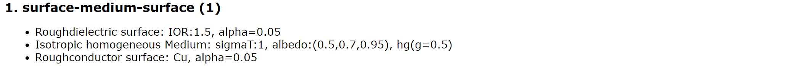
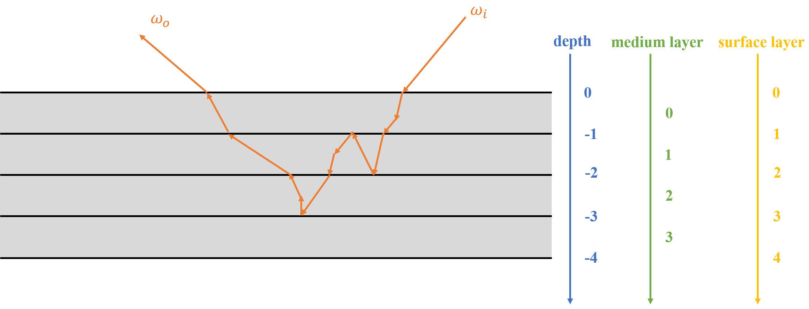
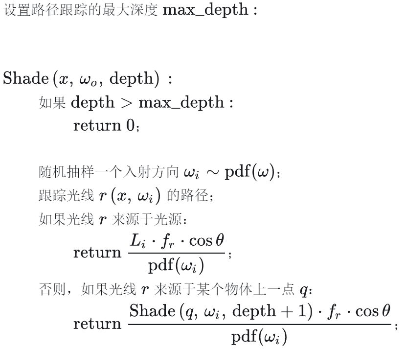
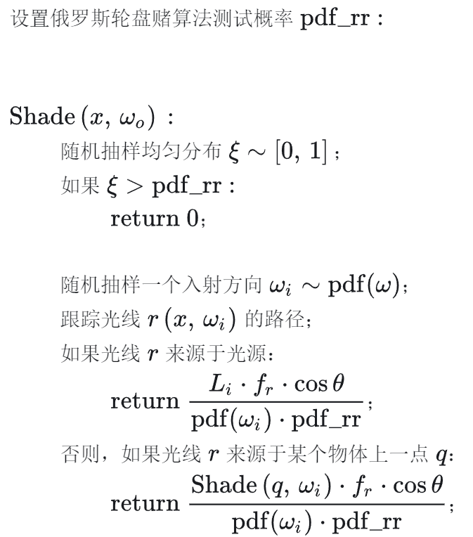
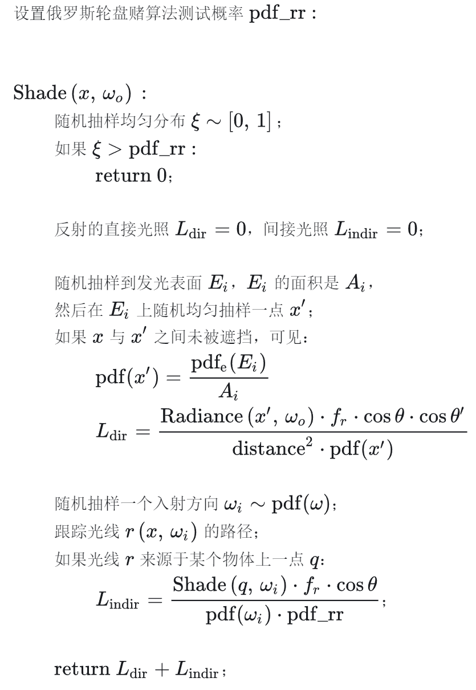

## Participating Media


### 简介

参与介质可以分为各向同性参与介质和各项异性参与介质，它们通过散射或吸收来影响通过它们的光。

体渲染把光子与粒子发生作用的过程，进一步细化为四种类型：

- 吸收 (absorption)：光子被粒子吸收，会导致入射光的辐射强度减弱

  

  假设例子的投影面积为 $A$，密度为 $\rho$，圆柱厚度为 $\Delta s$（很小，因此例子不会重叠），圆柱底面积为 $E$，因此光通过圆柱被遮挡的概率为：
  $$
  E\Delta s\rho A / E=\Delta s\rho A
  $$
  因此：
  $$
  \begin{align}
  & \Delta I=I_o-I_i=((1-\Delta s\rho A)-1)I_i=-\rho(s)AI(s)\Delta s\\
  & \frac{d I}{d s}=-\rho(s)AI(s)=-\sigma_a(s)I(s)\\
  & I(s)=I_0\exp(-\int_0^s\sigma_a(s)ds)
  \end{align}
  $$
  如果粒子群是均匀的，那么 $\sigma_a$ 是常量，呈指数衰减。

- 放射 (emission)：粒子本身可能发光，比如气体加热到一定程度就会离子化发光。这会进一步增大辐射强度。

- 外散射 (out-scattering)：光子在撞击到粒子后，可能会发生弹射，导致方向发生偏移，会减弱入射光强度

  同吸收一样，外散射对光线的削弱程度，也跟光学厚度相关，不过过程相对吸收来说又复杂一些，因此我们用 $\sigma_s$ 来表示外散射对光线的削弱比例，以区别于 $\sigma_a$。

  同样的，这一过程可以表示为：
  $$
  \frac{dI}{ds}=-\sigma_s(s)I(s)
  $$
  考虑吸收和外散射，假设 $\sigma_a$ 和 $\sigma_s$ 是常数，$\sigma_t=\sigma_a+\sigma_s$，那么经过距离 $d$ 后残留光线的比例为：
  $$
  L=\exp(-\sigma_td)
  $$
  这被称为朗伯-比尔定律（Lambert-Beer law）。

- 内散射 (in-scattering)：其他方向的光子在撞到粒子后，可能和当前方向上的光子重合，从而增强当前光路上的辐射强度。


### 公式推导

1. 辐射能传输方程（Radiative Transfer Equation，RTE）

   光子会因为吸收（$\sigma_a$）和外散射（$\sigma_s$）而不沿着直线传播，因此使用 $\sigma_t=\sigma_a+\sigma_s$ 代表光线衰减的整个过程。而散射和吸收系数决定了介质的反照率（albedo）$\rho$，其被定义为：
   $$
   \rho=\frac{\sigma_s}{\sigma_s+\sigma_a}=\frac{\sigma_s}{\sigma_t}
   $$
   $\rho$ 表示了光谱范围内介质中相对于吸收散射的重要程度，$\rho$ 接近 $0$ 的值表示大部分光线被吸收，导致介质浑浊，如深色的尾气烟雾。$\rho$ 接近 $1$​ 的值表示大部分光线是散射的，而不是被吸收的，从而产生更明亮的介质，如空气、云或地球的大气层。

   ```cpp
   if (hasSigmaAS && hasSigmaTAlbedo)
       SLog(EError, "You can either specify sigmaS & sigmaA *or* "
            "sigmaT & albedo, but no other combinations!");
   ```

   Mitsuba 中也实现了这两种参数体系，即 $\sigma_s$，$\sigma_a$ 和 $\sigma_t$，$\rho$，这两组参数可以根据上述公式相互转换，在我实现的就只传入参数 $\sigma_s$，$\sigma_a$​​​​。

   综上所述，RTE 为：
   $$
   \begin{align}
   & L_o(p,\omega)=\\
   & \begin{matrix} \underbrace{-\sigma_a(p,\omega)L_i(p,\omega)} \\\text{光线被粒子吸收}\end{matrix}\\
   & \begin{matrix} \underbrace{-\sigma_s(p,\omega)L_i(p,\omega)}\\\text{光线被粒子散射到其他方向}\end{matrix}\\
   & \begin{matrix} \underbrace{+\sigma_s(p,\omega)\int_{\mathcal{S}^2}f_p(p,\omega_i\rightarrow\omega)L_i(p,\omega_i)\mathrm{d}\omega_i}\\\text{其他方向的光线被粒子散射到当前方向}\end{matrix}\\
   & \begin{matrix} \underbrace{+L_e(p,\omega)}\\\text{粒子自发光}\end{matrix}\\
   & =-\sigma_t(p,\omega)L_i(p,\omega)+\sigma_s(p,\omega)\int_{\mathcal{S}^2}f_p(p,\omega_i\rightarrow\omega)L_i(p,\omega_i)\mathrm{d}\omega_i+L_e(p,\omega)
   \end{align}
   $$
   其中 $f_p$ 是相函数（Phase function），将在后面说明。

2. 蒙特卡罗方法估计辐射传输方程：

   一方面，透射比可以看作光线在介质内被吸收、散射后，抵达介质内距离 $d$ 处残留的能量比例；另一方面，透射比也可以看作是光线在介质内没有被吸收、散射而直接抵达介质内距离 $d$​ 处的概率。于是，可以考虑结合蒙特卡罗方法估计光线在均匀介质内部的交互，基本的流程如下：

   1. 从均匀分布中生成随机数，$\xi\sim\mathcal{U}(0,1)$。

   2. 如果 $\xi\lt $ 抽样散射的权重 $\text{pdf}_a$​：

      光线在进入在介质中后发生了散射。

      抽样得到的光线在散射前于介质中传播的距离：
      $$
      d=\frac{-\log(1-\frac{\xi}{\text{pdf}_a})}{\sigma_t}
      $$
      $d$ 应该小于光线在介质中能传播的最大距离 $d_{max}$。

      在 $d$ 处发生散射的概率 $\text{pdf}(d)=\sigma_t\cdot\exp(-\sigma_t d)\cdot \text{pdf}_a$。

   3. 否则：

      光线在进入介质后，直到离开介质前都没有发生散射。

      相应的概率 $\text{pdf}(d_{max})=\exp(-\sigma_t d_{max})\cdot \text{pdf}_a+(1-\text{pdf}_a)$​。

   推导：
   $$
   \begin{align}
   & \text{the posibility of scattering is }\text{pdf}(d)=\sigma_t\cdot\exp(-\sigma_t d)\cdot \text{pdf}_a\\
   & \text{cdf}(d_0)=\int_0^{d_0}\sigma_t\cdot\exp(-\sigma_t d)\cdot \text{pdf}_a\mathrm{d}d\\
   & =-(\exp(-\sigma_t d)\cdot \text{pdf}_a)\vert_0^{d_0}=\text{pdf}_a-\text{pdf}_a\exp(-\sigma_t d_0)\\
   & \text{cdf}(d_0)^{-1}=\frac{-\ln(1-\frac{d_0}{\text{pdf}_a})}{\sigma_t}\\
   & \text{the posibility of not scattering is }\\
   & 1-\int_0^{d_{max}}\sigma_t\cdot\exp(-\sigma_t d)\cdot \text{pdf}_a\mathrm{d}d\\
   & =1-(\text{pdf}_a-\text{pdf}_a\exp(-\sigma_t d_{max}))\\
   & =\exp(-\sigma_t d_{max})\cdot \text{pdf}_a+(1-\text{pdf}_a)
   \end{align}
   $$
   抽样散射的权重 $\text{pdf}_a$ 可以考虑从反照率 $\rho=\frac{\sigma_s}{\sigma_s+\sigma_a}=\frac{\sigma_s}{\sigma_t}$ 推导得出。

   

### Homogeneous Medium 代码复现

Python 实现如下：

```python
class HomogeneousMedium:
    def __init__(self, sigma_s: np.array, sigma_a: np.array):
        """
        Homogeneous participating medium.
        :param sigma_s, sigma_a: Scattering and absorption coefficients of the medium in inverse scene units.
        """
        self.sigma_s = sigma_s
        self.sigma_a = sigma_a
        """
        This is implemented in Mitsuba 0.6:
        self.sigma_s *= np.array([1.0, 1.0, 1.0], dtype=np.float32) - phase_g;
        But it does not make sense because whether the rays are scattered or 
        not is irrelevant to which direction the rays are scattered.
        """
        self.sigma_t = sigma_s + sigma_a

        """
        Calculate the medium sampling weight.
        Ensure that the medium sampling weight is at least 0.5
        because otherwise we will render lots of spatially varying noise where
        one pixel has a medium interaction and the neighbors don't.
        """
        self.medium_sampling_weight = 0.5
        for i in range(3):
            if self.sigma_t[i] != 0:
                albedo = self.sigma_s[i] / self.sigma_t[i]
                self.medium_sampling_weight = max(albedo, self.medium_sampling_weight)

    def sample(self, rand1: float, rand2: float):
        """
        Sample a distance along the ray segment.
        Should ideally importance sample with respect to the transmittance.
        :param rand1: A random number between [0, 1].
        :param rand2: A random number between [0, 1].
        :return:
            1. Success flag: false if the maximum distance was exceeded,
            or if no interaction inside the medium could be sampled.
            2. Sampled distance.
        """
        if rand1 < self.medium_sampling_weight:
            channel = min(int(rand2 * 3), 2)
            sampling_density = self.sigma_t[channel]
            distance = -np.log(1 - rand1 / self.medium_sampling_weight) / sampling_density
            success = True
        else:  # Don't generate a medium interaction
            distance = np.inf
            success = False

        return success, distance

    def pdf(self, success: bool, distance: float):
        """
        Compute the 1D density of sampling distance.

        The function computes the continuous densities in the case of
        a successful invocation (in both directions) and the Dirac delta density associated with a failure.
        :param success: Whether the ray is scattered in the medium.
        :param distance: Sampled distance.
        :return: Pdf.
        """
        if success:
            pdf_success = 0
            for i in range(3):
                temp = np.exp(-self.sigma_t[i] * distance)
                pdf_success += self.sigma_t[i] * temp
            pdf_success /= 3
            pdf_success *= self.medium_sampling_weight
            return pdf_success
        else:
            pdf_failure = 0
            for i in range(3):
                temp = np.exp(-self.sigma_t[i] * distance)
                pdf_failure += temp
            pdf_failure /= 3
            pdf_failure = self.medium_sampling_weight * pdf_failure + (1 - self.medium_sampling_weight)
            return pdf_failure

    def eval(self, distance: float):
        """
        Compute the transmittance along the supplied ray segment with the sampled distance.

        :param distance: Sampled distance.
        :return: Transmittance.
        """
        transmittance = np.exp(-self.sigma_t * distance)
        return transmittance
```


## Phase function


### 简介

相函数有很多，在 Mitsuba 0.6 中，其实现了 Henyey-Greenstein phase function、Micro-flake phase function、Rayleigh phase function、von Mises-Fisher Phase Function、Mixture phase function、Kajiya-Kay phase function、Isotropic phase function 等。因为在论文 Position-Free Monte Carlo Simulation for Arbitrary Layered BSDFs 中其主要采用了 Henyey-Greenstein phase function，并且论文的重点不在相函数上，因此我只实现 Henyey-Greenstein phase function。



以后如果有需要（比如数据集），可能会复现其他的相函数。


### Henyey-Greenstein phase function 公式推导

相函数 $p(\omega_i,\omega_o)$ 表示 $\omega_i$ 方向射入的光散射到 $\omega_o$ 方向的概率密度。满足球面积分为 $1$。

Henyey-Greenstein phase function 最初被用来模拟星际尘埃中的光散射。 该函数不能捕获每个真实世界复杂的散射行为，但它可以很好地匹配代表一个相位函数 lobe，即主要散射方向。 它可以用来表示任何烟、雾或粉尘样的参与介质。 这种介质可以表现出强烈的向后或向前散射，导致光源周围出现大的视觉 halos。

Henyey-Greenstein phase function 公式为：
$$
p_{hg}(\theta,g)=\frac{1-g^2}{4\pi(1+g^2-2g\cos\theta)^{1.5}}
$$
其中 $g$ 参数可以用来表示向后（$g\lt 0$）、各向同性（$g= 0$）或向前（$g\gt 0$）散射，其中 $g$ 在 $(−1,1)$ 范围。 $\cos\theta$ 表示入射光方向和散射光方向的余弦角。

就采样而言，同样采用分布逆变换的思路：
$$
\begin{align}
pdf(\phi)
&=\frac{1}{2\pi}\\
cdf(\phi)
&=\frac{\phi}{2\pi}\\
cdf(\phi)^{-1}
&=2\pi\xi_1\\

pdf(\theta\vert\phi)
& =\frac{pdf(\theta,\phi)}{pdf(\phi)}\\
& =\frac{1-g^2}{2(1+g^2-2g\cos\theta)^{1.5}}\\

cdf(\theta\vert\phi)
& =\int_0^{\theta_0}\frac{1-g^2}{2(1+g^2-2g\cos\theta)^{1.5}}\sin\theta\mathrm{d}\theta\\
& =\frac{g^2-1}{2}\int_0^{\theta_0}\frac{1}{(1+g^2-2g\cos\theta)^{1.5}}\mathrm{d}\cos\theta\\
& =\frac{g^2-1}{2}\int_1^{\cos\theta_0}\frac{1}{(1+g^2-2gx)^{1.5}}\mathrm{d}x\\
& =\frac{g^2-1}{2} \frac{1}{g\sqrt{1+g^2-2gx}}\vert_1^{\cos\theta_0}\\
& =\frac{g^2-1}{2g}(\frac{1}{\sqrt{1+g^2-2g\cos\theta_0}}-\frac{1}{1-g})\\

cdf(\theta\vert\phi)^{-1}
& =\arccos (\frac{1+g^2-(\frac{1-g^2}{1+g-2g\xi_2})^2}{2g})
\end{align}
$$
在 Mitsuba 中，因为 $\xi\sim\mathcal{U}(0,1)$，所以他做了个变换，即 $\xi_2'=1-\xi_2$，因此公式变为：
$$
cdf(\theta\vert\phi)^{-1}=\arccos (\frac{1+g^2-(\frac{1-g^2}{1-g+2g\xi_2'})^2}{2g})
$$


### Henyey-Greenstein phase function 代码复现

Python 实现如下：

```python
epsilon = 1e-4


class HGPhase:
    """
    Henyey-Greenstein phase function.
    """

    def __init__(self, g: float):
        """
        :param g: This parameter is in (-1, 1).
        It denotes the mean cosine of scattering interactions.
        A value greater than zero indicates that medium interactions predominantly.
        scatter incident light into a similar direction (i.e. the medium is forward-scattering),
        whereas values smaller than zero cause the medium to be scatter more light in the opposite direction.
        """
        assert -1 < g < 1, 'The asymmetry parameter must lie in the interval (-1, 1)'
        self.g = g

    def sample(self, wi: np.array, rand1: float, rand2: float):
        """
        Sample the phase function and return the wo.
        :param wi: Direction of incident light.
        :param rand1: a random number between [0, 1].
        :param rand2: a random number between [0, 1].
        :return: wo.
        """
        if np.abs(self.g) < epsilon:
            cos_theta = 1 - 2 * rand1
        else:
            sqr_term = (1 - self.g * self.g) / (1 - self.g + 2 * self.g * rand1)
            cos_theta = (1 + self.g * self.g - sqr_term * sqr_term) / (2 * self.g)
        sin_theta = np.sqrt(1 - cos_theta ** 2)

        sin_phi = np.sin(2 * np.pi * rand2)
        cos_phi = np.cos(2 * np.pi * rand2)
		
        # local to world
        wo_local = np.array([sin_theta * cos_phi, sin_theta * sin_phi, cos_theta], dtype=np.float32)
        world_x, world_y, world_z = coordinate_system(-wi)
        wo_world = world_x * wo_local[0] + world_y * wo_local[1] + world_z * wo_local[2]

        return wo_world

    def eval(self, wi: np.array, wo: np.array):
        """
        Evaluate the pdf of phase function for an outward-pointing pair of directions (wi, wo).
        :param wi: Incident light direction. Note that wi points to the source.
        :param wo: Emergent light direction.
        :return: pdf.
        """
        # Formula is temp = 1.0 + self.g ** 2 - 2.0 * self.g * np.dot(wi, wo),
        # but in Mitsuba, wi points to the source, therefore '-' turns to '+'.
        temp = 1.0 + self.g ** 2 + 2.0 * self.g * np.dot(wi, wo)
        return 1.0 / (4.0 * np.pi) * (1 - self.g ** 2) / (temp * np.sqrt(temp))
```


## Position-Free Monte Carlo Simulation for Arbitrary Layered BSDFs

论文链接：[Position-free monte carlo simulation for arbitrary layered BSDFs | ACM Transactions on Graphics](https://dl.acm.org/doi/abs/10.1145/3272127.3275053)


### 背景

现实中大多数的材质都有超过一层以上的组成部分。例如木地板，木头本身是粗糙的漫反射表面，但是很多木地板都会在表面涂上一层镜面反射的透明油漆。


### 主要工作

提出一种无偏的、能更好建模光线传播路径的、支持 SVBRDF 的多层材质模型。


###  算法与实现


#### 建模

该文章提出的假设是：光线的射入点和射出点在宏观上是一个点。基于上述假设，对双层材质进行一个简单的建模：对于某个顶点的渲染，可以将其抽象为在无限大的、厚度为单位 1 的平面上进行光线传输。==但这里我有一个疑问，既然平面无穷大，那么厚度为什么是 1，而不是其他数字？询问作者，作者的想法是深度无所谓，可以通过调整 $\sigma_s$ 和 $\sigma_a$ 来变相调整厚度。==

这篇文章的建模如下图：



一个多层材质有 $n$ 层 BSDF 材质，每两层 BSDF 材质之间有一个 Participating Medium（$n-1$ 层），最上层 BSDF 材质的深度为 $0$，最下层 BSDF 材质的深度为 $-(n-1)$，相邻两层之间 Participating Medium 的深度为 $1$​。

光线从最上层材质上方或者最下层材质下方射入：

- 当光线打到材质上时，在这个材质上采样一个出射光线方向 $w_o$，作为下一个光线段的方向。
- 当光线在介质中传播时，首先在介质上采样一个传播距离 $d$（并且保证光线不会跨介质）。然后计算出下一个光线段的起始位置。并且通过对介质的 Phase function 采样得到下一个光线段的方向。

光线在多层材质中不断的散射、透射、反射，直到光线离开多层材质或者递归深度达到人为设定的最大值。

为了实现这个建模，我在 Python 中定义了一个 `LayeredMaterial` 类：

```python
class LayeredMaterial:
    def __init__(self, mediums: list[HomogeneousMedium], surfaces: list[MonolayerMaterial], sample_number: int):
        assert len(surfaces) == len(mediums) + 1, 'Error, number of layers does not match the number of mediums'
        self.layer_number = len(surfaces)
        self.mediums = mediums
        self.surfaces = surfaces
        self.sample_number = sample_number
```

其中 `mediums` 是上述介质类组成的列表，`surfaces` 是上述 BSDF 材质组成的列表，`sample_number` 是一个超参数，指定在蒙特卡洛积分时的采样数。

`ray_intersect` 函数是为了判断光线是否与 BSDF 材质相交以及相交在哪一层材质：

```python
    def ray_intersect(self, ray: Ray):
        """
        Calculates whether the light intersects a slab and calculates the intersection point.
        In this method of modeling, the depth of the top layer is 0, the depth of the second layer is -1, ...
        the depth of the bottom layer is -(layer_number - 1).
        :param ray: a ray including origin point and direction.
        :return: whether the ray intersects a slab, the intersection point, and the distance from the origin point.
        """
        ray.direction = normalize(ray.direction)
        intersection = Intersection(np.inf, np.inf, np.inf)

        is_ray_up = ray.direction[2] > 0  # whether the light travel upward or downward
        z = ray.travel(epsilon)[2]  # depth after the light travel a short distance
        z_bottom = np.floor(z)  # depth of the bottom layer
        z_top = z_bottom + 1  # depth of the upper layer

        # Light does not intersect a slab, including parallel case
        if (np.abs(ray.direction[2]) < epsilon
                or (z_top > 0 and is_ray_up)
                or (z_bottom < -(self.layer_number - 1) and not is_ray_up)):
            return False, None, None

        intersection.z = z_top if is_ray_up else z_bottom
        distance = (intersection.z - ray.origin[2]) / ray.direction[2]
        intersection.x = ray.origin[0] + ray.direction[0] * distance
        intersection.y = ray.origin[1] + ray.direction[1] * distance

        return True, intersection, distance
```


#### 采样

采样只需要调用 generate path 方法随机产生一条路径，最后返回出射方向即可。

`generate_path` 函数是为了随机产生一条光路：

每个路径点需要记录以下参数：

- `ratio`和 `ratio_pdf`

   主要用于实现双向路径追踪（Bidirectional Path Tracing, BPT）中的多重重要性采样（Multiple Importance Sampling, MIS）。它们分别记录了路径连接点（Path vertex）的重要性采样比率及其概率密度函数（PDF）的比率。

  - `ratio` 用于调整路径连接处的贡献权重，以减少方差。
  - `ratio_pdf` 是 `ratio` 对应的概率密度函数值，用于计算路径贡献的加权平均。

- `current_point.throughput0` 和 `current_point.throughput1`

  - `current_point.throughput0` 处理的是正向 path tracing 在到达当前顶点前的透过率。
  - `current_point.throughput1` 处理的是逆向 path tracing 在经过当前顶点到达下一顶点前的透过率。

- `current_point.edge_pdf` 和 `current_point.vertex_pdf`

  - `current_point.edge_pdf` 用于描述光线从一个点到下一个点的传播概率，这是路径中相邻两点间传播的概率密度。
  - `current_point.vertex_pdf` 指的是在给定的方向上采样光线方向时的概率密度，它描述了在当前路径点上采样出射方向的概率密度。

  他们有两个元素，其中第一个元素是为了正向路径追踪算传播，第二个元素是为了逆向路径追踪算传播，从而支持双向路径追踪。

- `position`、`wi`、`wo`、`layer_index`、`is_surface`：位置，入射光、出射光、层级 id，处于表面还是介质。

计算流程：

1. 每次迭代计算光线是否会与某个平面相交，如果不想相交说明路径生成结束。

2. 接着判断光线是否在介质中传播并且在在介质中采样一段距离

   1. 如果光线在介质中传播并且采样的距离没有与平面相交：

      计算出发生散射的点并采样散射方向 $w_o$。

      1. 记录 `throughput`：

         光线在正向经过介质后透过率会衰减：

         ==$\text{throughput}=\text{throughput}\cdot\sigma_s\cdot \text{tranmittance} / \text{pdf\_success}$==

         $\text{throughput0}=\text{throughput}$​

         光线在反向经过介质后透过率衰减相同：

         $\text{throughput1}=\text{throughput}$

      2. 记录 `edge_pdf`：

         正向传播采样距离的概率密度为：

         ==$\text{edge\_pdf[0]} = \text{pdf\_success} / \abs{ray.direction.z}$==

         `abs(ray.direction.z)` 反映了光线与介质表面垂直方向的夹角。

         当光线垂直于介质表面传播时（即 `abs(ray.direction.z)` 接近于 $1$），光线穿过介质的路径与介质的厚度几乎相等，不会对PDF产生显著的调整；当光线以较小的角度（接近于平行于介质表面）传播时，`abs(ray.direction.z)` 的值接近于 $0$​，这意味着光线在介质中实际行进的距离要远大于介质的厚度。因此，`abs(ray.direction.z)` 的值变小，会增大 PDF 的值，因为同一段厚度内，光线实际行进的距离变长，穿过介质的概率变小。

         计算反向传播采样距离的概率密度时，如果光线不是从表面发出的，那么

         $\text{edge\_pdf[1]}=\text{edge\_pdf[0]}$

         否则

         $\text{edge\_pdf[1]}=\text{pdf\_failure}$​

      3. 记录 `vertex_pdf`：

         正向传播散射的概率密度为：

         $\text{vertex\_pdf[0]} = \text{medium.phase\_function.pdf}(wi, wo)$​

         同理，逆向传播散射的概率密度为：

         $\text{vertex\_pdf[1]} = \text{medium.phase\_function.pdf}(wo, wi)$

      最后产生下一条光线。

   2. 另外一种情况是光线与平面相交（不管是否在介质中）：

      1. 如果光线在介质中传播但是采样距离超过与平面相交的距离：

         更新透过率：

         $\text{throughput}=\text{throughput}\cdot \text{tranmittance} / \text{pdf\_failure}$​

         记录 `edge_pdf`：

         正向传播采样距离的概率密度为：

         $\text{edge\_pdf[0]} = \text{pdf\_failure}$

         计算反向传播采样距离的概率密度时，如果光线是从表面发出的，那么

         $\text{edge\_pdf[1]}=\text{pdf\_failure}$

         否则

         $\text{edge\_pdf[1]}=\text{pdf\_success} / \abs{ray.direction.z}$

      计算交点所在的平面、入射光方向，采样得到出射光方向 $w_o$​​，以及对应的 BSDF、PDF 值。

      1. 记录 `throughput`：

         光线在经过介质后透过率会衰减情况已经在前面更新过了

         $\text{throughput0}=\text{throughput}$​

         光线在逆向经过介质后不仅有上述的衰减，还会有经过 BSDF 表面散射的衰减：

         $\text{throughput}=\text{bsdf}/\text{pdf}$

         $\text{throughput1}=\text{throughput}$

      2. 记录 `edge_pdf`：

         光线在经过介质时的 `edge_pdf` 已经在上面计算了，如果光线不在介质中传播，概率密度为默认的 $0$。

      3. 记录 `vertex_pdf`：

         正向传播散射的概率密度为：

         $\text{vertex\_pdf[0]} = \text{bsdf.pdf}(wi, wo)$​

         同理，逆向传播散射的概率密度为：

         $\text{vertex\_pdf[1]} = \text{bsdf.pdf}(wo, wi)$

      最后产生下一条光线。


#### 计算 BSDF 值和概率密度值


##### Bidirectional Path Tracing

参考：

- [蒙特卡罗路径跟踪（Monte Carlo Path Tracing）、双向路径跟踪（Bidirectional Path Tracing，BDPT） - 知乎 (zhihu.com)](https://zhuanlan.zhihu.com/p/475547095)

- [图形学｜Robust：Path Tracing & Bidirectional Path Tracing 路径追踪、双向路径追踪 - 知乎 (zhihu.com)](https://zhuanlan.zhihu.com/p/384408596)

1. 路径跟踪（path tracing）算法从照相机出发，跟踪光线在场景中景物表面之间的反射和折射，追溯进入照相机光线的源头，如果发现了光线来源的光源，或达到了最大追踪深度，则停止跟踪。

   可以手动规定路径跟踪的最大深度，使用蒙特卡罗路径跟踪算法计算物体表面一点 $x$ 朝方向 $w_o$​ 的辐射亮度（光亮度）。主要框架如下：

   

   路径跟踪的深度也可以通过俄罗斯轮盘赌算法（Russian roulette，RR）控制，加入了俄罗斯轮盘赌算法的框架如下：

   

2. 直接抽样光源

   从照相机出发，根据照相机焦距、绘制分辨率等参数确定的光线入射方向，使用路径跟踪算法进行着色，在溯源光线时，有可能在达到最大深度时仍没有回溯到光源，这会导致蒙特卡罗方法求解的绘制方程数学期望存在极大的方差。

   为了减小着色计算数学期望的方差，可以在溯源光线时主动地抽样发光物体，提高效率。

   假设随机抽样到场景中某个发光表面  的概率是 $pdf_e(E_i)$，$E_i$ 的表面积是 $A$，则在 $E_i$ 上均匀抽样到某一点 $x'$ 的概率是 $\frac{1}{A}$，在所有发光表面中抽样到 $x'$ 的概率是 $\frac{pdf_e(E_i)}{A}$。
   $$
   1=\int_{x'\in E_i}\frac{1}{A}\mathrm{d}A(x')=\sum_ipdf_e(E_i)\int_{x'\in E_i}\frac{1}{A}\mathrm{d}A(x')
   $$
   $x’$ 在 $E_i$ 上的面元 $dA(x')$ 朝 $w_i$ 方向的投影是 $\cos\theta' dA(x')$，转换为相对于 $x$ 的立体角元是 $dw=\frac{\cos\theta' dA(x')}{\norm{x'-x}^2}$​。

   加入了直接抽样光源的算法框架如下：

   

   这里使用了多重重要性采样（MIS），可以认为对光源计算是一种采样方案，继续 Path Tracing 是另一种采样方案。每种采样方案赋予一个 `mis_weight`，使得两种采样方案的权重相加为 $1$，通常情况下有两种情况：

   1. 上一个打到的交点表面是 delta 分布：

      那么此次发出的光线肯定是基于 BSDF 采样的，因此对于光源采样的 pdf 是 0，`mis_weight = 1`。

   2. 上一个打到的交点表面不是 delta 分布：

      $$
      \text{mis\_bsdf}=\frac{\text{prev\_bsdf\_pdf}^2}{\text{prev\_bsdf\_pdf}^2+\text{em\_pdf}^2}
      $$

3. 双向路径跟踪（Bidirectional Path Tracing，BDPT）

   在路径跟踪算法之中，虽然加入直接抽样光源可以提高算法的效率，但有时候场景中光源的位姿可能比较特殊，使得从照相机出发溯源光路时，难以追溯到发光物体。

   双向路径跟踪算法（Bidirectional Path Tracing，BDPT）在路径跟踪算法的基础之上，额外从光源出发创建光路，再连接从照相机追溯的光路和从光源出发的光路上的点，创建多条光路，并根据光线从这些光路传播的概率，合并各个光路传递的辐射亮度（光亮度）数学期望，即进行所谓的多重重要性抽样（multiple importance sampling），计算光线最后进入照相机生成图像相应像素的数值。


##### Layered BSDF  双向路径追踪公式

给定了入射方向 $\omega_i$ 和出射方向 $\omega_o$，光线散射的路径有非常多，而最终的目标 BSDF 是每个路径的 BSDF 对路径空间积分，表示为：
$$
f_l(\omega_i,\omega_o)=\int_{\Omega(\omega_i,\omega_o)}f(\overline{x})d\mu(\overline{x})
$$
其中 $\Omega(\omega_i,\omega_o)$ 是入射方向是 $\omega_i$，出射方向是 $\omega_o$ 的路径的集合；$\overline{x}$ 是一条光路 $(\bold{d}_0,z_1,\bold{d}_1,\cdots,z_k,\bold{d}_k)$ 满足 $\bold{d_0}=-\omega_i$ 以及 $\bold{d}_k=\omega_o$。

1. $f(\overline{x})$ 是光路 $\overline{x}$ 的贡献：$f(\overline{x})=v_1s_1v_2s_2\cdots v_{k-1}s_k$，其中 $v_i$ 是顶点 $i$ 贡献，$s_i$ 是光路 $i$ 贡献。

   1. 其中顶点 $v_i$ 的贡献可以定义为：
      $$
      v_i=v(z_i,-\bold{d}_{i-1},\bold{d}_i)=\left\{\begin{array}{rcl}& f_\uparrow(-\bold{d}_{i-1},\bold{d}_i) & \text{if } z_i=0\\& f_\uparrow(-\bold{d}_{i-1},\bold{d}_i) & \text{if } z_i=1\\& \hat{f}_p(-\bold{d}_{i-1},\bold{d}_i) & \text{if } 0\lt z_i\lt 1\\\end{array}\right.
      $$
      其中 $f_\uparrow,f_\downarrow$ 是最上层介质和最下层介质的 BSDF 函数。

      $\hat{f}_p$ 是相位函数乘上散射系数：$\hat{f}_p=\sigma_sf_p$​。

   2. 路径 $s_i$ 的贡献可以定义为：
      $$
      \begin{align}
      & s_i=s(z_i,z_{i+1},\bold{d}_i)=\tau(z_i,z_{i+1},\bold{d}_i)\cdot \abs{\cos\bold{d}_i}^{\alpha_i}\\
      & \text{where }\alpha_i=\mathbb{I}(z_i\in\{0,1\})+\mathbb{I}(z_{i+1}\in\{0,1\})-1\\
      & \text{and }\tau(z,z',\omega)=\exp(\frac{-\sigma_t\abs{z'-z}}{\abs{\cos\omega}})\cdot\mathbb{I}(\frac{z'-z}{\cos\omega}\gt 0)\\
      \end{align}
      $$
      下面推导 $\abs{\cos\bold{d}_i}^{\alpha_i}$​ 的由来：

      对于光线在介质中传播一段距离后发生散射：
      $$
      \begin{align}
      & L_v(t_0,w)=S(t_0,w)+\int_0^{t_0}\exp(-t\sigma_t)\int_{\mathcal{S}^2}\hat{f}_p(w',w)L_v(t,w')\mathrm{d}w'\mathrm{d}t\\
      & \because \text{depth }z=t\abs{\cos w}\\
      & \therefore L_v(z_0,w)=S(z_0,w)+\\
      & \int_0^{z_0}\exp(-\frac{z}{\abs{\cos w}}\sigma_t)\int_{\mathcal{S}^2}\hat{f}_p(w',w)L_v(z,w')\mathrm{d}w'\mathrm{d}z\abs{\frac{1}{\cos w}}\\
      \end{align}
      $$
      因此，从距离 $t$ 变换到深度 $z$ 的时候，会除以一个 $\abs{\cos w}$，但因为 BSDF 材质发生散射时，会乘上一个 $\abs{\cos w}$：
      $$
      L_o(p,w_o)=\int_\Omega f_s(p,w_i,w_o)L_i(p,w_i)\abs{\cos w}\mathrm{d}w_i
      $$
      而这个余弦项没有算在顶点贡献里面，因此有了上述这个 $\abs{\cos\bold{d}_i}^{\alpha_i}$。

2. $\mu(\overline{x})$ 是路径的测度：
   $$
   \begin{align}
   & \mu(\overline{x})=\prod_{i=1}^{k-1}\sigma(\bold{d}_i)\cdot \prod_{i\in V(\overline{x})}\lambda(z_i)\\
   & \text{where }\sigma(d)\text{ is solid angle measure.}\\
   & \text{and }\lambda(z) \text{ is standard lebesgue measure.}\\
   \end{align}
   $$


他有 Unidirectional 和 Bidirectional 两种实现方式，Unidirectional 类似于传统的 unidirectional path tracer。最初的想法是：考察任意一个着色点（不管是位于最底层的还是介质中间层的）随机游走创建一条到外部点的光路（方向为 $\omega_i$​），但是直接连接两个点经常会使得路径失效。==因为 Unidirectional 涉及到采样光源，而这在训练神经网络时是不可用的，因此这里我只打算实现 Bidirectional 的版本。==

类似于 BDPT。已知入射方向 $\omega_i$ 以及出射方向 $\omega_o$，考察入射、出射两条光路：
$$
\begin{align}
& \overline{x}_i=(\bold{d}_0,z_1,\bold{d}_1,\cdots,z_s)\\
& \overline{x}_o=(\bold{d}_0',z_1',\bold{d}_1',\cdots,z_t')\\
& \text{where $\bold{d}_0=-\omega_i$, $\bold{d}_0'=-\omega_o$}
\end{align}
$$
然后将 $z_s$ 和 $z_t'$  连接（并且假设这种连接不会跨越任何层次），整个光路为：
$$
\overline{y}_{s,t}=(\bold{d}_0,z_1,\bold{d}_1,\cdots,z_s,\tilde{d},z_t',\cdots,-\bold{d}_1',z_1',-\bold{d}_0')
$$
但是不像 BDPT，这个方法中 $\tilde{d}$ 可以从两个方向分别采样，从 $\overline{x}_i$ 和 $\overline{x}_o$ 分别进行了采样：
$$
\begin{align}
& \overline{x}_i^+=(\bold{d}_0,z_1,\bold{d}_1,\cdots,z_s,\bold{d}_s)\\
& \overline{x}_o^+=(\bold{d}_0',z_1',\bold{d}_1',\cdots,z_t',\bold{d}_t')\\
\end{align}
$$
现假设：
$$
\begin{align}
& \text{$\overline{x}^*$ is the reversed path of $\overline{x}$}\\
& \text{$v(z,\omega,\omega')$ and $s(z,z',\omega)$ are the vertex and segment contributions}\\
\end{align}
$$
那么：
$$
\begin{align}
& f(\overline{y}_{s,t}^{(0)})=f(\overline{x}_i^+)f(\overline{x}_o^*)s(z_s,z_t',\bold{d}_s)v(z_t',-\bold{d}_s,-\bold{d}_{t-1}')\\
& f(\overline{y}_{s,t}^{(1)})=f(\overline{x}_i)f(\overline{x}_o^{+*})v(z_s,-\bold{d}_{s-1},-\bold{d}_{t}')s(z_s,z_t',-\bold{d}_t')\\
& \frac{f(\overline{y}_{s,t}^{(0)})}{p(\overline{y}_{s,t}^{(0)})}=\frac{f(\overline{x}_i^+)}{p(\overline{x}_i^+)}\frac{f(\overline{x}_o^*)}{p(\overline{x}_o)}s(z_s,z_t',\bold{d}_s)v(z_t',-\bold{d}_s,-\bold{d}_{t-1}')\\
& \frac{f(\overline{y}_{s,t}^{(1)})}{p(\overline{y}_{s,t}^{(1)})}=\frac{f(\overline{x}_i)}{p(\overline{x}_i)}\frac{f(\overline{x}_o^{+*})}{p(\overline{x}_o^{+})}v(z_s,-\bold{d}_{s-1},-\bold{d}_{t}')s(z_s,z_t',-\bold{d}_t')\\
& p(w_o\vert w_i)=\int_{\Omega(w_i,w_o)}\mathcal{P}(\overline{x})\mathrm{d}\mu(\overline{x})\\
& \text{where } \mathcal{P}(\overline{x})=\left(
\prod_{j=1}^kp(\bold{d}_j\vert z_j,\bold{d}_{j-1})
\right)\left(
\prod_{j=1}^{k-1}p(z_{j+1}\vert z_j,\bold{d}_{j})
\right)\\
& \text{with k denoting the number of vertices in } \overline{x}\\
& \frac{\mathcal{P}(\overline{y}_{s,t}^{(0)})}{p(\overline{y}_{s,t}^{(0)})}=\frac{\mathcal{P}(\overline{x}_o^*)}{p(\overline{x}_o)}p(\bold{d}_s\vert z_t',-\bold{d}_{t-1}')p(z_t'\vert z_s,\bold{d}_s)\\
& \frac{\mathcal{P}(\overline{y}_{s,t}^{(1)})}{p(\overline{y}_{s,t}^{(1)})}=\frac{\mathcal{P}(\overline{x}_o^{+*})}{p(\overline{x}_o^+)}p(\bold{d}_t'\vert z_s,\bold{d}_{s-1})p(z_s\vert z_t',\bold{d}_t')\\
& \text{with }\mathcal{P}(\overline{x})=p(\overline{x})
\end{align}
$$

这里 $f$ 是指这条光路的 throughput（或者说 BSDF 值），$p$ 是指分别选择 $\overline{x}_i$ 前 $s$ 个点和选择 $\overline{x}_o$ 前 $t$ 个点的概率。$\mathcal{P}$ 是指选择这整个光路的概率。

根据 MIS 和 Stochastic Function Evaluation，可以写成：
$$
\begin{align}
& \int f(x)\mathrm{d}x=\sum_{s=1}^{n_i}\sum_{t=1}^{n_o}\sum_{u=0}^1 w_{s,t}^{(u)}(\overline{y}_{s,t}^{(u)})\frac{f(\overline{y}_{s,t}^{(u)})}{p_{s,t}^{(u)}(\overline{y}_{s,t}^{(u)})}\\
& \text{where }w_{s,t}^{(u)}=\left(
\sum_{s'=1}^{s+t-1}\sum_{u'=0}^1\frac{p_{s',s+t-s'}^{(u')}(\overline{y}_{s,t})}{p_{s,t}^{(u)}(\overline{y}_{s,t})}
\right)^{-1}\\
\end{align}
$$

这里的上标 $u$ 是指从哪个方向采样，$u=0$ 代表从光线端 $x_i$ 发出的光线进行连接，$u=1$ 代表从相机端 $x_o$ 发出的光线进行连接。

计算上述公式的时间复杂度为 $O(n_in_o(n_i+n_o))$，论文对公式进行了简化，使得时间复杂度降为 $O(n_in_o)$：

不妨记 $\overline{y}_{s,t}=(\bold{d}_0,z_1,\bold{d}_1,\cdots,z_n,\bold{d}_n) \text{ with } n=s+t$，那么对于 $s',t'\in\{1,2,\cdots,n\}$，定义：
$$
\begin{align}
& p^{(0)}_{s'}=\prod_{i=1}^{s'-1}p(\bold{d}_i\vert z_i,\bold{d}_{i-1})p(z_{i+1}\vert z_i,\bold{d}_i)\\
& p^{(1)}_{t'}=\prod_{i=n-t'+1}^{n-1}p(-\bold{d}_i\vert z_{i+1},-\bold{d}_{i+1})p(z_i\vert z_{i+1},-\bold{d}_i)\\
\end{align}
$$
那么：
$$
\begin{align}
& p_{s',t'}^{(u')}(\overline{y}_{s,t})=p^{(0)}_{s'}p^{(1)}_{t'}q_{s'}^{(u')}\\
& \text{where } q_{s'}^{(u)}=\left\{
\begin{array}{l}
p(\bold{d}_{s'}\vert z_{s'},\bold{d}_{s'-1})& \text{if }u=0\\
p(-\bold{d}_{s'}\vert z_{s'+1},-\bold{d}_{s'+1})& \text{if }u=1\\
\end{array}
\right.\\
& \therefore \frac{p_{s',t'}^{(u')}(\overline{y}_{s,t})}{p_{s,t}^{(u)}(\overline{y}_{s,t})}=\frac{p^{(0)}_{s'}p^{(1)}_{t'}q_{s'}^{(u')}}{p^{(0)}_{s}p^{(1)}_{t}q_{s}^{(u)}}\\
& \because \forall s'\lt s\text{, we have }p_{s',t'}^{(u')}(\overline{y}_{s,t})=p_{s'}^{(0)}\frac{p^{(1)}_{t'}}{p^{(1)}_{t+1}}q_{s'}^{(u')}p_{t+1}^{(1)}\\
& \therefore \sum_{s'=1}^{s-1}\sum_{u'=0}^{1}\frac{p_{s',t'}^{(u')}(\overline{y}_{s,t})}{p_{s,t}^{(u)}(\overline{y}_{s,t})}=\frac{p_{t+1}^{(1)}}{p_t^{(1)}q_s^{(u)}}
\underbrace{\sum_{s'=1}^{s-1}\sum_{u'=0}^{1}\frac{p_{s'}^{(0)}\frac{p_{t'}^{(1)}}{p_{t+1}^{(1)}}q_{s'}^{(u')}}{p_s^{(0)}}}_{:=P_s^{(0)}}\\
& \because \frac{p_{t'}^{(1)}}{p_{t+1}^{(1)}}=\prod_{i=s'+1}^{s-1}p(-\bold{d}_i\vert z_{i+1},-\bold{d}_{i+1})p(z_{i}\vert z_{i+1},-\bold{d}_i)\\
& \therefore P_s^{(0)} \text{ depends only on depths } z_{s'} \text{ and directions } \bold{d}_{s'} \text{ with } s'\le s \text{,}\\
& P_s^{(0)} \text{remains constant for all paths } \overline{y}_{s,t} \text{ with } s\gt s' \text{.}\\
& P_s^{(0)} \text{ an be efficiently evaluated
using the following relation:}\\
& P_s^{(0)}=\left\{
\begin{array}{l}
0 & \text{if }s=0\\
\frac{p_{s-1}^{(0)}}{p_s^{(0)}}\left(P_{s-1}^{(0)}\frac{p_{t+2}^{(1)}}{p_{t+1}^{(1)}}+\sum_{u'}q_{s-1}^{(u')}\right) & \text{if }s\gt0\\
\end{array}
\right.
\end{align}
$$
注意，这里的 $p_{s',t'}^{(u')}(\overline{y}_{s,t})$ 是指分别从前 $s'$ 和后 $t’$ 个顶点构建两个子路径的概率。而不是连成一条线的概率，因此 $q$ 的计算是合理的。

因此可以在 $O(n_i)$ 的时间内计算 $P_s^{(0)}\text{ for }s=1,2,\cdots,n_i$。

同样地：
$$
\begin{align}
& \forall t'\lt t,\quad\sum_{t'=1}^{t-1}\sum_{u'=0}^{1}\frac{p_{s',t'}^{(u')}(\overline{y}_{s,t})}{p_{s,t}^{(u)}(\overline{y}_{s,t})}=

\frac{p_{s+1}^{(0)}}{p_s^{(0)}q_s^{(u)}}
\underbrace{\sum_{t'=1}^{t-1}\sum_{u'=0}^{1}\frac{p_{t'}^{(1)}\frac{p_{s'}^{(0)}}{p_{s+1}^{(0)}}q_{n-t'}^{(u')}}{p_t^{(1)}}}_{:=P_t^{(1)}}

\end{align}
$$
因此可以在 $O(n_o)$ 的时间内计算 $P_t^{(1)}\text{ for }t=1,2,\cdots,n_o$。

最终有：
$$
\begin{align}
& w_{s,t}^{(u)}=\left(
\sum_{s'=1}^{s+t-1}\sum_{u'=0}^1\frac{p_{s',s+t-s'}^{(u')}(\overline{y}_{s,t})}{p_{s,t}^{(u)}(\overline{y}_{s,t})}
\right)^{-1}\\
& =\left( 1+P_s^{(0)}+P_t^{(1)}+\sum_{u'=0}^1\frac{p_{s-1,t+1}^{(u')}(\overline{y}_{s,t})+p_{s+1,t-1}^{(u')}(\overline{y}_{s,t})}{p_{s,t}^{(u)}(\overline{y}_{s,t})} \right)^{-1}
\end{align}
$$
这个可以在常数时间复杂度内计算，因此最后的时间复杂度为 $O(n_in_o)$。

在计算权重 $w$ 时，首先在随机生成路径时记录路径信息，记：
$$
\begin{align}
& \text{v[0]}_i=p(\bold{d}_{i+1}\vert z_{i+1},\bold{d}_{i})\\
& \text{v[1]}_i=p(-\bold{d}_{i}\vert z_{i+1},-\bold{d}_{i+1})\\
& \text{e[0]}_i=\left\{
\begin{array}{l}
p(z_{i+1}\vert z_{i},\bold{d}_{i})&\text{if } i\gt 0\\
0 &\text{if } i= 0
\end{array}
\right.\\
& \text{e[1]}_i=\left\{
\begin{array}{l}
p(z_{i}\vert z_{i+1},-\bold{d}_{i})&\text{if } i\gt 0\\
0 &\text{if } i= 0
\end{array}
\right.\\
\end{align}
$$
在生成路径结束后可以计算 $P_s^{(0)}$：
$$
\begin{align}
& P_0^{(0)}=0\\
& P_i^{(0)}=\frac{p_{i-1}^{(0)}}{p_i^{(0)}}\left(P_{i-1}^{(0)}\frac{p_{n-i+2}^{(1)}}{p_{n-i+1}^{(1)}}+\sum_{u'}q_{i-1}^{(u')}\right)\\
& = \frac{1}{p(\bold{d}_{i-1}\vert z_{i-1},\bold{d}_{i-2})p(z_{i}\vert z_{i-1},\bold{d}_{i-1})}\\
& \left(
\begin{array}{l}
P_{i-1}^{(0)}p(-\bold{d}_{i-1}\vert z_{i},-\bold{d}_{i})p(z_{i-1}\vert z_{i},-\bold{d}_{i-1})\\
+p(\bold{d}_{i-1}\vert z_{i-1},\bold{d}_{i-2})+p(-\bold{d}_{i-1}\vert z_{i},-\bold{d}_{i})
\end{array}
\right)\\
& =\frac{1}{\text{v[0]}_{i-2}\text{e[0]}_{i-1}}\left(
P_{i-1}^{(0)}\text{v[1]}_{i-1}\text{e[1]}_{i-1}
+\text{v[0]}_{i-2}+\text{v[1]}_{i-1})
\right)\\
& =\frac{\text{v[1]}_{i-1}}{\text{v[0]}_{i-2}}\left(
\frac{1}{\text{v[1]}_{i-1}}+\frac{1}{\text{v[0]}_{i-2}}+\text{e[1]}_{i-1}P_{i-1}^{(0)}
\right)\frac{1}{\text{e[0]}_{i-1}}
\end{align}
$$


##### 符号表

| Symbol                      | Meaning                                                      |
| --------------------------- | ------------------------------------------------------------ |
| $\omega_i$                  | 光线方向                                                     |
| $\omega_o$                  | 相机方向                                                     |
| $\cos\omega$                | 默认法向是 $\vec{n}=(0,0,1)$，$\cos\omega$ 是 $\omega$ 的 $z$ 分量 |
| $\mathbb{I}(x)$             | $\mathbb{I}(x)=1\text{ if } x\text{ is true else }0$         |
| $f_l(\omega_i,\omega_o)$    | 多层材质的 BSDF（目标函数），$f_l(\omega_i,\omega_o)=\int_{\Omega(\omega_i,\omega_o)}f(\overline{x})d\mu(\overline{x})$ |
| $f_s(z,\omega_i,\omega_o)$  | 在深度 $z$ 的 BSDF 函数                                      |
| $f_\uparrow,f_\downarrow$   | 最上层介质和最下层介质的 BSDF 函数                           |
| $f_p(\omega_i,\omega_o)$    | Phase Function，描述参与介质上散射分布的函数                 |
| $\sigma_s,\sigma_t$         | 介质的散射系数和吸收系数                                     |
| $\hat{f}_p$                 | $\hat{f}_p=\sigma_sf_p$                                      |
| $z_i$                       | 第 $i$ 个路径点的深度，$z_i\in[0,1]$，$0$ 代表顶层，$1$ 代表底层 |
| $\bold{d}_i$                | 第 $i$ 条光路的方向                                          |
| $\overline{x}$              | 光路 $(\bold{d}_0,z_1,\bold{d}_1,\cdots,z_k,\bold{d}_k)$ where $\bold{d_0}=-\omega_i$ and $\bold{d}_k=\omega_o$ |
| $v_i$                       | 顶点 $i$ 贡献，$v_i=v(z_i,-\bold{d}_{i-1},\bold{d}_i)=\left\{\begin{array}{rcl}& f_\uparrow(-\bold{d}_{i-1},\bold{d}_i) & \text{if } z_i=0\\& f_\uparrow(-\bold{d}_{i-1},\bold{d}_i) & \text{if } z_i=1\\& \hat{f}_p(-\bold{d}_{i-1},\bold{d}_i) & \text{if } 0\lt z_i\lt 1\\\end{array}\right.$ |
| $\tau(z,z',\omega)$         | 计算通过 $\omega$ 从 $z$ 到 $z'$ 的透过率，$\tau(z,z',\omega)=\exp(\frac{-\sigma_t\abs{z'-z}}{\abs{\cos\omega}})\cdot\mathbb{I}(\frac{z'-z}{\cos\omega}\gt 0)$ |
| $\alpha_i$                  | $\alpha_i=\mathbb{I}(z_i\in\{0,1\})+\mathbb{I}(z_{i+1}\in\{0,1\})-1$ |
| $s_i$                       | 光路 $i$ 贡献，$s_i=s(z_i,z_{i+1},\bold{d}_i)=\tau(z_i,z_{i+1},\bold{d}_i)\cdot \abs{\cos\bold{d}_i}^{\alpha_i}$ |
| $f(\overline{x})$           | 整条光路的贡献：$f(\overline{x})=v_1s_1v_2s_2\cdots v_{k-1}s_k$ |
| $\mu(\overline{x})$         | $\mu(\overline{x})=\prod_{i=1}^{k-1}\sigma(\bold{d}_i)\cdot \prod_{i\in V(\overline{x})}\lambda(z_i)$ |
| $\sigma(\omega)$            | Solid angle measures                                         |
| $\lambda(z)$                | Line measure like standard Lebesgue measure                  |
| $p(\overline{x})$           | 在 $\mu(\overline{x})$ 下采样到路径 $\overline{x}$ 的 pdf    |
| $L_v(z,\omega_o)$           | Volume radiance，$L_v(z,\omega_o)=S(z,\omega)+\int_0^1\frac{\tau(z,z',\omega)}{\abs{\cos\omega}}\int_{\mathcal{S}^2}\hat{f}_p(\omega',\omega)L_v(z',\omega')d\omega'dz'$ |
| $L_s(z,\omega_o)$           | Outgoing surface radiance，$L_s(z,\omega)=\int_{\mathcal{S}^2}f_s(z,\omega,\omega')\abs{\cos\omega'}L_S^i(z,\omega')d\sigma(\omega')$ |
| $L_s^i(z,\omega_i)$         | Incoming surface radiance，$L_s^i(z,\omega)=L_v(z,-\omega)$  |
| $S(z,\omega)$               | Source term in radiative transfer，$S(z,\omega)=\tau(0,z,\omega)L_s(0,\omega)+\tau(1,z,\omega)L_s(1,\omega)$ |
| $\Omega(\omega_i,\omega_o)$ | 入射方向是 $\omega_i$，出射方向是 $\omega_o$ 的路径的集合    |

