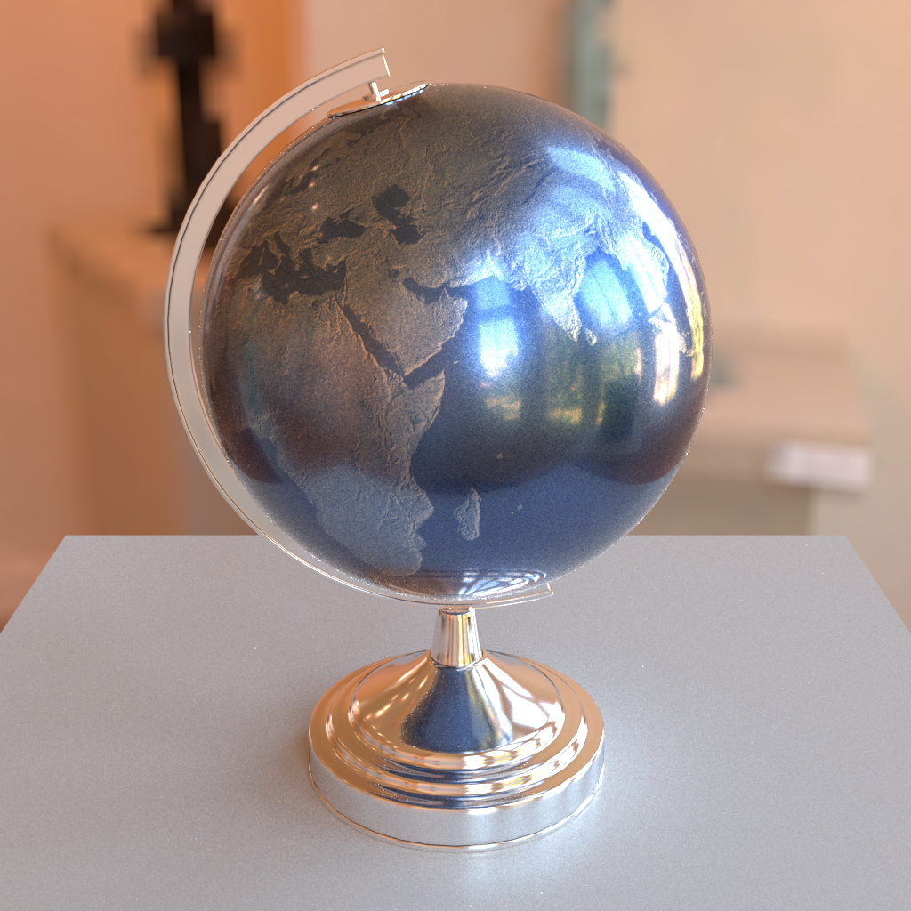
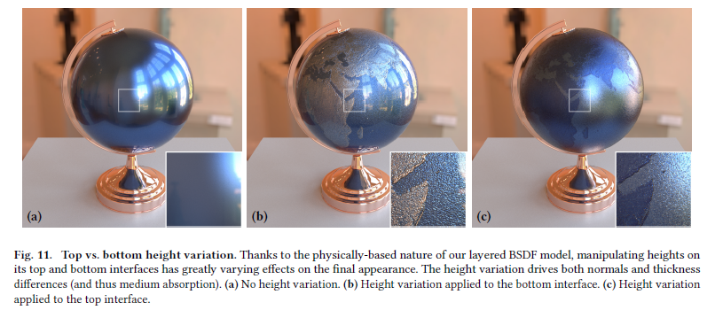

# 2024.3.25-2024.3.31


## 本周任务

1. 在Mitsuba3上复现多层材质并debug。


## 下周安排

1. 写训练和搭建神经网络的代码。
2. 在CUDA上跑数据集。


## 详细实现

主要有两个坑，一个是边界条件的处理和数值精度的处理，二是在模拟光传输过程中，要分清 Importance 和 Radiance，后者在 BSDF sampling 时有立体角压缩。

```cpp
#include <mitsuba/core/properties.h>
#include <mitsuba/core/spectrum.h>
#include <mitsuba/core/string.h>
#include <mitsuba/render/bsdf.h>
#include <mitsuba/render/sampler.h>
#include <mitsuba/render/texture.h>

#define EPSILON (Float(1e-5))
#define REPEAT_NUM 1
#define MAX_LENGTH 6

NAMESPACE_BEGIN(mitsuba)

template <typename Float, typename Spectrum> class Layered final : public BSDF<Float, Spectrum> {
public:
    MI_IMPORT_BASE(BSDF, m_flags, m_components)
    MI_IMPORT_TYPES(Texture, PhaseFunction, Sampler)

    explicit Layered(const Properties &props) : Base(props) {
        m_sigma_t         = props.texture<Texture>("sigma_t", 0.f);
        m_albedo          = props.texture<Texture>("albedo", 1.f);
        m_g               = props.get<ScalarFloat>("g", 0.f);
        m_sigma_t_scale_r = props.get<ScalarFloat>("sigma_t_scale_r", 1.f);
        m_sigma_t_scale_g = props.get<ScalarFloat>("sigma_t_scale_g", 1.f);
        m_sigma_t_scale_b = props.get<ScalarFloat>("sigma_t_scale_b", 1.f);
        props.mark_queried("sigma_t");
        props.mark_queried("albedo");
        props.mark_queried("g");
        props.mark_queried("sigma_t_scale_r");
        props.mark_queried("sigma_t_scale_g");
        props.mark_queried("sigma_t_scale_b");

        for (auto &[name, obj] : props.objects(false)) {
            if (name == "top_bsdf" && !props.was_queried("top_bsdf")) {
                m_top_bsdf = dynamic_cast<Base *>(obj.get());
                props.mark_queried("top_bsdf");
            }
            if (name == "bottom_bsdf" && !props.was_queried("bottom_bsdf")) {
                m_bottom_bsdf = dynamic_cast<Base *>(obj.get());
                props.mark_queried("bottom_bsdf");
            }
        }

        if (!m_top_bsdf || !m_bottom_bsdf) {
            Log(Error, "Layered bsdf initialize failed.\n");
        }

        if (has_flag(m_bottom_bsdf->flags(), BSDFFlags::GlossyTransmission) &&
            has_flag(m_top_bsdf->flags(), BSDFFlags::GlossyTransmission)) {
            m_components.push_back(BSDFFlags::GlossyTransmission | BSDFFlags::FrontSide | BSDFFlags::BackSide |
                                   BSDFFlags::NonSymmetric);
            m_components.push_back(BSDFFlags::GlossyReflection | BSDFFlags::FrontSide | BSDFFlags::BackSide);
            m_flags = m_components[0] | m_components[1];
        } else {
            m_components.push_back(BSDFFlags::GlossyReflection | BSDFFlags::FrontSide);
            m_flags = m_components[0];
        }
        dr::set_attr(this, "flags", m_flags);
    }

    void traverse(TraversalCallback *callback) override {
        callback->put_object("top_bsdf", m_top_bsdf.get(), +ParamFlags::Differentiable);
        callback->put_object("sigma_t", m_sigma_t.get(), +ParamFlags::Differentiable | ParamFlags::Discontinuous);
        callback->put_parameter("sigma_t_scale_r", m_sigma_t_scale_r, ParamFlags::Differentiable | ParamFlags::Discontinuous);
        callback->put_parameter("sigma_t_scale_g", m_sigma_t_scale_g, ParamFlags::Differentiable | ParamFlags::Discontinuous);
        callback->put_parameter("sigma_t_scale_b", m_sigma_t_scale_b, ParamFlags::Differentiable | ParamFlags::Discontinuous);
        callback->put_object("albedo", m_albedo.get(), +ParamFlags::Differentiable | ParamFlags::Discontinuous);
        callback->put_parameter("g", m_g, ParamFlags::Differentiable | ParamFlags::Discontinuous);
        callback->put_object("bottom_bsdf", m_bottom_bsdf.get(), +ParamFlags::Differentiable);
    }

    /* Phase function implementation */

    Vector3f phase_sample(Vector3f wi, Point2f sample2, Mask active = true) const {
        Float sqr_term  = (1.f - dr::sqr(m_g)) / (1.f - m_g + 2.f * m_g * sample2.x()),
              cos_theta = (1.f + dr::sqr(m_g) - dr::sqr(sqr_term)) / (2.f * m_g);

        // Diffuse fallback
        dr::masked(cos_theta, dr::abs(m_g) < dr::Epsilon<ScalarFloat>) = 1.f - 2.f * sample2.x();

        Float sin_theta         = dr::safe_sqrt(1.f - dr::sqr(cos_theta));
        auto [sin_phi, cos_phi] = dr::sincos(2.f * dr::Pi<ScalarFloat> * sample2.y());

        Frame3f frame = Frame3f(-wi);
        Vector3f wo   = frame.to_world(Vector3f(sin_theta * cos_phi, sin_theta * sin_phi, cos_theta));

        return wo & active;
    }

    Spectrum phase_eval(Float cos_theta, Mask active = true) const {
        Float temp = 1.f + dr::sqr(m_g) + 2.f * m_g * cos_theta;
        return dr::select(active, dr::InvFourPi<ScalarFloat> * (1.f - dr::sqr(m_g)) / (temp * dr::sqrt(temp)), 0.0f);
    }

    Float phase_pdf(Float cos_theta, Mask active = true) const {
        Float temp = 1.f + dr::sqr(m_g) + 2.f * m_g * cos_theta;
        return dr::select(active, dr::InvFourPi<ScalarFloat> * (1.f - dr::sqr(m_g)) / (temp * dr::sqrt(temp)), 0.0f);
    }

    /* Medium implementation */

    std::pair<Bool, Float> medium_sample(const SurfaceInteraction3f &si, Float max_distance, Float rand,
                                         Mask active = true) const {
        Spectrum sigma_t = Spectrum(Color3f(m_sigma_t_scale_r, m_sigma_t_scale_g, m_sigma_t_scale_b)) * m_sigma_t->eval(si, active);
        Float sampling_weight = dr::min(sigma_t);

        Float medium_sampling_weight = 1.0f;
        Float distance               = dr::Infinity<Float>;
        Bool success                 = false;

        Bool scattering                  = rand < medium_sampling_weight;
        dr::masked(distance, scattering) = -dr::log(1 - rand / medium_sampling_weight) / sampling_weight;
        dr::masked(success, scattering)  = true;

        Bool exceed                  = distance > max_distance;
        dr::masked(distance, exceed) = max_distance;
        dr::masked(success, exceed)  = false;

        return { dr::select(active, success, false), dr::select(active, distance, 0.0f) };
    }

    Spectrum medium_eval(const SurfaceInteraction3f &si, Float distance, Mask active = true) const {
        Spectrum sigma_t = Spectrum(Color3f(m_sigma_t_scale_r, m_sigma_t_scale_g, m_sigma_t_scale_b)) * m_sigma_t->eval(si, active);
        return dr::select(active, dr::exp(-sigma_t * distance), 0);
    }

    std::pair<Float, Float> medium_pdf(const SurfaceInteraction3f &si, Float distance, Mask active = true) const {
        Spectrum sigma_t = Spectrum(Color3f(m_sigma_t_scale_r, m_sigma_t_scale_g, m_sigma_t_scale_b)) * m_sigma_t->eval(si, active);
        Float sampling_density = dr::min(sigma_t);
        Float medium_sampling_weight = 1.0f;

        Float temp        = exp(-sampling_density * distance) * medium_sampling_weight;
        Float pdf_success = sampling_density * temp;
        Float pdf_failure = temp + (1.0f - medium_sampling_weight);

        return { dr::select(active, pdf_success, 0.0f), dr::select(active, pdf_failure, 0.0f) };
    }

    /* Layered implementation */

    Bool ray_intersect(const Ray3f &ray, SurfaceInteraction3f &its) const {
        its.p  = Point3f(dr::Infinity<Float>, dr::Infinity<Float>, dr::Infinity<Float>);
        its.t  = dr::Infinity<Float>;
        its.wi = dr::normalize(-ray.d);

        Bool is_intersect = dr::abs(ray.d.z()) > EPSILON;

        Bool is_up = ray.d.z() > 0;

        Float z        = ray(EPSILON).z();
        Float z_bottom = dr::floor(z);
        Float z_top    = z_bottom + 1;

        is_intersect &= !((z_top > 0 && is_up) || (z_bottom < -1 && !is_up));

        dr::masked(its.p.z(), is_intersect) = dr::select(is_up, z_top, z_bottom);
        is_intersect &= !((its.p.z() > EPSILON) || (its.p.z() < -1 - EPSILON));

        dr::masked(its.p.x(), is_intersect) = ray.o.x() + ray.d.x() * ((its.p.z() - ray.o.z()) / ray.d.z());
        dr::masked(its.p.y(), is_intersect) = ray.o.y() + ray.d.y() * ((its.p.z() - ray.o.z()) / ray.d.z());
        dr::masked(its.t, is_intersect)     = dr::norm(its.p - ray.o);

        return is_intersect;
    }

    struct PathInformation {
        Point3f position{ 0, 0, 0 };
        Vector3f wi{ Vector3f(0, 0, 0) }, wo{ Vector3f(0, 0, 0) };
        Int32 layer_index{ 0 };
        Bool is_surface{ false };
        Spectrum throughput0{ 0 }, throughput1{ 0 };
        Float edge_pdf[2]{ 0, 0 }, vertex_pdf[2]{ 0, 0 };
    };

    std::tuple<Int32, Spectrum, Vector3f, Float, Bool>
    generate_path(const BSDFContext &ctx, const SurfaceInteraction3f &si, Int32 max_depth, PathInformation *path,
                  Float *ratio, Float *ratio_pdf, Sampler *sampler, Bool active = true) const {
        Spectrum sigma_t = Spectrum(Color3f(m_sigma_t_scale_r, m_sigma_t_scale_g, m_sigma_t_scale_b)) * m_sigma_t->eval(si, active);
        Spectrum albedo  = m_albedo->eval(si, active);
        Spectrum sigma_s = sigma_t * albedo;

        Point3f ray_target = dr::select(si.wi.z() > 0, Vector3f(0, 0, 0), Vector3f(0, 0, -1));
        Ray3f ray          = Ray3f(ray_target + si.wi, -si.wi);

        SurfaceInteraction3f its(si);
        Bool loop_active = ray_intersect(ray, its) && active;
        BSDFContext ctx_importance(ctx);
        ctx_importance.mode = TransportMode::Importance;

        Bool is_in_medium    = false;
        Bool is_surface_prev = false;
        int depth            = 0;
        Int32 length         = 0;
        Spectrum throughput  = 1.0f;
        Vector3f wo          = Vector3f(0, 0, 0);
        Float leave_depth    = 0.0f;
        Float rand1;
        Point2f rand2;

        dr::Loop<Bool> loop("Layered", depth, throughput, is_in_medium, length, ray, wo, is_surface_prev, rand1, rand2,
                            leave_depth, loop_active, its);
        loop.set_max_iterations(MAX_LENGTH);

        while (loop(loop_active)) {
            // Get current layer and corresponding bsdf.
            PathInformation current_point{};
            Int32 current_layer_medium = 0;

            // Whether the light is sampled to scatter in the medium.
            rand1 = sampler->next_1d();
            sampler->advance();
            auto [medium_sample_success, medium_sample_distance] = medium_sample(si, its.t, rand1, loop_active);
            auto [medium_pdf_success, medium_pdf_failure]        = medium_pdf(si, medium_sample_distance, loop_active);
            Spectrum medium_transmittance                        = medium_eval(si, medium_sample_distance, loop_active);

            // Scatter condition.
            Bool medium_scatter      = is_in_medium && medium_sample_success;
            Bool medium_scatter_fail = is_in_medium && !medium_sample_success;
            Bool not_scatter         = !(is_in_medium && medium_sample_success);

            // Light is in the medium and scatters.
            dr::masked(current_point.layer_index, medium_scatter) = current_layer_medium;
            dr::masked(current_point.is_surface, medium_scatter)  = false;
            dr::masked(current_point.position, medium_scatter)    = ray(medium_sample_distance);
            dr::masked(current_point.wi, medium_scatter)          = -ray.d;
            dr::masked(throughput, medium_scatter) *= sigma_s * medium_transmittance / medium_pdf_success;
            dr::masked(current_point.throughput0, medium_scatter) = throughput;
            dr::masked(current_point.edge_pdf[0], medium_scatter) = medium_pdf_success / dr::abs(ray.d.z());
            dr::masked(loop_active, medium_scatter) &= current_point.edge_pdf[0] > EPSILON;
            dr::masked(throughput, medium_scatter && !loop_active) = 0.0f;
            dr::masked(current_point.edge_pdf[1], medium_scatter) =
                dr::select(is_surface_prev, medium_pdf_failure, current_point.edge_pdf[0]);
            dr::masked(current_point.throughput1, medium_scatter) = throughput;
            rand2                                                 = sampler->next_2d();
            sampler->advance();
            dr::masked(current_point.wo, medium_scatter) = phase_sample(current_point.wi, rand2, medium_scatter);
            dr::masked(current_point.vertex_pdf[0], medium_scatter) =
                phase_pdf(dr::dot(current_point.wo, -current_point.wi), medium_scatter);
            dr::masked(loop_active, medium_scatter) &= current_point.vertex_pdf[0] > EPSILON;
            dr::masked(throughput, medium_scatter && !loop_active)  = 0.0f;
            dr::masked(current_point.vertex_pdf[1], medium_scatter) = current_point.vertex_pdf[0];

            // Light is in the medium but not scatters.
            dr::masked(throughput, medium_scatter_fail) *= medium_transmittance / medium_pdf_failure;
            dr::masked(current_point.edge_pdf[0], medium_scatter_fail) = medium_pdf_failure;
            dr::masked(loop_active, medium_scatter_fail) &= current_point.edge_pdf[0] > EPSILON;
            dr::masked(throughput, medium_scatter_fail && !loop_active) = 0.0f;
            dr::masked(current_point.edge_pdf[1], medium_scatter_fail) =
                dr::select(is_surface_prev, medium_pdf_failure, medium_pdf_success / dr::abs(ray.d.z()));

            // Light is not in the medium or light is in the medium but not scatters.
            dr::masked(loop_active, not_scatter) &= dr::neq(its.t, dr::Infinity<Float>);
            Int32 current_layer_bsdf                        = dr::clamp(-dr::round2int<Int32>(its.p.z()), 0, 1);
            Bool is_top_bsdf                                = dr::eq(current_layer_bsdf, 0);
            dr::masked(current_point.position, not_scatter) = its.p;
            dr::masked(current_point.wi, not_scatter)       = its.wi;
            auto surface_sample                             = dr::zeros<BSDFSample3f>();
            Spectrum surface_bsdf = 0.0f, surface_throughput = 0.0f;
            Float surface_pdf = 0.0f, surface_pdf_reverse = 0.0f;
            SurfaceInteraction3f si_temp(si);
            dr::masked(si_temp.wi, not_scatter) = current_point.wi;
            rand1                               = sampler->next_1d();
            rand2                               = sampler->next_2d();
            sampler->advance();
            dr::masked(surface_sample, not_scatter) =
                dr::select(is_top_bsdf, m_top_bsdf->sample(ctx_importance, si_temp, rand1, rand2, sampler, not_scatter).first,
                           m_bottom_bsdf->sample(ctx_importance, si_temp, rand1, rand2, sampler, not_scatter).first);
            dr::masked(current_point.wo, not_scatter) = surface_sample.wo;
            dr::masked(surface_bsdf, not_scatter) =
                dr::select(is_top_bsdf, m_top_bsdf->eval(ctx_importance, si_temp, current_point.wo, sampler, not_scatter),
                           m_bottom_bsdf->eval(ctx_importance, si_temp, current_point.wo, sampler, not_scatter));
            dr::masked(surface_pdf, not_scatter) =
                dr::select(is_top_bsdf, m_top_bsdf->pdf(ctx_importance, si_temp, current_point.wo, sampler, not_scatter),
                           m_bottom_bsdf->pdf(ctx_importance, si_temp, current_point.wo, sampler, not_scatter));
            dr::masked(si_temp.wi, not_scatter) = current_point.wo;
            dr::masked(surface_pdf_reverse, not_scatter) =
                dr::select(is_top_bsdf, m_top_bsdf->pdf(ctx_importance, si_temp, current_point.wi, sampler, not_scatter),
                           m_bottom_bsdf->pdf(ctx_importance, si_temp, current_point.wi, sampler, not_scatter));
            dr::masked(surface_throughput, not_scatter)                             = surface_bsdf / surface_pdf;
            dr::masked(current_point.layer_index, not_scatter)                      = current_layer_bsdf;
            dr::masked(current_point.is_surface, not_scatter)                       = true;
            dr::masked(current_point.throughput0, not_scatter)                      = throughput;
            dr::masked(current_point.edge_pdf[0], not_scatter && dr::eq(length, 0)) = 0.0f;
            dr::masked(loop_active, not_scatter) &=
                current_point.edge_pdf[0] > EPSILON || dr::eq(length, 0); // TODO: why?
            dr::masked(throughput, not_scatter && !loop_active)                     = 0.0f;
            dr::masked(current_point.edge_pdf[1], not_scatter && dr::eq(length, 0)) = 0.0f;
            dr::masked(throughput, not_scatter) *= surface_throughput;
            dr::masked(current_point.throughput1, not_scatter)   = throughput;
            dr::masked(current_point.vertex_pdf[0], not_scatter) = surface_pdf;
            dr::masked(loop_active, not_scatter) &= current_point.vertex_pdf[0] > EPSILON;
            dr::masked(throughput, not_scatter && !loop_active)  = 0.0f;
            dr::masked(current_point.vertex_pdf[1], not_scatter) = surface_pdf_reverse;
            dr::masked(is_in_medium, not_scatter && (current_point.wi.z() * current_point.wo.z() < 0)) = !is_in_medium;

            // Update condition.
            path[depth] = current_point;
            dr::masked(length, loop_active)++;
            dr::masked(leave_depth, loop_active)     = current_point.position.z();
            dr::masked(is_surface_prev, loop_active) = current_point.is_surface;
            dr::masked(wo, loop_active)              = current_point.wo;

            ray = Ray3f(current_point.position, current_point.wo);
            loop_active &= ray_intersect(ray, its) || !is_in_medium;

            depth++;
            loop_active &= (depth < max_depth);
        }

        int i                  = 1;
        Bool ratio_loop_active = active;
        ratio[0]               = 0.0f;
        ratio_pdf[0]           = path[0].vertex_pdf[1] / path[0].vertex_pdf[0];

        dr::Loop<Bool> ratio_loop("Ratio", i, ratio_loop_active);
        ratio_loop.set_max_iterations(MAX_LENGTH);
        while (ratio_loop(ratio_loop_active)) {
            Float r      = 1.0f / path[i].vertex_pdf[1] + 1.0f / path[dr::maximum(i - 1, 0)].vertex_pdf[0];
            Float r1     = path[i].vertex_pdf[1] / path[i].vertex_pdf[0];
            ratio[i]     = r1 * (r + path[i].edge_pdf[1] * ratio[dr::maximum(i - 1, 0)]) / path[i].edge_pdf[0];
            ratio_pdf[i] = ratio_pdf[i - 1] * (path[i].vertex_pdf[1] / path[i].vertex_pdf[0]) *
                           (path[i].edge_pdf[1] / path[i].edge_pdf[0]);
            i++;
            ratio_loop_active &= (i < length);
        }

        return { length, throughput, wo, leave_depth, is_surface_prev };
    }

    std::pair<Spectrum, Float> bidirectional_eval(const BSDFContext &ctx, const SurfaceInteraction3f &si, Vector3f wo,
                                                  PathInformation *path, Float *ratio, Float *ratio_pdf,
                                                  Int32 path_length, PathInformation *path_reverse,
                                                  Float *ratio_reverse, Float *ratio_pdf_reverse,
                                                  Int32 path_length_reverse, Sampler *sampler, int max_depth,
                                                  Mask active) const {
        Vector3f origin_wo        = wo;
        Bool is_reflection        = si.wi.z() * wo.z() > 0;
        Bool is_incident_from_top = si.wi.z() > 0;

        Spectrum li0 = 0.0f, li = 0.0f;
        Float pdf0 = 0.0f, pdf = 0.0f;

        // Direct reflection is not considered by Bidirectional Path Tracing connection.
        dr::masked(li0, is_reflection && active) =
            dr::select(is_incident_from_top, m_top_bsdf->eval(ctx, si, wo, sampler, active),
                       m_bottom_bsdf->eval(ctx, si, wo, sampler, active));
        dr::masked(pdf0, is_reflection && active) =
            dr::select(is_incident_from_top, m_top_bsdf->pdf(ctx, si, wo, sampler, active),
                       m_bottom_bsdf->pdf(ctx, si, wo, sampler, active));

        // Traverse all nodes along two light paths and try to connect them.
        int m            = 0;
        Bool loop_active = active;
        dr::Loop<Bool> loop("Bidir", m, li, pdf, loop_active);
        loop.set_max_iterations(max_depth * max_depth);

        BSDFContext ctx_importance(ctx);
        ctx_importance.mode = TransportMode::Importance;

        while (loop(loop_active)) {
            int i                = m / max_depth; // Calculate the index of forward path.
            int j                = m % max_depth; // Calculate the index of reverse path.
            Bool index_constrain = i < path_length && j < path_length_reverse;

            if (dr::none(index_constrain)) {
                m++;
                loop_active &= (m < max_depth * max_depth);
                continue;
            }

            // Initialize the information of current 2 nodes.
            Int32 layer_index_forward = 0, layer_index_reverse = 0;
            Float vertex_depth_forward = 0.0f, vertex_depth_reverse = 0.0f;
            Bool valid_connection = false, valid_connection_case1 = false, valid_connection_case2 = false;

            dr::masked(layer_index_forward, index_constrain && loop_active)  = path[i].layer_index;
            dr::masked(layer_index_reverse, index_constrain && loop_active)  = path_reverse[j].layer_index;
            dr::masked(vertex_depth_forward, index_constrain && loop_active) = path[i].position.z();
            dr::masked(vertex_depth_reverse, index_constrain && loop_active) = path_reverse[j].position.z();

            // Test whether the connection is valid or not.
            dr::masked(valid_connection_case1, index_constrain && loop_active) =
                path[i].is_surface && (vertex_depth_forward - 1 - EPSILON < vertex_depth_reverse) &&
                (vertex_depth_reverse < vertex_depth_forward + 1 + EPSILON) &&
                dr::abs(vertex_depth_forward - vertex_depth_reverse) > EPSILON;
            dr::masked(valid_connection_case2, index_constrain && loop_active) =
                !path[i].is_surface && dr::floor(vertex_depth_forward) - EPSILON < vertex_depth_reverse &&
                vertex_depth_reverse < dr::ceil(vertex_depth_forward) + EPSILON;
            dr::masked(valid_connection,
                       (valid_connection_case1 || valid_connection_case2) && index_constrain && loop_active) = true;

            // Initialize params used to compute connection.
            Float pdf_rr[2] = { 0.0f, 0.0f }, pdf_ll[2] = { 0.0f, 0.0f };
            Spectrum f = 0.0f, eval_value = 0.0f, medium_transmittance = 0.0f, etas = 1.0f;
            Float w = 0.0f, f_pdf = 0.0f, connect_distance = 0.0f, medium_pdf_success = 0.0f, medium_pdf_failure = 0.0f;
            SurfaceInteraction3f si_temp(si);
            Bool left_valid_connection = false, right_valid_connection = false,
                 left_valid_connect_right_surface = false, left_valid_connect_right_medium = false,
                 right_valid_connect_left_surface = false, right_valid_connect_left_medium = false;

            // Sample from left.
            dr::masked(connect_distance, valid_connection) =
                (vertex_depth_reverse - vertex_depth_forward) / path[i].wo.z();
            dr::masked(left_valid_connection, valid_connection) = connect_distance > EPSILON;

            dr::masked(medium_transmittance, left_valid_connection) =
                medium_eval(si, connect_distance, left_valid_connection);
            dr::masked(medium_pdf_success, left_valid_connection) =
                medium_pdf(si, connect_distance, left_valid_connection).first;
            dr::masked(medium_pdf_failure, left_valid_connection) =
                medium_pdf(si, connect_distance, left_valid_connection).second;
            dr::masked(medium_pdf_success, left_valid_connection) /= dr::abs(path[i].wo.z());
            dr::masked(left_valid_connect_right_surface, left_valid_connection) = path_reverse[j].is_surface;
            dr::masked(left_valid_connect_right_medium, left_valid_connection)  = !path_reverse[j].is_surface;

            dr::masked(si_temp.wi, left_valid_connect_right_surface) = path_reverse[j].wi;
            dr::masked(eval_value, left_valid_connect_right_surface) =
                dr::select(dr::eq(layer_index_reverse, 0),
                           m_top_bsdf->eval(ctx_importance, si_temp, -path[i].wo, sampler, left_valid_connect_right_surface),
                           m_bottom_bsdf->eval(ctx_importance, si_temp, -path[i].wo, sampler, left_valid_connect_right_surface));
            dr::masked(pdf_rr[0], left_valid_connect_right_surface) =
                dr::select(dr::eq(layer_index_reverse, 0),
                           m_top_bsdf->pdf(ctx_importance, si_temp, -path[i].wo, sampler, left_valid_connect_right_surface),
                           m_bottom_bsdf->pdf(ctx_importance, si_temp, -path[i].wo, sampler, left_valid_connect_right_surface));
            dr::masked(si_temp.wi, left_valid_connect_right_surface) = -path[i].wo;
            dr::masked(pdf_rr[1], left_valid_connect_right_surface)  = dr::select(
                dr::eq(layer_index_reverse, 0),
                m_top_bsdf->pdf(ctx_importance, si_temp, path_reverse[j].wi, sampler, left_valid_connect_right_surface),
                m_bottom_bsdf->pdf(ctx_importance, si_temp, path_reverse[j].wi, sampler, left_valid_connect_right_surface));

            dr::masked(eval_value, left_valid_connect_right_medium) =
                phase_eval(dr::dot(path_reverse[j].wi, -path[i].wo), left_valid_connect_right_medium);
            dr::masked(pdf_rr[0], left_valid_connect_right_medium) =
                phase_pdf(dr::dot(path_reverse[j].wi, -path[i].wo), left_valid_connect_right_medium);
            dr::masked(pdf_rr[1], left_valid_connect_right_medium) =
                phase_pdf(dr::dot(path_reverse[j].wi, -path[i].wo), left_valid_connect_right_medium);

            dr::masked(f, left_valid_connection) = path[i].throughput1 * path_reverse[j].throughput0 * eval_value *
                                                   medium_transmittance / dr::abs(path[i].wo.z());
            dr::masked(f_pdf, left_valid_connection) =
                dr::select(path_reverse[j].is_surface, medium_pdf_failure, medium_pdf_success) * pdf_rr[1] *
                dr::select(dr::neq(j, 0),
                           ratio_pdf_reverse[dr::maximum(j - 1, 0)] *
                               (path_reverse[j].edge_pdf[1] / path_reverse[j].edge_pdf[0]),
                           1.0f);
            dr::masked(w, left_valid_connection) = 1.0f + pdf_rr[0] / path[i].vertex_pdf[0];
            dr::masked(w, dr::neq(i, 0) && left_valid_connection) +=
                ratio[i] * dr::select(path[i].is_surface, medium_pdf_failure, medium_pdf_success) * pdf_rr[0];
            dr::masked(w, dr::neq(j, 0) && left_valid_connection) +=
                dr::select(path_reverse[j].is_surface, medium_pdf_failure, medium_pdf_success) /
                path_reverse[j].edge_pdf[0] * (1.0f + pdf_rr[1] / path_reverse[dr::maximum(j - 1, 0)].vertex_pdf[0]);
            dr::masked(w, dr::neq(j, 0) && left_valid_connection) +=
                ratio_reverse[dr::maximum(j - 1, 0)] *
                dr::select(path_reverse[j].is_surface, medium_pdf_failure, medium_pdf_success) * pdf_rr[1] *
                path_reverse[j].edge_pdf[1] / path_reverse[j].edge_pdf[0];
            dr::masked(etas, left_valid_connection) =
                dr::select((is_incident_from_top && is_reflection) || (!is_incident_from_top && !is_reflection),
                           dr::rcp(dr::sqr(m_top_bsdf->get_eta(si, left_valid_connection))),
                           dr::sqr(m_bottom_bsdf->get_eta(si, left_valid_connection)));
            dr::masked(li, left_valid_connection) += f / w * etas;
            dr::masked(pdf, left_valid_connection) += f_pdf / w;

            // Sample from right.
            dr::masked(connect_distance, valid_connection) =
                (vertex_depth_forward - vertex_depth_reverse) / path_reverse[j].wo.z();
            dr::masked(right_valid_connection, valid_connection) = connect_distance > EPSILON;

            dr::masked(medium_transmittance, right_valid_connection) =
                medium_eval(si, connect_distance, right_valid_connection);
            dr::masked(medium_pdf_success, right_valid_connection) =
                medium_pdf(si, connect_distance, right_valid_connection).first;
            dr::masked(medium_pdf_failure, right_valid_connection) =
                medium_pdf(si, connect_distance, right_valid_connection).second;
            dr::masked(medium_pdf_success, right_valid_connection) /= dr::abs(path_reverse[j].wo.z());
            dr::masked(right_valid_connect_left_surface, right_valid_connection) = path[i].is_surface;
            dr::masked(right_valid_connect_left_medium, right_valid_connection)  = !path[i].is_surface;

            dr::masked(si_temp.wi, right_valid_connect_left_surface) = path[i].wi;
            dr::masked(eval_value, right_valid_connect_left_surface) = dr::select(
                dr::eq(layer_index_forward, 0),
                m_top_bsdf->eval(ctx_importance, si_temp, -path_reverse[j].wo, sampler, right_valid_connect_left_surface),
                m_bottom_bsdf->eval(ctx_importance, si_temp, -path_reverse[j].wo, sampler, right_valid_connect_left_surface));
            dr::masked(pdf_ll[0], right_valid_connect_left_surface) = dr::select(
                dr::eq(layer_index_forward, 0),
                m_top_bsdf->pdf(ctx_importance, si_temp, -path_reverse[j].wo, sampler, right_valid_connect_left_surface),
                m_bottom_bsdf->pdf(ctx_importance, si_temp, -path_reverse[j].wo, sampler, right_valid_connect_left_surface));
            dr::masked(si_temp.wi, right_valid_connect_left_surface) = -path_reverse[j].wo;
            dr::masked(pdf_ll[1], right_valid_connect_left_surface) =
                dr::select(dr::eq(layer_index_forward, 0),
                           m_top_bsdf->pdf(ctx_importance, si_temp, path[i].wi, sampler, right_valid_connect_left_surface),
                           m_bottom_bsdf->pdf(ctx_importance, si_temp, path[i].wi, sampler, right_valid_connect_left_surface));

            dr::masked(eval_value, right_valid_connect_left_medium) =
                phase_eval(dr::dot(path[i].wi, -path_reverse[j].wo), right_valid_connect_left_medium);
            dr::masked(pdf_ll[0], right_valid_connect_left_medium) =
                phase_pdf(dr::dot(path[i].wi, -path_reverse[j].wo), right_valid_connect_left_medium);
            dr::masked(pdf_ll[1], right_valid_connect_left_medium) =
                phase_pdf(dr::dot(path[i].wi, -path_reverse[j].wo), right_valid_connect_left_medium);

            dr::masked(f, right_valid_connection) = path[i].throughput0 * path_reverse[j].throughput1 * eval_value *
                                                    medium_transmittance / dr::abs(path_reverse[j].wo.z());
            dr::masked(f_pdf, right_valid_connection) =
                pdf_ll[0] * dr::select(path_reverse[j].is_surface, medium_pdf_failure, medium_pdf_success) *
                ratio_pdf_reverse[j];
            dr::masked(w, right_valid_connection) = 1.0f + pdf_ll[0] / path_reverse[j].vertex_pdf[0];
            dr::masked(w, dr::neq(j, 0) && right_valid_connection) +=
                ratio_reverse[j] * dr::select(path_reverse[j].is_surface, medium_pdf_failure, medium_pdf_success) *
                pdf_ll[0];
            dr::masked(w, dr::neq(i, 0) && right_valid_connection) +=
                dr::select(path[i].is_surface, medium_pdf_failure, medium_pdf_success) / path[i].edge_pdf[0] *
                (1.0f + pdf_ll[1] / path[dr::maximum(i - 1, 0)].vertex_pdf[0]);
            dr::masked(w, dr::neq(i, 0) && right_valid_connection) +=
                ratio[dr::maximum(i - 1, 0)] * dr::select(path[i].is_surface, medium_pdf_failure, medium_pdf_success) *
                pdf_ll[1] * path[i].edge_pdf[1] / path[i].edge_pdf[0];
            dr::masked(etas, right_valid_connection) =
                dr::select((is_incident_from_top && is_reflection) || (!is_incident_from_top && !is_reflection),
                           dr::rcp(dr::sqr(m_top_bsdf->get_eta(si, right_valid_connection))),
                           dr::sqr(m_bottom_bsdf->get_eta(si, right_valid_connection)));
            dr::masked(li, right_valid_connection) += f / w * etas;
            dr::masked(pdf, right_valid_connection) += f_pdf / w;

            // Update condition.
            m++;
            loop_active &= (m < max_depth * max_depth);
        }

        Spectrum bsdf_value            = 0.0f;
        Float pdf_value                = 0.0f;
        dr::masked(bsdf_value, active) = li0 + li * dr::abs(origin_wo.z());
        dr::masked(pdf_value, active)  = pdf0 + pdf;

        return { dr::select(active, bsdf_value, 0.0f), dr::select(active, pdf_value, 0.0f) };
    }

    std::pair<BSDFSample3f, Spectrum> sample(const BSDFContext &ctx, const SurfaceInteraction3f &si, Float,
                                             const Point2f &, Sampler *sampler, Mask active) const override {
        MI_MASKED_FUNCTION(ProfilerPhase::BSDFSample, active)

        sampler->advance();

        active &= has_flag(m_flags, BSDFFlags::GlossyTransmission) || si.wi.z() > 0;

        PathInformation path[MAX_LENGTH];
        Float ratio[MAX_LENGTH];
        Float ratio_pdf[MAX_LENGTH];
        auto [path_length, path_throughput, wo_forward, leave_depth, leave_surface] =
            generate_path(ctx, si, MAX_LENGTH, path, ratio, ratio_pdf, sampler, active);

        Bool selected_r = si.wi.z() * wo_forward.z() > 0;
        active &= (leave_surface && ((wo_forward.z() > 0 && dr::abs(leave_depth) < EPSILON) ||
                                     (wo_forward.z() < 0 && dr::abs(leave_depth + 1) < EPSILON)));
        active &= has_flag(m_flags, BSDFFlags::GlossyReflection) || selected_r;

        auto bs = dr::zeros<BSDFSample3f>();
        bs.eta  = dr::select(selected_r, 1.0f, m_top_bsdf->get_eta(si, active) * m_bottom_bsdf->get_eta(si, active));
        bs.sampled_component = dr::select(selected_r, UInt32(0), UInt32(1));
        bs.sampled_type =
            dr::select(selected_r, UInt32(+BSDFFlags::GlossyReflection), UInt32(+BSDFFlags::GlossyTransmission));
        bs.wo = wo_forward;

        auto [bsdf, pdf] = eval_pdf(ctx, si, wo_forward, sampler, active);

        bs.pdf = pdf;
        active &= (pdf > 0);

        return { bs, bsdf / pdf & active };
    }

    Spectrum eval(const BSDFContext &ctx, const SurfaceInteraction3f &si, const Vector3f &wo, Sampler *sampler,
                  Mask active) const override {
        MI_MASKED_FUNCTION(ProfilerPhase::BSDFEvaluate, active)

        return eval_pdf(ctx, si, wo, sampler, active).first;
    }

    Float pdf(const BSDFContext &ctx, const SurfaceInteraction3f &si, const Vector3f &wo, Sampler *sampler,
              Mask active) const override {
        MI_MASKED_FUNCTION(ProfilerPhase::BSDFEvaluate, active)

        return eval_pdf(ctx, si, wo, sampler, active).second;
    }

    std::pair<Spectrum, Float> eval_pdf(const BSDFContext &ctx, const SurfaceInteraction3f &si, const Vector3f &wo,
                                        Sampler *sampler, Mask active) const override {
        MI_MASKED_FUNCTION(ProfilerPhase::BSDFEvaluate, active)

        sampler->advance();

        active &= dr::abs(dr::norm(wo) - 1) < EPSILON;

        Int32 valid_number = 0;
        Spectrum bsdf      = 0.0f;
        Float pdf          = 0.0f;

        active &= !(!has_flag(m_flags, BSDFFlags::GlossyTransmission) && (si.wi.z() <= 0 || wo.z() <= 0));

        for (int i = 0; i < REPEAT_NUM; i++) {
            PathInformation path[MAX_LENGTH]{};
            Float ratio[MAX_LENGTH]{ 0 };
            Float ratio_pdf[MAX_LENGTH]{ 0 };
            auto [path_length, path_throughput, wo_forward, leave_depth, leave_surface] =
                generate_path(ctx, si, MAX_LENGTH, path, ratio, ratio_pdf, sampler, active);

            SurfaceInteraction3f si_reverse(si);
            si_reverse.wi = wo;

            PathInformation path_reverse[MAX_LENGTH];
            Float ratio_reverse[MAX_LENGTH]{ 0 };
            Float ratio_pdf_reverse[MAX_LENGTH]{ 0 };
            auto [path_length_reverse, path_throughput_reverse, wo_reverse, leave_depth_reverse,
                  leave_surface_reverse] = generate_path(ctx, si_reverse, MAX_LENGTH, path_reverse, ratio_reverse,
                                                         ratio_pdf_reverse, sampler, active);

            auto [bsdf_value, pdf_value] =
                bidirectional_eval(ctx, si, wo, path, ratio, ratio_pdf, path_length, path_reverse, ratio_reverse,
                                   ratio_pdf_reverse, path_length_reverse, sampler, MAX_LENGTH, active);

            Bool valid = dr::neq(pdf_value, 0) && active;
            dr::masked(bsdf, valid) += bsdf_value;
            dr::masked(pdf, valid) += pdf_value;
            dr::masked(valid_number, valid)++;
        }

        active &= (dr::neq(valid_number, 0));
        bsdf = dr::select(active, bsdf / valid_number, 0.0f);
        pdf  = dr::select(active, pdf / valid_number, 0.0f);

        return { dr::select(active, depolarizer<Spectrum>(bsdf), 0.0f), dr::select(active, pdf, 0.0f) };
    }

    [[nodiscard]] std::string to_string() const override {
        std::ostringstream oss;
        oss << "Layered[" << std::endl
            << "  top_bsdf = " << string::indent(m_top_bsdf) << "," << std::endl
            << "  sigma_t = " << string::indent(m_sigma_t) << "," << std::endl
            << "  sigma_t_scale_r = " << string::indent(m_sigma_t_scale_r) << "," << std::endl
            << "  sigma_t_scale_g = " << string::indent(m_sigma_t_scale_g) << "," << std::endl
            << "  sigma_t_scale_b = " << string::indent(m_sigma_t_scale_b) << "," << std::endl
            << "  albedo = " << string::indent(m_albedo) << "," << std::endl
            << "  g = " << string::indent(m_g) << "," << std::endl
            << "  bottom_bsdf = " << string::indent(m_bottom_bsdf) << "," << std::endl
            << "]";
        return oss.str();
    }

    MI_DECLARE_CLASS()
protected:
    ref<Base> m_top_bsdf, m_bottom_bsdf;
    ref<Texture> m_sigma_t, m_albedo;
    ScalarFloat m_g, m_sigma_t_scale_r, m_sigma_t_scale_g, m_sigma_t_scale_b;
};

MI_IMPLEMENT_CLASS_VARIANT(Layered, BSDF)
MI_EXPORT_PLUGIN(Layered, "layered")
NAMESPACE_END(mitsuba)
```

场景描述文件为：

```xml
<scene version="3.0.0">
    <default name="spp" value="256"/>
    <default name="max_depth" value="6"/>
    <default name="integrator" value="path"/>

    <integrator type='$integrator'>
        <integer name="max_depth" value="$max_depth"/>
    </integrator>

    <sensor type="perspective" id="sensor">
        <string name="fov_axis" value="smaller"/>
        <float name="fov" value="38"/>
        <transform name="to_world">
            <lookat origin="0, -420, 180"
                    target="0,  0,  20"
                    up    ="0,  0,  1"/>
        </transform>
        <sampler type="independent">
            <integer name="sample_count" value="$spp"/>
        </sampler>
        <film type="hdrfilm">
            <integer name="width"  value="1024"/>
            <integer name="height" value="1024"/>
            <rfilter type="tent"/>
            <string name="pixel_format" value="rgb"/>
            <string name="component_format" value="float32"/>
        </film>
    </sensor>

    <!-- Environment map -->
    <emitter type="envmap">
        <string name="filename" value="textures/envmap.exr"/>
        <transform name="to_world">
            <rotate x="1" angle="90"/>
            <rotate z="1" angle="210"/>
        </transform>
        <float name="scale" value="2"/>
    </emitter>

    <shape type="rectangle">
        <transform name="to_world">
            <scale x="200" y="200"/>
            <translate x="0" y="0" z="-100"/>
        </transform>
        <bsdf type="roughplastic"/>
    </shape>

    <shape type="obj">
        <transform name="to_world">
            <scale x="1" y="1" z="1"/>
            <rotate x="1" angle="90"/>
            <rotate z="1" angle="180"/>
            <translate x="0" y="0" z="-100"/>
        </transform>
        <string name="filename" value="meshes/globe2.obj"/>
        <bsdf type="roughconductor">
            <float name="alpha" value="0.01"/>
            <string name="material" value="Al"/>
            <boolean name="sample_visible" value="false"/>
            <string name="distribution" value="ggx"/>
        </bsdf>
    </shape>

    <shape type="obj">
        <transform name="to_world">
            <scale x="1" y="1" z="1"/>
            <rotate x="1" angle="90"/>
            <rotate z="1" angle="180"/>
            <translate x="0" y="0" z="-100"/>
        </transform>
        <string name="filename" value="meshes/globe1.obj"/>

        <bsdf type="layered">
            <bsdf type="roughdielectric" name="top_bsdf">
                <float name="ext_ior" value="1.0"/>
                <float name="int_ior" value="1.5"/>
                <float name="alpha" value="0.005"/>
                <boolean name="sample_visible" value="false"/>
                <string name="distribution" value="ggx"/>
            </bsdf>

            <texture name="sigma_t" type="bitmap">
                <string name="filename" value="textures/glints_sigmaT.exr"/>
            </texture>
            <float name="sigma_t_scale_r" value="3.0"/>
            <float name="sigma_t_scale_g" value="3.0"/>
            <float name="sigma_t_scale_b" value="3.0"/>
            <rgb name="albedo" value="0.0, 0.0, 0.0"/>
            <float name="g" value="0.0"/>

            <bsdf type="roughconductor" name="bottom_bsdf">
                <float name="alpha" value="0.05"/>
                <string name="material" value="Hg"/>
                <boolean name="sample_visible" value="false"/>
                <string name="distribution" value="ggx"/>
            </bsdf>
        </bsdf>
    </shape>
</scene>
```

最终结果为：



论文结果为：



复现结果和论文中间那张图基本一致。